# Agent Integration

<cite>
**Referenced Files in This Document**
- [base_agent_wrapper.py](file://reme/components/agent_wrapper/base_agent_wrapper.py)
- [as_agent_wrapper.py](file://reme/components/agent_wrapper/as_agent_wrapper.py)
- [cc_agent_wrapper.py](file://reme/components/agent_wrapper/cc_agent_wrapper.py)
- [component_registry.py](file://reme/components/component_registry.py)
- [base_component.py](file://reme/components/base_component.py)
- [mcp_service.py](file://reme/components/service/mcp_service.py)
- [http_service.py](file://reme/components/service/http_service.py)
- [mcp_client.py](file://reme/components/client/mcp_client.py)
- [hooks.json](file://plugins/reme/hooks/hooks.json)
- [auto_memory.py](file://plugins/reme/hooks/auto_memory.py)
- [.mcp.json](file://plugins/reme/.mcp.json)
- [SKILL.md (reme-memory)](file://plugins/reme/skills/reme-memory/SKILL.md)
- [SKILL.md (reme_memory)](file://skills/reme_memory/SKILL.md)
- [auto_memory_cc.py](file://reme/steps/evolve/auto_memory_cc.py)
- [auto_memory.py](file://reme/steps/evolve/auto_memory.py)
</cite>

## Table of Contents
1. [Introduction](#introduction)
2. [Project Structure](#project-structure)
3. [Core Components](#core-components)
4. [Architecture Overview](#architecture-overview)
5. [Detailed Component Analysis](#detailed-component-analysis)
6. [Dependency Analysis](#dependency-analysis)
7. [Performance Considerations](#performance-considerations)
8. [Troubleshooting Guide](#troubleshooting-guide)
9. [Conclusion](#conclusion)
10. [Appendices](#appendices)

## Introduction
This document explains the ReMe agent integration system that supports multiple AI agent frameworks through unified interfaces and integration patterns. It covers:
- The agent wrapper abstraction that normalizes different agent backends
- The hook-based integration mechanism for automated workflows
- The SKILL-based agent capability definition for Claude Code
- The MCP (Model Context Protocol) service implementation and HTTP API for programmatic access
- Practical examples for integrating with AgentScope and Claude Code
- Communication protocols, authentication mechanisms, and best practices

## Project Structure
The integration spans several subsystems:
- Agent wrappers: a common interface for AgentScope and Claude Code
- Services: MCP and HTTP servers exposing jobs as tools/endpoints
- Clients: MCP client for programmatic access
- Hooks: plugin-driven automation for Claude Code
- Skills: declarative capability definitions for Claude Code
- Steps: server-side orchestration for memory and file operations

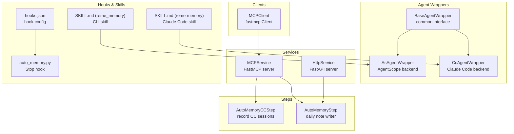

**Diagram sources**
- [base_agent_wrapper.py:18-83](file://reme/components/agent_wrapper/base_agent_wrapper.py#L18-L83)
- [as_agent_wrapper.py:89-371](file://reme/components/agent_wrapper/as_agent_wrapper.py#L89-L371)
- [cc_agent_wrapper.py:132-607](file://reme/components/agent_wrapper/cc_agent_wrapper.py#L132-L607)
- [mcp_service.py:110-167](file://reme/components/service/mcp_service.py#L110-L167)
- [http_service.py:32-108](file://reme/components/service/http_service.py#L32-L108)
- [mcp_client.py:18-128](file://reme/components/client/mcp_client.py#L18-L128)
- [hooks.json:1-17](file://plugins/reme/hooks/hooks.json#L1-L17)
- [auto_memory.py:140-174](file://plugins/reme/hooks/auto_memory.py#L140-L174)
- [SKILL.md (reme-memory):1-59](file://plugins/reme/skills/reme-memory/SKILL.md#L1-L59)
- [SKILL.md (reme_memory):1-100](file://skills/reme_memory/SKILL.md#L1-L100)
- [auto_memory_cc.py:49-184](file://reme/steps/evolve/auto_memory_cc.py#L49-L184)
- [auto_memory.py:37-326](file://reme/steps/evolve/auto_memory.py#L37-L326)

**Section sources**
- [base_agent_wrapper.py:18-83](file://reme/components/agent_wrapper/base_agent_wrapper.py#L18-L83)
- [as_agent_wrapper.py:89-371](file://reme/components/agent_wrapper/as_agent_wrapper.py#L89-L371)
- [cc_agent_wrapper.py:132-607](file://reme/components/agent_wrapper/cc_agent_wrapper.py#L132-L607)
- [mcp_service.py:110-167](file://reme/components/service/mcp_service.py#L110-L167)
- [http_service.py:32-108](file://reme/components/service/http_service.py#L32-L108)
- [mcp_client.py:18-128](file://reme/components/client/mcp_client.py#L18-L128)
- [hooks.json:1-17](file://plugins/reme/hooks/hooks.json#L1-L17)
- [auto_memory.py:140-174](file://plugins/reme/hooks/auto_memory.py#L140-L174)
- [SKILL.md (reme-memory):1-59](file://plugins/reme/skills/reme-memory/SKILL.md#L1-L59)
- [SKILL.md (reme_memory):1-100](file://skills/reme_memory/SKILL.md#L1-L100)
- [auto_memory_cc.py:49-184](file://reme/steps/evolve/auto_memory_cc.py#L49-L184)
- [auto_memory.py:37-326](file://reme/steps/evolve/auto_memory.py#L37-L326)

## Core Components
- Unified Agent Wrapper: BaseAgentWrapper defines a common interface for agent backends, including methods to set prompts, attach job tools, attach skills, and stream unified chunks.
- AgentScope Backend: AsAgentWrapper integrates AgentScope, building agents with tools, skills, permissions, and session persistence.
- Claude Code Backend: CcAgentWrapper integrates Claude Code SDK, handling MCP tool exposure, session storage, structured output, and streaming events.
- Service Layer: MCPService exposes jobs as MCP tools; HttpService exposes jobs as JSON or SSE endpoints.
- Client Layer: MCPClient provides a programmatic client for MCP services.
- Hooks and Skills: hooks.json configures Claude Code Stop hooks; SKILL.md files define capabilities for Claude Code and CLI integrations.
- Orchestration Steps: AutoMemoryCCStep and AutoMemoryStep coordinate session recording and daily note creation.

**Section sources**
- [base_agent_wrapper.py:18-83](file://reme/components/agent_wrapper/base_agent_wrapper.py#L18-L83)
- [as_agent_wrapper.py:89-371](file://reme/components/agent_wrapper/as_agent_wrapper.py#L89-L371)
- [cc_agent_wrapper.py:132-607](file://reme/components/agent_wrapper/cc_agent_wrapper.py#L132-L607)
- [mcp_service.py:110-167](file://reme/components/service/mcp_service.py#L110-L167)
- [http_service.py:32-108](file://reme/components/service/http_service.py#L32-L108)
- [mcp_client.py:18-128](file://reme/components/client/mcp_client.py#L18-L128)
- [hooks.json:1-17](file://plugins/reme/hooks/hooks.json#L1-L17)
- [SKILL.md (reme-memory):1-59](file://plugins/reme/skills/reme-memory/SKILL.md#L1-L59)
- [auto_memory_cc.py:49-184](file://reme/steps/evolve/auto_memory_cc.py#L49-L184)
- [auto_memory.py:37-326](file://reme/steps/evolve/auto_memory.py#L37-L326)

## Architecture Overview
The system separates concerns:
- Agent backends implement a unified interface for replies and streaming
- Services publish jobs as tools/endpoints
- Clients consume services programmatically
- Hooks automate workflows triggered by agent actions
- Skills define capabilities for Claude Code

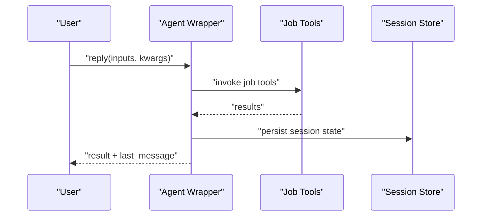

**Diagram sources**
- [base_agent_wrapper.py:77-83](file://reme/components/agent_wrapper/base_agent_wrapper.py#L77-L83)
- [as_agent_wrapper.py:243-269](file://reme/components/agent_wrapper/as_agent_wrapper.py#L243-L269)
- [cc_agent_wrapper.py:489-510](file://reme/components/agent_wrapper/cc_agent_wrapper.py#L489-L510)

## Detailed Component Analysis

### Agent Wrapper System
The agent wrapper system provides a unified interface across backends:
- BaseAgentWrapper: defines common methods and utilities for setting prompts, attaching tools and skills, and streaming unified chunks.
- AsAgentWrapper: builds AgentScope agents with tools, skills, permissions, and session persistence; converts AgentScope events to unified chunks.
- CcAgentWrapper: builds Claude Code options, exposes MCP tools, persists sessions, and converts Claude events to unified chunks.

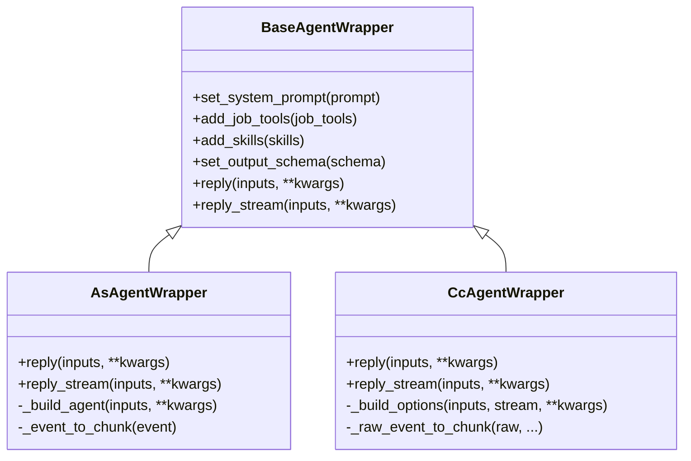

**Diagram sources**
- [base_agent_wrapper.py:18-83](file://reme/components/agent_wrapper/base_agent_wrapper.py#L18-L83)
- [as_agent_wrapper.py:89-371](file://reme/components/agent_wrapper/as_agent_wrapper.py#L89-L371)
- [cc_agent_wrapper.py:132-607](file://reme/components/agent_wrapper/cc_agent_wrapper.py#L132-L607)

**Section sources**
- [base_agent_wrapper.py:18-83](file://reme/components/agent_wrapper/base_agent_wrapper.py#L18-L83)
- [as_agent_wrapper.py:89-371](file://reme/components/agent_wrapper/as_agent_wrapper.py#L89-L371)
- [cc_agent_wrapper.py:132-607](file://reme/components/agent_wrapper/cc_agent_wrapper.py#L132-L607)

### Hook-Based Integration Mechanism
Claude Code integrates with ReMe via a Stop hook:
- hooks.json registers a Stop hook that invokes a Python script
- auto_memory.py reads the session_id from stdin, detaches, and calls the ReMe MCP server’s auto_memory_cc tool
- The MCP server routes the tool to AutoMemoryCCStep, which resolves the Claude Code session and records it into ReMe’s daily notes

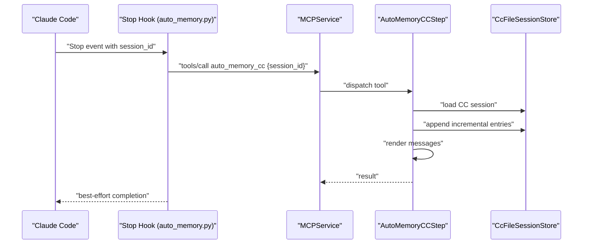

**Diagram sources**
- [hooks.json:1-17](file://plugins/reme/hooks/hooks.json#L1-L17)
- [auto_memory.py:140-174](file://plugins/reme/hooks/auto_memory.py#L140-L174)
- [mcp_service.py:110-167](file://reme/components/service/mcp_service.py#L110-L167)
- [auto_memory_cc.py:49-184](file://reme/steps/evolve/auto_memory_cc.py#L49-L184)

**Section sources**
- [hooks.json:1-17](file://plugins/reme/hooks/hooks.json#L1-L17)
- [auto_memory.py:140-174](file://plugins/reme/hooks/auto_memory.py#L140-L174)
- [mcp_service.py:110-167](file://reme/components/service/mcp_service.py#L110-L167)
- [auto_memory_cc.py:49-184](file://reme/steps/evolve/auto_memory_cc.py#L49-L184)

### SKILL-Based Agent Capability Definition
Skills define capabilities surfaced to Claude Code:
- reme-memory SKILL describes how to recall ReMe memory via MCP tools
- The skill instructs Claude Code to start the MCP service and lists available tools
- The skill’s URL and transport are configured in .mcp.json

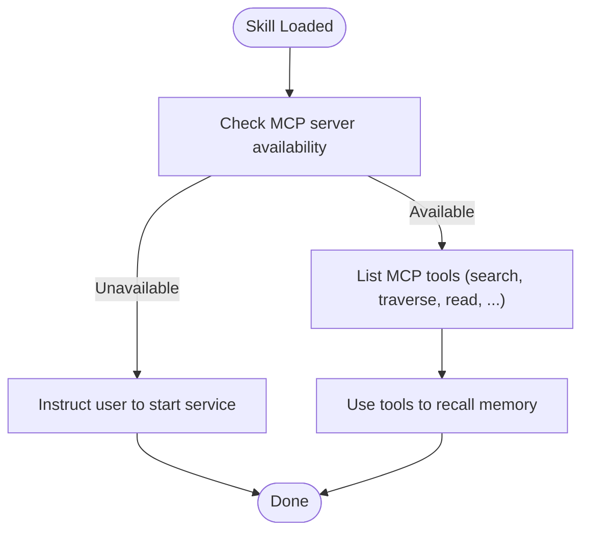

**Diagram sources**
- [SKILL.md (reme-memory):1-59](file://plugins/reme/skills/reme-memory/SKILL.md#L1-L59)
- [.mcp.json:1-9](file://plugins/reme/.mcp.json#L1-L9)

**Section sources**
- [SKILL.md (reme-memory):1-59](file://plugins/reme/skills/reme-memory/SKILL.md#L1-L59)
- [.mcp.json:1-9](file://plugins/reme/.mcp.json#L1-L9)

### MCP Service Implementation
MCPService exposes jobs as MCP tools:
- Builds a FastMCP server and publishes a ChannelSink for workspace change notifications
- Registers non-stream jobs as tools; StreamJobs are unsupported
- Supports stdio, SSE, and streamable-http transports

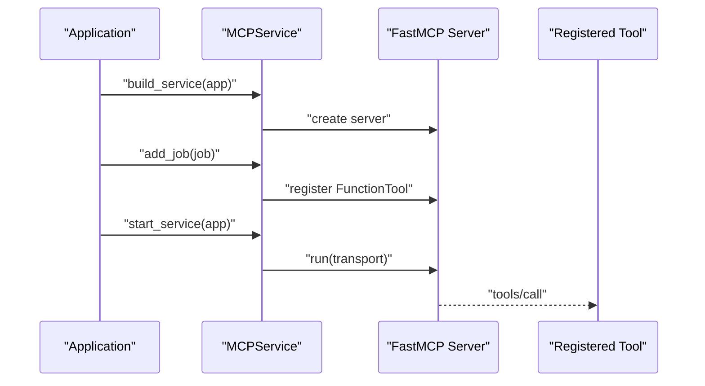

**Diagram sources**
- [mcp_service.py:110-167](file://reme/components/service/mcp_service.py#L110-L167)

**Section sources**
- [mcp_service.py:110-167](file://reme/components/service/mcp_service.py#L110-L167)

### HTTP API for Programmatic Access
HttpService exposes jobs as JSON or SSE endpoints:
- Non-stream jobs: POST /{job.name} returns JSON Response
- StreamJobs: POST /{job.name} streams text/event-stream
- Permissive CORS is enabled

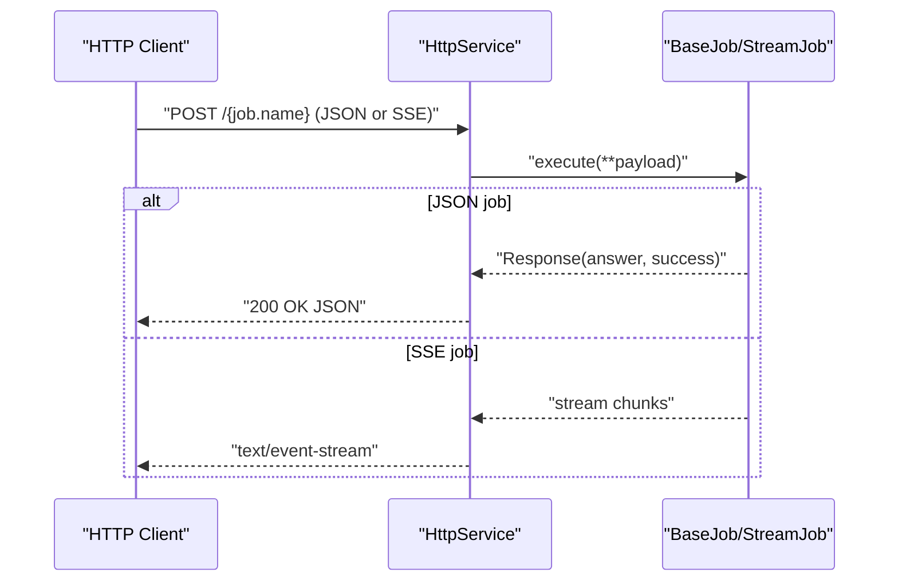

**Diagram sources**
- [http_service.py:32-108](file://reme/components/service/http_service.py#L32-L108)

**Section sources**
- [http_service.py:32-108](file://reme/components/service/http_service.py#L32-L108)

### MCP Client for Programmatic Access
MCPClient provides a client for MCP services:
- Supports SSE, stdio, and streamable-http transports
- Resolves host/port from environment or defaults
- Executes tools and extracts text content from results

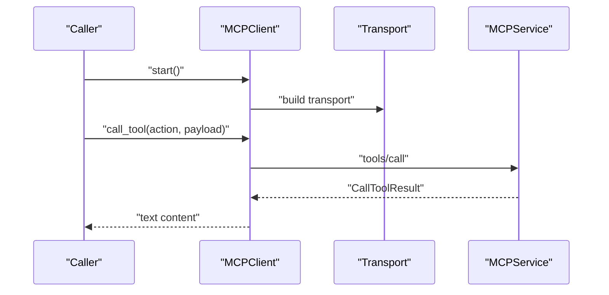

**Diagram sources**
- [mcp_client.py:18-128](file://reme/components/client/mcp_client.py#L18-L128)

**Section sources**
- [mcp_client.py:18-128](file://reme/components/client/mcp_client.py#L18-L128)

### Agent Wrappers for Different Frameworks
- AgentScope integration: AsAgentWrapper constructs AgentScope agents with tools, skills, and permissions; persists state and streams unified chunks.
- Claude Code integration: CcAgentWrapper builds Claude Code options, exposes MCP tools, manages session storage, and streams events.

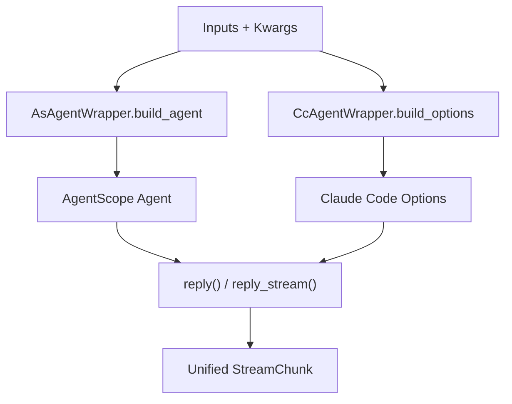

**Diagram sources**
- [as_agent_wrapper.py:205-241](file://reme/components/agent_wrapper/as_agent_wrapper.py#L205-L241)
- [cc_agent_wrapper.py:229-299](file://reme/components/agent_wrapper/cc_agent_wrapper.py#L229-L299)
- [as_agent_wrapper.py:243-371](file://reme/components/agent_wrapper/as_agent_wrapper.py#L243-L371)
- [cc_agent_wrapper.py:489-607](file://reme/components/agent_wrapper/cc_agent_wrapper.py#L489-L607)

**Section sources**
- [as_agent_wrapper.py:205-371](file://reme/components/agent_wrapper/as_agent_wrapper.py#L205-L371)
- [cc_agent_wrapper.py:229-607](file://reme/components/agent_wrapper/cc_agent_wrapper.py#L229-L607)

### Hook Registration and Execution Patterns
- hooks.json declares a Stop hook that executes a command pointing to auto_memory.py
- auto_memory.py reads session_id from stdin, optionally daemonizes, and calls the MCP server’s auto_memory_cc tool
- The MCP server routes to AutoMemoryCCStep, which loads CC sessions, appends increments, renders messages, and triggers AutoMemoryStep

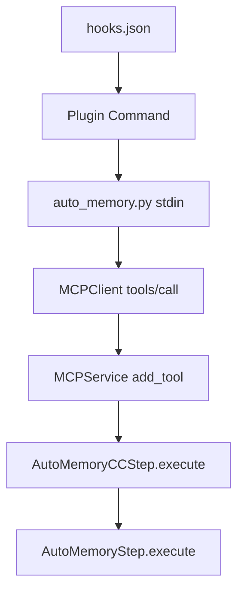

**Diagram sources**
- [hooks.json:1-17](file://plugins/reme/hooks/hooks.json#L1-L17)
- [auto_memory.py:140-174](file://plugins/reme/hooks/auto_memory.py#L140-L174)
- [mcp_service.py:110-167](file://reme/components/service/mcp_service.py#L110-L167)
- [auto_memory_cc.py:49-184](file://reme/steps/evolve/auto_memory_cc.py#L49-L184)
- [auto_memory.py:37-326](file://reme/steps/evolve/auto_memory.py#L37-L326)

**Section sources**
- [hooks.json:1-17](file://plugins/reme/hooks/hooks.json#L1-L17)
- [auto_memory.py:140-174](file://plugins/reme/hooks/auto_memory.py#L140-L174)
- [mcp_service.py:110-167](file://reme/components/service/mcp_service.py#L110-L167)
- [auto_memory_cc.py:49-184](file://reme/steps/evolve/auto_memory_cc.py#L49-L184)
- [auto_memory.py:37-326](file://reme/steps/evolve/auto_memory.py#L37-L326)

### Skill Definition Formats
- Claude Code skills: defined via SKILL.md with name, description, and usage instructions; surface MCP tools when the server is running
- CLI skills: defined via SKILL.md for the reme CLI, documenting retrieval and writing memory commands

**Section sources**
- [SKILL.md (reme-memory):1-59](file://plugins/reme/skills/reme-memory/SKILL.md#L1-L59)
- [SKILL.md (reme_memory):1-100](file://skills/reme_memory/SKILL.md#L1-L100)

## Dependency Analysis
The system relies on a global registry and component lifecycle:
- ComponentRegistry maps component types to classes and supports decorators
- BaseComponent provides dependency injection, lifecycle control, and workspace helpers
- Agent wrappers depend on LLM components and job tools; services depend on jobs; clients depend on transports

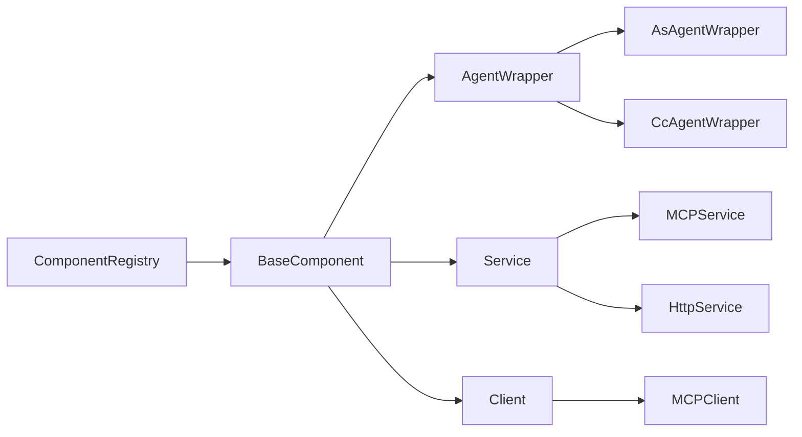

**Diagram sources**
- [component_registry.py:12-85](file://reme/components/component_registry.py#L12-L85)
- [base_component.py:85-255](file://reme/components/base_component.py#L85-L255)
- [as_agent_wrapper.py:89-371](file://reme/components/agent_wrapper/as_agent_wrapper.py#L89-L371)
- [cc_agent_wrapper.py:132-607](file://reme/components/agent_wrapper/cc_agent_wrapper.py#L132-L607)
- [mcp_service.py:110-167](file://reme/components/service/mcp_service.py#L110-L167)
- [http_service.py:32-108](file://reme/components/service/http_service.py#L32-L108)
- [mcp_client.py:18-128](file://reme/components/client/mcp_client.py#L18-L128)

**Section sources**
- [component_registry.py:12-85](file://reme/components/component_registry.py#L12-L85)
- [base_component.py:85-255](file://reme/components/base_component.py#L85-L255)
- [as_agent_wrapper.py:89-371](file://reme/components/agent_wrapper/as_agent_wrapper.py#L89-L371)
- [cc_agent_wrapper.py:132-607](file://reme/components/agent_wrapper/cc_agent_wrapper.py#L132-L607)
- [mcp_service.py:110-167](file://reme/components/service/mcp_service.py#L110-L167)
- [http_service.py:32-108](file://reme/components/service/http_service.py#L32-L108)
- [mcp_client.py:18-128](file://reme/components/client/mcp_client.py#L18-L128)

## Performance Considerations
- Session persistence: both AgentScope and Claude Code backends persist sessions to disk; consider retention policies and cleanup strategies
- Streaming: unified chunk conversion minimizes overhead; ensure clients handle partial messages efficiently
- Tool invocation: avoid redundant tool calls; cache environment variables and credentials where appropriate
- Concurrency: lifecycle management uses locks; avoid blocking operations in hot paths

## Troubleshooting Guide
Common issues and remedies:
- Missing MCP server: ensure the server is running and reachable; verify host/port configuration
- Session ID validation: Claude Code sessions must be valid UUIDs; errors arise if malformed
- Rate limits and errors: MCP and Claude Code streams may surface rate limit or error events; handle gracefully
- Hook failures: Stop hooks run best-effort; check logs and environment variables for service URLs

**Section sources**
- [mcp_service.py:47-107](file://reme/components/service/mcp_service.py#L47-L107)
- [cc_agent_wrapper.py:129-154](file://reme/components/agent_wrapper/cc_agent_wrapper.py#L129-L154)
- [auto_memory.py:140-174](file://plugins/reme/hooks/auto_memory.py#L140-L174)

## Conclusion
ReMe’s agent integration system provides a unified abstraction across AgentScope and Claude Code, enabling consistent agent interactions, robust session management, and automated workflows through hooks. The MCP and HTTP services offer flexible programmatic access, while skills define clear capabilities for Claude Code. Following the patterns documented here ensures reliable integration and extensible automation.

## Appendices
- Practical examples:
  - Integrate with AgentScope: instantiate AsAgentWrapper, bind an LLM, add job tools and skills, and call reply or reply_stream
  - Integrate with Claude Code: configure skills via SKILL.md, expose MCP tools, and use hooks to record sessions
  - Configure hooks: define Stop hooks in hooks.json and implement the hook script to call MCP tools
  - Define custom skills: create SKILL.md files describing tools and usage instructions
- Best practices:
  - Keep session IDs valid and manage retention
  - Use structured output schemas for deterministic results
  - Prefer MCP for Claude Code; use HTTP for general-purpose automation
  - Log and monitor hook executions for reliability