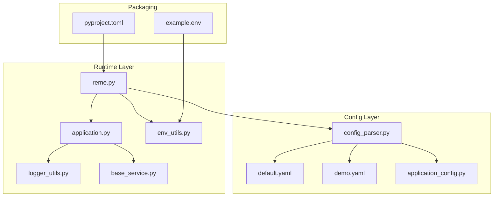
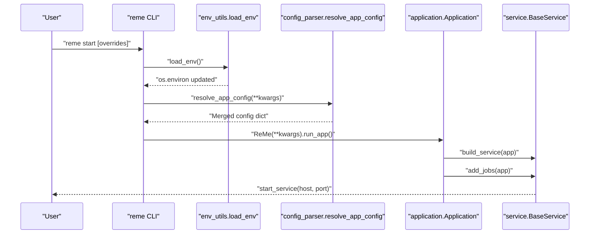
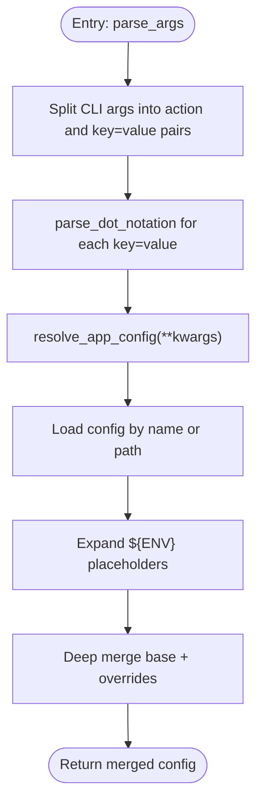
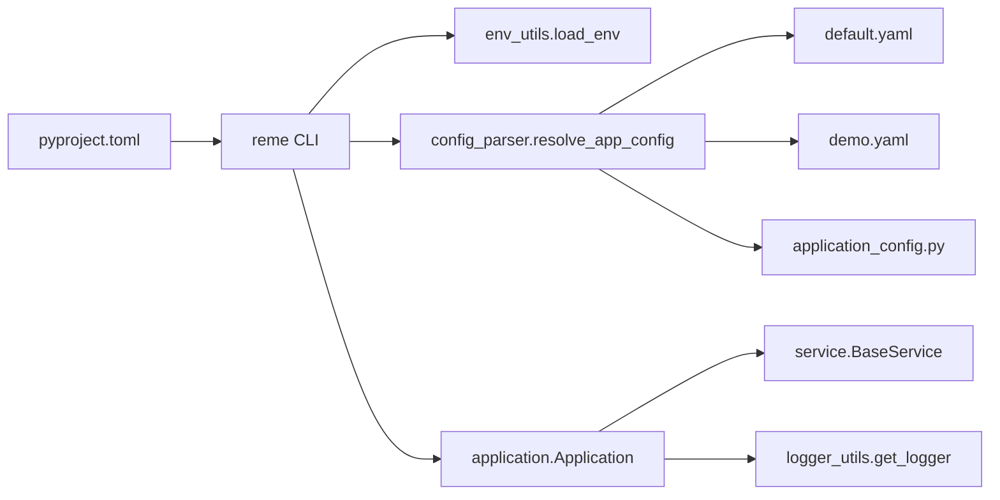

# Configuration and Deployment

<cite>
**Referenced Files in This Document**
- [reme/config/config_parser.py](file://reme/config/config_parser.py)
- [reme/config/default.yaml](file://reme/config/default.yaml)
- [reme/config/demo.yaml](file://reme/config/demo.yaml)
- [reme/schema/application_config.py](file://reme/schema/application_config.py)
- [reme/utils/env_utils.py](file://reme/utils/env_utils.py)
- [reme/application.py](file://reme/application.py)
- [reme/reme.py](file://reme/reme.py)
- [reme/components/service/base_service.py](file://reme/components/service/base_service.py)
- [reme/utils/logger_utils.py](file://reme/utils/logger_utils.py)
- [pyproject.toml](file://pyproject.toml)
- [example.env](file://example.env)
- [README.md](file://README.md)
- [tests/unit/test_config_parser.py](file://tests/unit/test_config_parser.py)
</cite>

## Table of Contents
1. [Introduction](#introduction)
2. [Project Structure](#project-structure)
3. [Core Components](#core-components)
4. [Architecture Overview](#architecture-overview)
5. [Detailed Component Analysis](#detailed-component-analysis)
6. [Dependency Analysis](#dependency-analysis)
7. [Performance Considerations](#performance-considerations)
8. [Troubleshooting Guide](#troubleshooting-guide)
9. [Conclusion](#conclusion)
10. [Appendices](#appendices)

## Introduction
This document explains how ReMe manages configuration and deploys across environments. It covers the YAML-based configuration system, environment variable interpolation, default configuration options, the configuration parser implementation, parameter validation, and inheritance patterns. It also documents deployment strategies for local development, production, containers, and cloud platforms, along with practical examples and troubleshooting guidance.

## Project Structure
ReMe organizes configuration and deployment support primarily in:
- Configuration parser and built-in YAML configs
- Typed application configuration schema
- Environment variable loading utilities
- Application lifecycle and service wiring
- Packaging and CLI entrypoint
- Logging configuration

**Diagram sources**
- [reme/config/config_parser.py:1-231](file://reme/config/config_parser.py#L1-L231)
- [reme/config/default.yaml:1-672](file://reme/config/default.yaml#L1-L672)
- [reme/config/demo.yaml:1-64](file://reme/config/demo.yaml#L1-L64)
- [reme/schema/application_config.py:1-50](file://reme/schema/application_config.py#L1-L50)
- [reme/application.py:1-254](file://reme/application.py#L1-L254)
- [reme/reme.py:1-49](file://reme/reme.py#L1-L49)
- [reme/utils/env_utils.py:1-60](file://reme/utils/env_utils.py#L1-L60)
- [reme/utils/logger_utils.py:1-109](file://reme/utils/logger_utils.py#L1-L109)
- [reme/components/service/base_service.py:1-84](file://reme/components/service/base_service.py#L1-L84)
- [pyproject.toml:1-90](file://pyproject.toml#L1-L90)
- [example.env:1-5](file://example.env#L1-L5)

**Section sources**
- [reme/config/config_parser.py:1-231](file://reme/config/config_parser.py#L1-L231)
- [reme/config/default.yaml:1-672](file://reme/config/default.yaml#L1-L672)
- [reme/config/demo.yaml:1-64](file://reme/config/demo.yaml#L1-L64)
- [reme/schema/application_config.py:1-50](file://reme/schema/application_config.py#L1-L50)
- [reme/application.py:1-254](file://reme/application.py#L1-L254)
- [reme/reme.py:1-49](file://reme/reme.py#L1-L49)
- [reme/utils/env_utils.py:1-60](file://reme/utils/env_utils.py#L1-L60)
- [reme/utils/logger_utils.py:1-109](file://reme/utils/logger_utils.py#L1-L109)
- [reme/components/service/base_service.py:1-84](file://reme/components/service/base_service.py#L1-L84)
- [pyproject.toml:1-90](file://pyproject.toml#L1-L90)
- [example.env:1-5](file://example.env#L1-L5)

## Core Components
- Configuration Parser: Loads YAML/JSON configs, expands environment variable placeholders, merges overrides, and resolves application configuration.
- Built-in Configs: Default and demo job definitions shipped with the package.
- Typed Schema: Pydantic models validating application-level configuration fields.
- Environment Utilities: Load .env files and inject values into os.environ.
- Application Lifecycle: Wires components and jobs according to configuration and starts the service.
- Service Layer: Base service interface exposing jobs over network protocols.
- Logging Utilities: Configure console and file logging sinks with environment toggles.
- Packaging and CLI: Installable package with CLI entrypoint and script.

**Section sources**
- [reme/config/config_parser.py:1-231](file://reme/config/config_parser.py#L1-L231)
- [reme/config/default.yaml:1-672](file://reme/config/default.yaml#L1-L672)
- [reme/config/demo.yaml:1-64](file://reme/config/demo.yaml#L1-L64)
- [reme/schema/application_config.py:1-50](file://reme/schema/application_config.py#L1-L50)
- [reme/utils/env_utils.py:1-60](file://reme/utils/env_utils.py#L1-L60)
- [reme/application.py:1-254](file://reme/application.py#L1-L254)
- [reme/components/service/base_service.py:1-84](file://reme/components/service/base_service.py#L1-L84)
- [reme/utils/logger_utils.py:1-109](file://reme/utils/logger_utils.py#L1-L109)
- [pyproject.toml:1-90](file://pyproject.toml#L1-L90)

## Architecture Overview
The configuration and deployment pipeline connects CLI invocation to configuration resolution, environment injection, typed validation, component instantiation, and service exposure.

**Diagram sources**
- [reme/reme.py:32-49](file://reme/reme.py#L32-L49)
- [reme/utils/env_utils.py:35-60](file://reme/utils/env_utils.py#L35-L60)
- [reme/config/config_parser.py:204-231](file://reme/config/config_parser.py#L204-L231)
- [reme/application.py:250-254](file://reme/application.py#L250-L254)
- [reme/components/service/base_service.py:79-84](file://reme/components/service/base_service.py#L79-L84)

## Detailed Component Analysis

### Configuration Parser Implementation
The parser supports:
- Loading built-in configs by name or absolute/relative paths
- Environment variable interpolation with defaults using ${VAR} and ${VAR:-default}
- Dot-notation CLI overrides (e.g., service.port=8181)
- Recursive merging of configs and overrides
- Type conversion preserving booleans, numbers, JSON structures, and strings

**Diagram sources**
- [reme/config/config_parser.py:179-231](file://reme/config/config_parser.py#L179-L231)

Key behaviors:
- Environment interpolation: ${VAR} and ${VAR:-default} are expanded recursively in strings, lists, and dicts.
- Type conversion: "true"/"false" to booleans; leading-zero strings remain strings; JSON loads for arrays/dicts/strings.
- Override precedence: CLI dot notation and kwargs override default.yaml; missing values fall back to defaults in the schema.

**Section sources**
- [reme/config/config_parser.py:1-231](file://reme/config/config_parser.py#L1-L231)
- [tests/unit/test_config_parser.py:1-77](file://tests/unit/test_config_parser.py#L1-L77)

### Default Configuration Options
The default configuration defines:
- Service backend selection
- Jobs for indexing, resource watching, digest watching, cron dreams, and various operations
- Component backends for tokenizers, embeddings, embedding stores, LLMs, agent wrappers, file catalogs, chunkers, keyword indices, and file stores
- Environment variable placeholders embedded in component credentials and URLs

Practical examples:
- Set LLM provider and model via environment variables referenced in default.yaml.
- Adjust job watch directories and suffixes to match your workspace layout.
- Customize component parameters such as dimensions, max tokens, and context sizes.

**Section sources**
- [reme/config/default.yaml:1-672](file://reme/config/default.yaml#L1-L672)

### Typed Application Configuration Schema
The schema enforces:
- Application-level fields: app_name, workspace_dir, metadata_dir, session_dir, resource_dir, daily_dir, digest_dir, enable_logo, timezone, language, log preferences, MCP servers, service config, jobs, thread pool workers, and components registry
- ComponentConfig and JobConfig define backend selection and step sequences
- Defaults are applied from environment variables (e.g., APP_NAME) and YAML where applicable

Validation and defaults:
- Missing required fields are filled by defaults; environment variables can override defaults
- Backend selection validated at runtime via component registry lookup

**Section sources**
- [reme/schema/application_config.py:1-50](file://reme/schema/application_config.py#L1-L50)

### Environment Variable Handling
Environment utilities:
- Load .env files from current directory upward with a bounded search depth
- Idempotent loading: subsequent calls without explicit path return previously loaded values
- Values are injected into os.environ unless already present (unless override is enabled)

Interpolation in configs:
- default.yaml embeds ${VAR} and ${VAR:-default} placeholders for API keys, base URLs, and model names
- The parser expands these placeholders during config load

Best practices:
- Keep secrets in .env files outside version control
- Use ${VAR:-default} to provide safe fallbacks for optional values
- Prefer environment variables for sensitive or environment-specific values

**Section sources**
- [reme/utils/env_utils.py:1-60](file://reme/utils/env_utils.py#L1-L60)
- [reme/config/default.yaml:588-634](file://reme/config/default.yaml#L588-L634)
- [example.env:1-5](file://example.env#L1-L5)

### Parameter Validation and Inheritance Patterns
- Dot-notation overrides are parsed into nested dictionaries and merged with base configs
- Deep merge ensures nested dictionaries are combined; scalar values overwrite nested dicts and vice versa
- Runtime validation occurs when components are instantiated (backend presence, type compatibility)

Common patterns:
- Use config.name=value to override top-level fields
- Use dot notation to target nested fields (e.g., service.port=8181)
- Combine environment variables and YAML defaults for flexible deployments

**Section sources**
- [reme/config/config_parser.py:61-118](file://reme/config/config_parser.py#L61-L118)
- [reme/config/config_parser.py:159-167](file://reme/config/config_parser.py#L159-L167)
- [tests/unit/test_config_parser.py:33-44](file://tests/unit/test_config_parser.py#L33-L44)

### Service Exposure and Runtime Wiring
- The application initializes workspace directories, logs, service, components, and jobs
- The service builds endpoints/tools from jobs marked enable_serve
- The BaseService lifecycle manages startup/shutdown and publishes service info via environment

Operational notes:
- Host/port are controlled by service configuration; the service publishes its address for discovery
- Jobs are registered based on enable_serve flags

**Section sources**
- [reme/application.py:47-87](file://reme/application.py#L47-L87)
- [reme/application.py:171-209](file://reme/application.py#L171-L209)
- [reme/components/service/base_service.py:48-84](file://reme/components/service/base_service.py#L48-L84)

### Logging Configuration
Logging supports:
- Console and file sinks
- Rotation and retention policies
- Environment toggle to disable Loguru and fall back to stdlib logging
- Global logger initialization with optional forced re-init

**Section sources**
- [reme/utils/logger_utils.py:1-109](file://reme/utils/logger_utils.py#L1-L109)

## Dependency Analysis
The configuration system relies on:
- Pydantic for typed configuration validation
- PyYAML for YAML parsing and JSON for structured overrides
- Environment utilities for .env loading
- Component registry for backend resolution
- Packaging metadata for CLI entrypoints

**Diagram sources**
- [pyproject.toml:67-68](file://pyproject.toml#L67-L68)
- [reme/reme.py:32-49](file://reme/reme.py#L32-L49)
- [reme/utils/env_utils.py:35-60](file://reme/utils/env_utils.py#L35-L60)
- [reme/config/config_parser.py:204-231](file://reme/config/config_parser.py#L204-L231)
- [reme/config/default.yaml:1-672](file://reme/config/default.yaml#L1-L672)
- [reme/config/demo.yaml:1-64](file://reme/config/demo.yaml#L1-L64)
- [reme/schema/application_config.py:1-50](file://reme/schema/application_config.py#L1-L50)
- [reme/application.py:1-254](file://reme/application.py#L1-L254)
- [reme/utils/logger_utils.py:91-109](file://reme/utils/logger_utils.py#L91-L109)

**Section sources**
- [pyproject.toml:1-90](file://pyproject.toml#L1-L90)
- [reme/reme.py:1-49](file://reme/reme.py#L1-L49)
- [reme/config/config_parser.py:1-231](file://reme/config/config_parser.py#L1-L231)
- [reme/application.py:1-254](file://reme/application.py#L1-L254)

## Performance Considerations
- Environment variable expansion happens once per config load; cache results by avoiding repeated loads where possible.
- Logging file rotation and compression occur at midnight; tune retention and compression for storage constraints.
- Thread pool sizing affects concurrency; set thread_pool_max_workers appropriately for workload characteristics.
- Job scheduling and background watchers should align with workspace scale to avoid excessive I/O.

## Troubleshooting Guide
Common issues and resolutions:
- Undefined environment variables in configs: Ensure ${VAR} or ${VAR:-default} placeholders are satisfied; the parser raises errors for missing required variables without defaults.
- Invalid dot notation overrides: Verify key=value format and non-empty path segments.
- Non-mapping root in config files: Root must be a dictionary/object; fix YAML/JSON structure.
- Backend not found: Confirm backend names match registered components; check component registry and backend class availability.
- Port conflicts: Change service.port in configuration or via CLI overrides.
- Missing .env values: Confirm .env file location and that load_env() is called before config resolution.

**Section sources**
- [tests/unit/test_config_parser.py:33-53](file://tests/unit/test_config_parser.py#L33-L53)
- [reme/config/config_parser.py:20-29](file://reme/config/config_parser.py#L20-L29)
- [reme/reme.py:36-40](file://reme/reme.py#L36-L40)

## Conclusion
ReMe’s configuration system blends YAML-based defaults with environment-driven customization and CLI overrides. The typed schema ensures correctness, while the parser and registry provide robust resolution and instantiation. With clear separation of concerns—configuration, environment, schema, and runtime—the system supports flexible deployment across local, containerized, and cloud environments.

## Appendices

### Practical Examples

- Local development setup
  - Create a .env file with API keys and base URLs.
  - Run the service with defaults: reme start
  - Override port: reme start service.port=8181

- Production deployment
  - Use environment variables for secrets and endpoints.
  - Pin component backends and parameters in default.yaml; override selectively via CLI.
  - Enable/disable jobs via enable_serve flags.

- Containerization
  - Mount a volume for workspace_dir to persist state.
  - Pass environment variables via container runtime.
  - Expose service.port and bind host as needed.

- Cloud deployment
  - Use platform-specific secret managers to populate environment variables.
  - Scale thread pools and replicas based on workload.
  - Monitor logs via file rotation and centralized logging.

- Example environment variables
  - EMBEDDING_API_KEY, EMBEDDING_BASE_URL
  - LLM_API_KEY, LLM_BASE_URL
  - CLAUDE_CODE_* for Claude Code integration

**Section sources**
- [README.md:73-104](file://README.md#L73-L104)
- [example.env:1-5](file://example.env#L1-L5)
- [reme/config/default.yaml:588-634](file://reme/config/default.yaml#L588-L634)
- [reme/utils/env_utils.py:35-60](file://reme/utils/env_utils.py#L35-L60)
- [reme/reme.py:32-49](file://reme/reme.py#L32-L49)