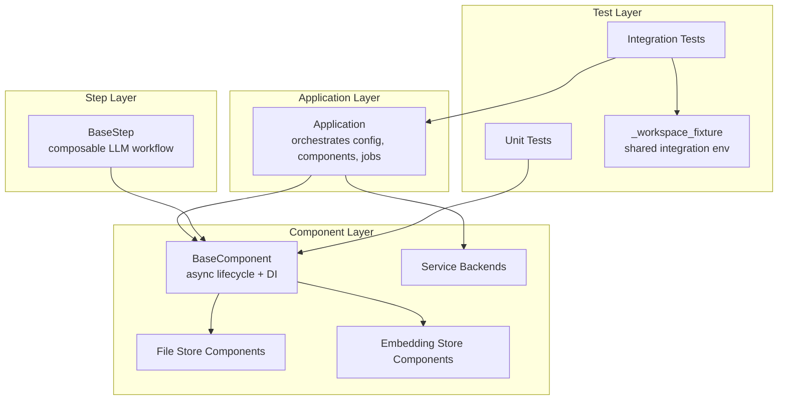
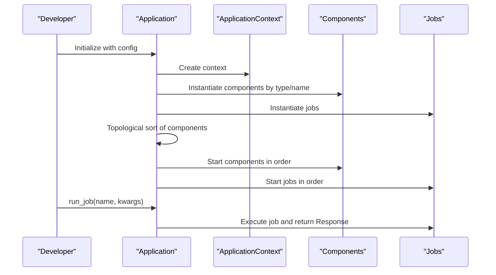
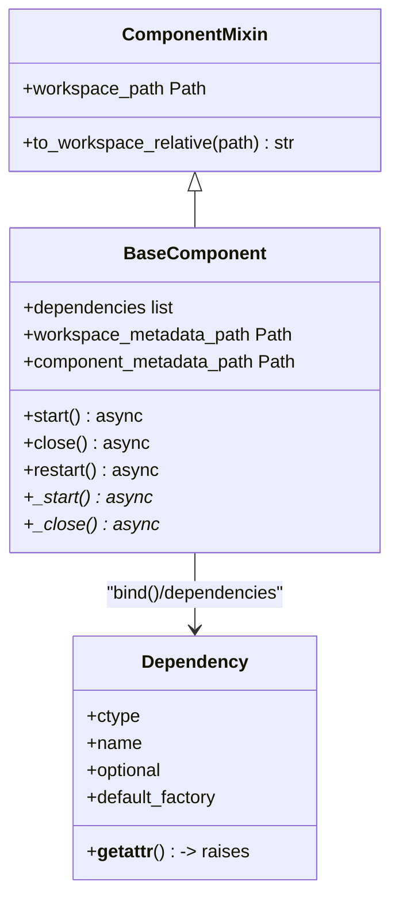
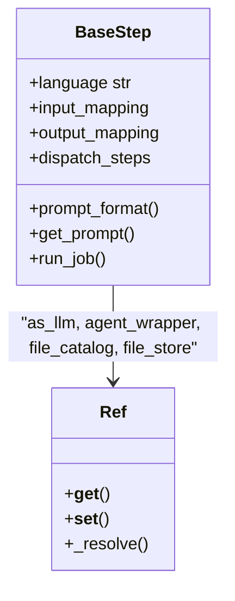
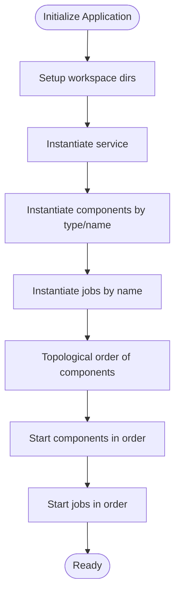
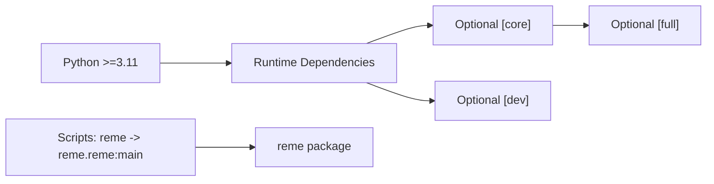
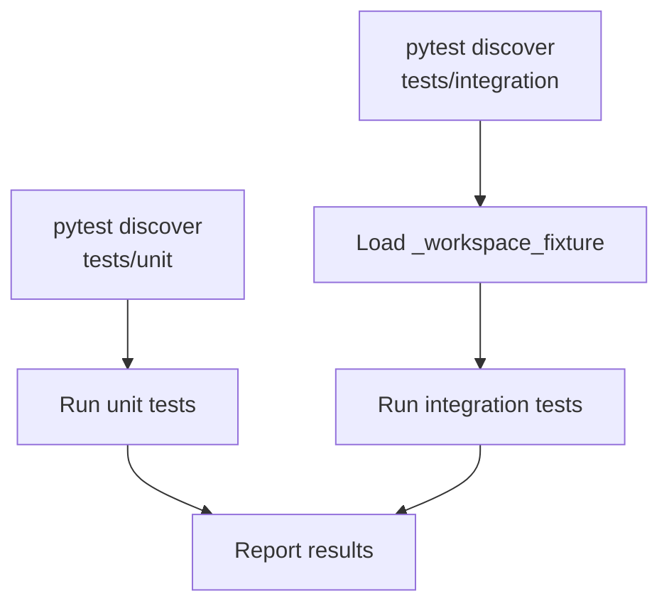
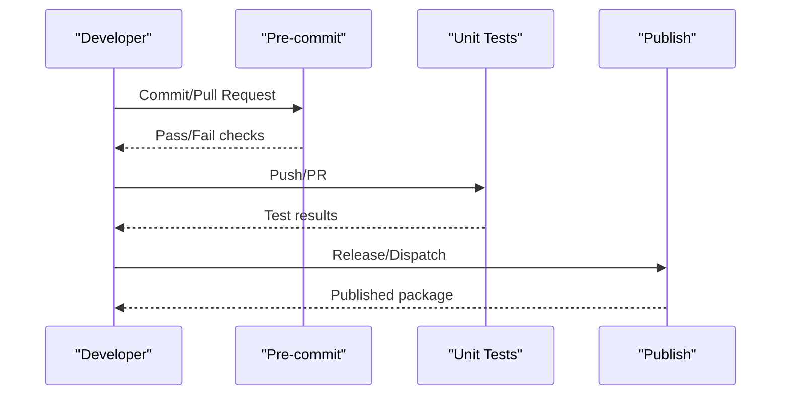

# Development Guide

<cite>
**Referenced Files in This Document**
- [README.md](file://README.md)
- [pyproject.toml](file://pyproject.toml)
- [.pre-commit-config.yaml](file://.pre-commit-config.yaml)
- [.github/workflows/unittest.yml](file://.github/workflows/unittest.yml)
- [.github/workflows/pre-commit.yml](file://.github/workflows/pre-commit.yml)
- [.github/workflows/python-publish.yml](file://.github/workflows/python-publish.yml)
- [reme/__init__.py](file://reme/__init__.py)
- [reme/application.py](file://reme/application.py)
- [reme/components/base_component.py](file://reme/components/base_component.py)
- [reme/steps/base_step.py](file://reme/steps/base_step.py)
- [tests/unit/test_base_component.py](file://tests/unit/test_base_component.py)
- [tests/integration/test_reme_e2e.py](file://tests/integration/test_reme_e2e.py)
- [tests/integration/_workspace_fixture.py](file://tests/integration/_workspace_fixture.py)
</cite>

## Table of Contents
1. [Introduction](#introduction)
2. [Project Structure](#project-structure)
3. [Core Components](#core-components)
4. [Architecture Overview](#architecture-overview)
5. [Detailed Component Analysis](#detailed-component-analysis)
6. [Dependency Analysis](#dependency-analysis)
7. [Performance Considerations](#performance-considerations)
8. [Testing Framework](#testing-framework)
9. [CI/CD Pipeline](#cicd-pipeline)
10. [Contribution Guidelines](#contribution-guidelines)
11. [Development Workflow](#development-workflow)
12. [Debugging and Troubleshooting](#debugging-and-troubleshooting)
13. [Conclusion](#conclusion)

## Introduction
This development guide explains how to contribute to ReMe, set up a development environment, follow coding practices, and operate the testing and CI/CD systems. It covers the project’s layered architecture (Application, Jobs, Steps, Components), coding standards enforced by pre-commit, the test suite (unit and integration), and the continuous integration workflows that validate contributions.

## Project Structure
ReMe is organized around a layered architecture:
- Application orchestrates configuration, components, and jobs.
- Components encapsulate capabilities (e.g., file stores, embedding stores, services).
- Steps implement LLM-driven workflows and compose through dependency injection.
- Tests are split into unit and integration categories with shared fixtures for integration environments.

**Diagram sources**
- [reme/application.py:21-254](file://reme/application.py#L21-L254)
- [reme/components/base_component.py:85-255](file://reme/components/base_component.py#L85-L255)
- [reme/steps/base_step.py:91-216](file://reme/steps/base_step.py#L91-L216)
- [tests/integration/_workspace_fixture.py:362-661](file://tests/integration/_workspace_fixture.py#L362-L661)

**Section sources**
- [README.md:1-261](file://README.md#L1-L261)
- [reme/application.py:21-254](file://reme/application.py#L21-L254)
- [reme/components/base_component.py:85-255](file://reme/components/base_component.py#L85-L255)
- [reme/steps/base_step.py:91-216](file://reme/steps/base_step.py#L91-L216)
- [tests/integration/_workspace_fixture.py:362-661](file://tests/integration/_workspace_fixture.py#L362-L661)

## Core Components
- Application: Initializes workspace directories, constructs service, components, and jobs, enforces dependency order, and manages lifecycle.
- BaseComponent: Provides async lifecycle hooks, dependency binding, and workspace path helpers.
- BaseStep: Defines composable workflow steps with dependency resolution via descriptors and prompt handling.

Key responsibilities:
- Dependency injection and resolution for components and steps.
- Thread pool and job scheduling order (base > stream > background > cron).
- Safe component start/close with owned component cascading.

**Section sources**
- [reme/application.py:21-254](file://reme/application.py#L21-L254)
- [reme/components/base_component.py:85-255](file://reme/components/base_component.py#L85-L255)
- [reme/steps/base_step.py:91-216](file://reme/steps/base_step.py#L91-L216)

## Architecture Overview
The system wires configuration-defined components and jobs into a cohesive runtime. Components are resolved by type and name, and jobs are executed either synchronously or streamed.

**Diagram sources**
- [reme/application.py:47-254](file://reme/application.py#L47-L254)

**Section sources**
- [reme/application.py:47-254](file://reme/application.py#L47-L254)

## Detailed Component Analysis

### BaseComponent and Dependency Injection
BaseComponent defines:
- Dependency placeholders (Dependency) and binding mechanism (bind).
- Lifecycle control (start, close, restart) with thread-safety.
- Workspace path helpers and metadata directories.
- Owned component cascade during close.

**Diagram sources**
- [reme/components/base_component.py:17-255](file://reme/components/base_component.py#L17-L255)

**Section sources**
- [reme/components/base_component.py:85-255](file://reme/components/base_component.py#L85-L255)
- [tests/unit/test_base_component.py:1-373](file://tests/unit/test_base_component.py#L1-L373)

### BaseStep and Prompt Handling
BaseStep provides:
- Descriptor-based lazy resolution of dependencies (Ref) from kwargs, context, or app context.
- Prompt loading and formatting via PromptHandler.
- Dispatching child steps and running jobs from within a step.

**Diagram sources**
- [reme/steps/base_step.py:27-216](file://reme/steps/base_step.py#L27-L216)

**Section sources**
- [reme/steps/base_step.py:91-216](file://reme/steps/base_step.py#L91-L216)

### Application Orchestration
Application:
- Ensures workspace directories exist.
- Instantiates service, components, and jobs.
- Computes dependency order and starts/shuts down in correct order.
- Supports updating component attributes at runtime.

**Diagram sources**
- [reme/application.py:47-254](file://reme/application.py#L47-L254)

**Section sources**
- [reme/application.py:21-254](file://reme/application.py#L21-L254)

## Dependency Analysis
- Python version: 3.11+.
- Core dependencies include FastAPI, uvicorn, agentscope, networkx, neo4j, FAISS, and others.
- Optional extras: core (for advanced integrations), dev (for testing and pre-commit), full (core + dev).
- Scripts define the CLI entry point “reme”.

**Diagram sources**
- [pyproject.toml:1-90](file://pyproject.toml#L1-L90)

**Section sources**
- [pyproject.toml:1-90](file://pyproject.toml#L1-L90)

## Performance Considerations
- Use the thread pool for CPU-bound tasks; configure via application config.
- Prefer streaming jobs for long-running operations to avoid blocking.
- Keep component lifecycles minimal and deterministic to reduce startup/shutdown overhead.
- Use appropriate index types (BM25 vs embeddings) based on workload characteristics.

[No sources needed since this section provides general guidance]

## Testing Framework
- Unit tests: Located under tests/unit/, validated by pytest configuration in pyproject.toml.
- Integration tests: Located under tests/integration/, using a shared workspace fixture to simulate a real workspace and drive end-to-end flows.
- Test execution: pytest discovers tests via configured patterns and paths.

Example test categories:
- Component lifecycle and dependency resolution.
- End-to-end memory loop (auto_memory → auto_dream → search → proactive).

**Diagram sources**
- [pyproject.toml:85-90](file://pyproject.toml#L85-L90)
- [tests/unit/test_base_component.py:1-373](file://tests/unit/test_base_component.py#L1-L373)
- [tests/integration/test_reme_e2e.py:1-217](file://tests/integration/test_reme_e2e.py#L1-L217)
- [tests/integration/_workspace_fixture.py:362-661](file://tests/integration/_workspace_fixture.py#L362-L661)

**Section sources**
- [pyproject.toml:85-90](file://pyproject.toml#L85-L90)
- [tests/unit/test_base_component.py:1-373](file://tests/unit/test_base_component.py#L1-L373)
- [tests/integration/test_reme_e2e.py:1-217](file://tests/integration/test_reme_e2e.py#L1-L217)
- [tests/integration/_workspace_fixture.py:362-661](file://tests/integration/_workspace_fixture.py#L362-L661)

## CI/CD Pipeline
- Pre-commit checks: Enforce formatting, linting, and basic validations across the repository.
- Unit tests: Matrix builds across Python versions (3.11, 3.12, 3.13) on Ubuntu.
- Publishing: Builds and publishes the package to PyPI on release or workflow dispatch.

**Diagram sources**
- [.github/workflows/pre-commit.yml:1-39](file://.github/workflows/pre-commit.yml#L1-L39)
- [.github/workflows/unittest.yml:1-44](file://.github/workflows/unittest.yml#L1-L44)
- [.github/workflows/python-publish.yml:1-41](file://.github/workflows/python-publish.yml#L1-L41)

**Section sources**
- [.github/workflows/pre-commit.yml:1-39](file://.github/workflows/pre-commit.yml#L1-L39)
- [.github/workflows/unittest.yml:1-44](file://.github/workflows/unittest.yml#L1-L44)
- [.github/workflows/python-publish.yml:1-41](file://.github/workflows/python-publish.yml#L1-L41)

## Contribution Guidelines
- Follow the documented contribution guide and code framework.
- Use conventional commits and run pre-commit and pytest locally before submitting PRs.
- For tests requiring external services (LLMs/embeddings), note limitations in the PR description.

**Section sources**
- [README.md:226-234](file://README.md#L226-L234)

## Development Workflow
- Install dependencies with optional extras for development and core features.
- Configure environment variables for LLM and embedding providers.
- Start the service via the CLI and verify health.
- Write unit tests for components and integration tests using the shared workspace fixture.

Practical steps:
- Install: pip install -e ".[dev,core]"
- Environment: create .env with provider keys and base URLs.
- Start: reme start
- Verify: reme version and curl health endpoint.

**Section sources**
- [README.md:55-118](file://README.md#L55-L118)
- [pyproject.toml:42-60](file://pyproject.toml#L42-L60)

## Debugging and Troubleshooting
Common issues and remedies:
- Dependency resolution errors: Ensure component_type is properly set and dependencies are resolvable in context or via default factories.
- Lifecycle errors: Verify start/close idempotency and that owned components are closed in reverse order.
- Integration test flakiness: Use the shared fixture helpers to wait for files and servers; confirm workspace paths and permissions.
- Pre-commit failures: Fix formatting/lint issues reported by black/flake8/pylint; ensure no private keys or invalid files are committed.

**Section sources**
- [reme/components/base_component.py:140-176](file://reme/components/base_component.py#L140-L176)
- [tests/integration/_workspace_fixture.py:505-569](file://tests/integration/_workspace_fixture.py#L505-L569)
- [.pre-commit-config.yaml:1-83](file://.pre-commit-config.yaml#L1-L83)

## Conclusion
This guide outlined ReMe’s architecture, development practices, testing strategy, and CI/CD processes. By following the established patterns—component lifecycle, dependency injection, streaming jobs, and robust testing—you can confidently contribute to ReMe while maintaining code quality and reliability.