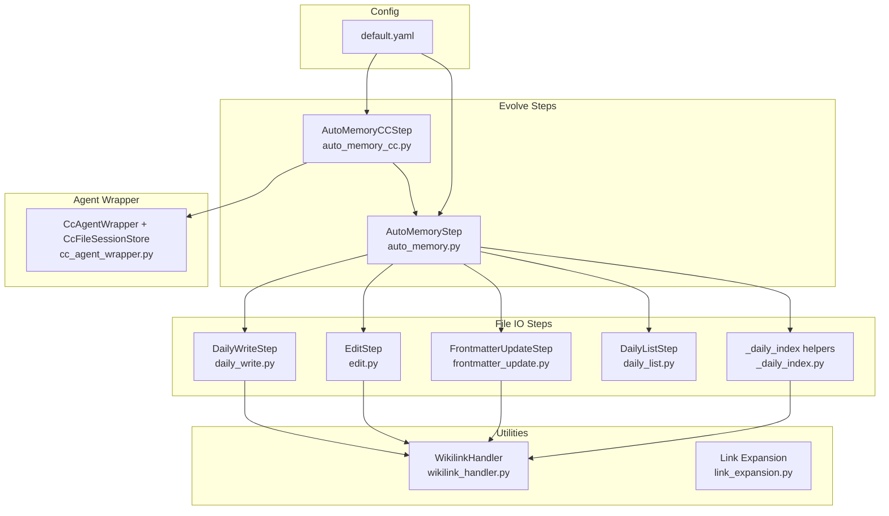
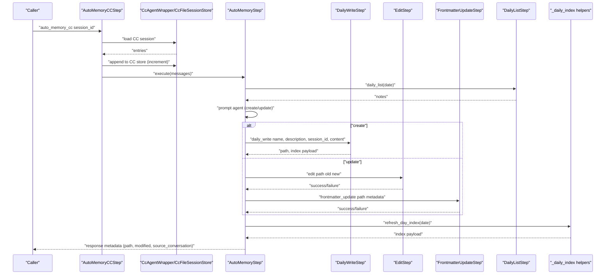
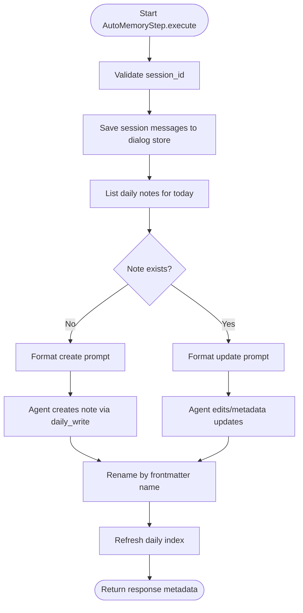
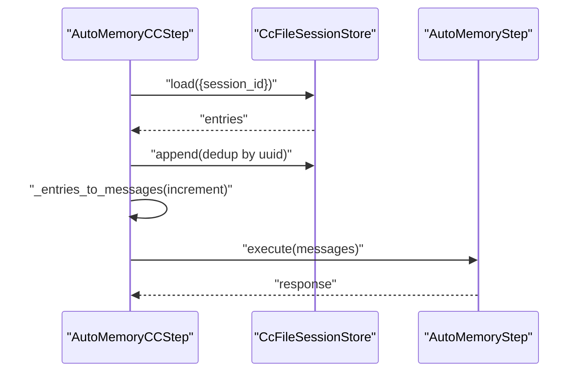
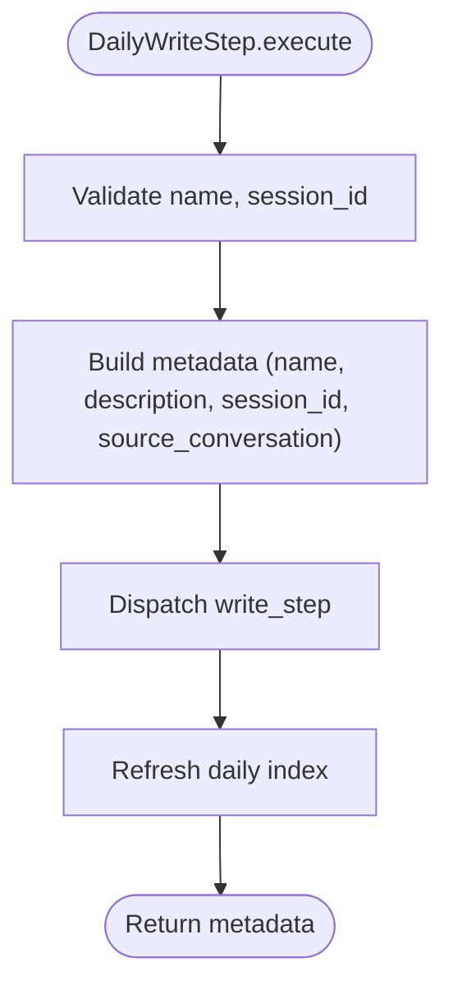
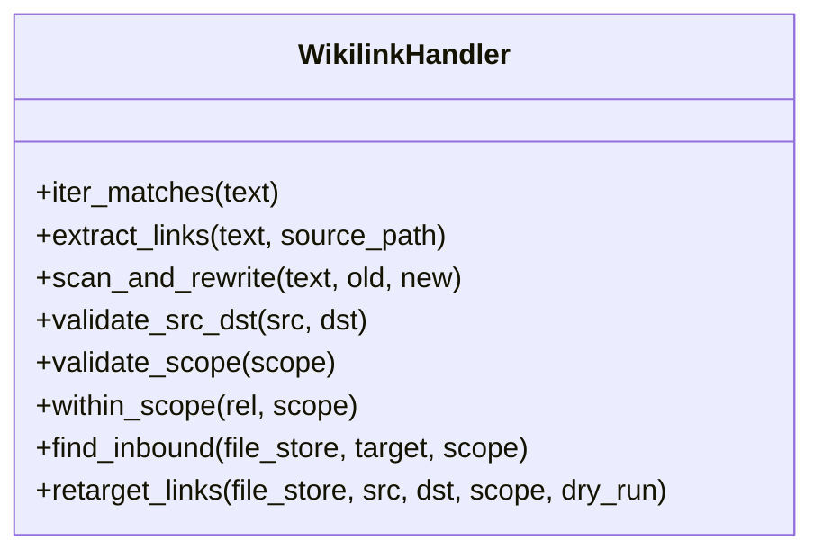
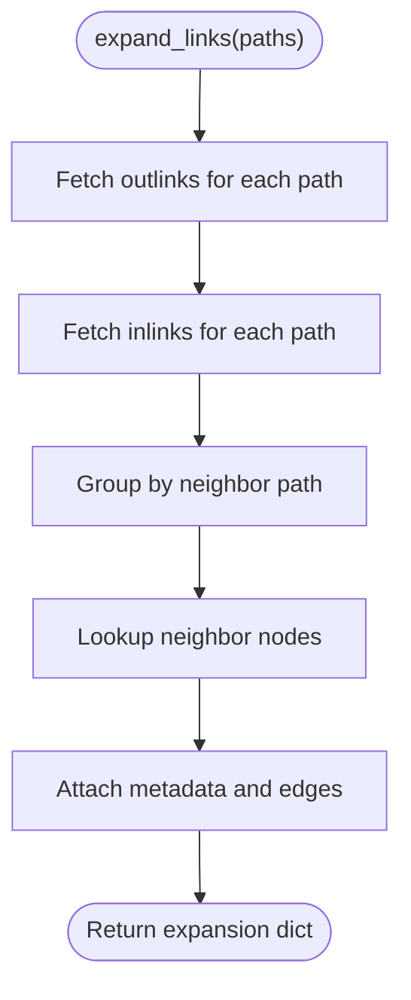
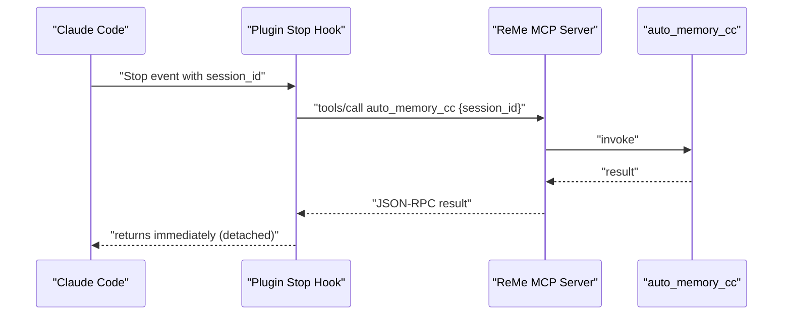
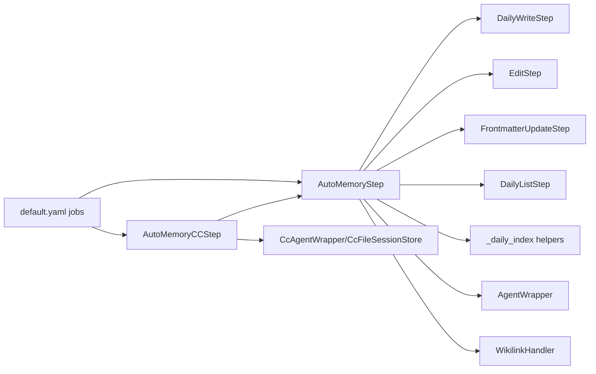

# Auto Memory

<cite>
**Referenced Files in This Document**
- [auto_memory.py](file://reme/steps/evolve/auto_memory.py)
- [auto_memory.yaml](file://reme/steps/evolve/auto_memory.yaml)
- [auto_memory_cc.py](file://reme/steps/evolve/auto_memory_cc.py)
- [auto_memory.py (plugin)](file://plugins/reme/hooks/auto_memory.py)
- [wikilink_handler.py](file://reme/utils/wikilink_handler.py)
- [link_expansion.py](file://reme/utils/link_expansion.py)
- [daily_list.py](file://reme/steps/file_io/daily_list.py)
- [daily_write.py](file://reme/steps/file_io/daily_write.py)
- [edit.py](file://reme/steps/file_io/edit.py)
- [_daily_index.py](file://reme/steps/file_io/_daily_index.py)
- [_path.py](file://reme/steps/file_io/_path.py)
- [cc_agent_wrapper.py](file://reme/components/agent_wrapper/cc_agent_wrapper.py)
- [default.yaml](file://reme/config/default.yaml)
- [_evolve.py](file://reme/steps/evolve/_evolve.py)
</cite>

## Table of Contents
1. [Introduction](#introduction)
2. [Project Structure](#project-structure)
3. [Core Components](#core-components)
4. [Architecture Overview](#architecture-overview)
5. [Detailed Component Analysis](#detailed-component-analysis)
6. [Dependency Analysis](#dependency-analysis)
7. [Performance Considerations](#performance-considerations)
8. [Troubleshooting Guide](#troubleshooting-guide)
9. [Conclusion](#conclusion)
10. [Appendices](#appendices)

## Introduction
The Auto Memory system automatically transforms raw conversation inputs into structured daily memory notes embedded in a file-based knowledge graph. It captures durable facts, decisions, current state, and reusable procedures from conversations, persists them as markdown files with frontmatter metadata, and establishes wikilink references to the source conversation. The system supports two modes:
- General mode: consumes a list of message objects and writes/updates daily notes.
- Claude Code mode: resolves a Claude Code session by session_id, copies only new turns into a local session store, renders incremental plain messages, and delegates to the general AutoMemoryStep.

The system integrates with the broader memory infrastructure by maintaining a daily index page, supporting link resolution and expansion, and exposing a job interface for orchestration.

## Project Structure
The Auto Memory pipeline spans several modules:
- Evolve steps: AutoMemoryStep and AutoMemoryCCStep implement the core logic.
- File IO steps: daily_write, edit, frontmatter_update, daily_list, and daily index helpers manage file operations and indexing.
- Utilities: wikilink_handler provides robust wikilink parsing, validation, and rewriting; link_expansion renders neighbor context for search.
- Agent wrapper: CC-specific session store and agent wrapper enable Claude Code integration.
- Configuration: default.yaml defines jobs and parameters for Auto Memory.

**Diagram sources**
- [auto_memory.py:37-326](file://reme/steps/evolve/auto_memory.py#L37-L326)
- [auto_memory_cc.py:49-184](file://reme/steps/evolve/auto_memory_cc.py#L49-L184)
- [daily_write.py:12-115](file://reme/steps/file_io/daily_write.py#L12-L115)
- [edit.py:12-117](file://reme/steps/file_io/edit.py#L12-L117)
- [wikilink_handler.py:58-388](file://reme/utils/wikilink_handler.py#L58-L388)
- [link_expansion.py:68-130](file://reme/utils/link_expansion.py#L68-L130)
- [cc_agent_wrapper.py:22-130](file://reme/components/agent_wrapper/cc_agent_wrapper.py#L22-L130)
- [default.yaml:116-154](file://reme/config/default.yaml#L116-L154)

**Section sources**
- [auto_memory.py:1-326](file://reme/steps/evolve/auto_memory.py#L1-L326)
- [auto_memory.yaml:1-239](file://reme/steps/evolve/auto_memory.yaml#L1-L239)
- [auto_memory_cc.py:1-184](file://reme/steps/evolve/auto_memory_cc.py#L1-L184)
- [wikilink_handler.py:1-388](file://reme/utils/wikilink_handler.py#L1-L388)
- [link_expansion.py:1-130](file://reme/utils/link_expansion.py#L1-L130)
- [daily_write.py:1-115](file://reme/steps/file_io/daily_write.py#L1-L115)
- [edit.py:1-117](file://reme/steps/file_io/edit.py#L1-L117)
- [daily_list.py:1-75](file://reme/steps/file_io/daily_list.py#L1-L75)
- [_daily_index.py:1-141](file://reme/steps/file_io/_daily_index.py#L1-L141)
- [cc_agent_wrapper.py:1-607](file://reme/components/agent_wrapper/cc_agent_wrapper.py#L1-L607)
- [default.yaml:116-154](file://reme/config/default.yaml#L116-L154)

## Core Components
- AutoMemoryStep: Orchestrates saving conversation messages, locating or creating a daily note, prompting an agent to write or merge content, updating frontmatter, renaming files based on frontmatter, refreshing the daily index, and returning metadata including the source conversation link.
- AutoMemoryCCStep: Resolves a Claude Code session by session_id, copies only new turns into a local session store, renders incremental plain messages, and delegates to AutoMemoryStep.
- DailyWriteStep: Writes a daily note with validated frontmatter and metadata, including a link to the source conversation.
- EditStep: Performs find-and-replace in a markdown file body while preserving frontmatter.
- FrontmatterUpdateStep: Merges key-value pairs into a markdown file’s frontmatter.
- DailyListStep: Lists daily notes under a single day without rebuilding the index.
- WikilinkHandler: Robust parsing, validation, and rewriting of wikilinks; supports inbound link discovery and retargeting.
- Link Expansion: Expands a file’s wikilink neighbors for search context rendering.
- CcAgentWrapper + CcFileSessionStore: Provides Claude Code session storage and agent integration for CC mode.

**Section sources**
- [auto_memory.py:37-326](file://reme/steps/evolve/auto_memory.py#L37-L326)
- [auto_memory_cc.py:49-184](file://reme/steps/evolve/auto_memory_cc.py#L49-L184)
- [daily_write.py:12-115](file://reme/steps/file_io/daily_write.py#L12-L115)
- [edit.py:12-117](file://reme/steps/file_io/edit.py#L12-L117)
- [wikilink_handler.py:58-388](file://reme/utils/wikilink_handler.py#L58-L388)
- [link_expansion.py:68-130](file://reme/utils/link_expansion.py#L68-L130)
- [cc_agent_wrapper.py:22-130](file://reme/components/agent_wrapper/cc_agent_wrapper.py#L22-L130)

## Architecture Overview
The Auto Memory system follows a deterministic pipeline:
1. Input collection: Messages (general) or session_id (CC).
2. Conversation persistence: Save messages or copy new CC turns to a local session store.
3. Daily note selection: List existing notes for the day and select the one associated with the session.
4. Agent-driven synthesis: Prompt an agent to create or update a daily note, using strict templates and rules.
5. File operations: Write, edit, or frontmatter updates; rename by updating frontmatter; refresh daily index.
6. Metadata propagation: Return structured metadata including the path, modification status, and the source conversation link.

**Diagram sources**
- [auto_memory_cc.py:56-68](file://reme/steps/evolve/auto_memory_cc.py#L56-L68)
- [cc_agent_wrapper.py:87-92](file://reme/components/agent_wrapper/cc_agent_wrapper.py#L87-L92)
- [auto_memory.py:198-326](file://reme/steps/evolve/auto_memory.py#L198-L326)
- [daily_write.py:66-115](file://reme/steps/file_io/daily_write.py#L66-L115)
- [edit.py:31-117](file://reme/steps/file_io/edit.py#L31-L117)
- [daily_list.py:58-75](file://reme/steps/file_io/daily_list.py#L58-L75)
- [_daily_index.py:78-141](file://reme/steps/file_io/_daily_index.py#L78-L141)

## Detailed Component Analysis

### AutoMemoryStep: General Mode Pipeline
AutoMemoryStep coordinates the entire memory creation/update process:
- Validates session_id and saves messages to a session dialog store.
- Lists daily notes for the current day and finds the note linked to the session.
- Prompts an agent to either create a new note or merge into an existing one using strict templates and rules.
- Updates frontmatter and renames the file based on frontmatter name.
- Refreshes the daily index and returns metadata including the source conversation link.

**Diagram sources**
- [auto_memory.py:198-326](file://reme/steps/evolve/auto_memory.py#L198-L326)

**Section sources**
- [auto_memory.py:37-326](file://reme/steps/evolve/auto_memory.py#L37-L326)
- [auto_memory.yaml:48-239](file://reme/steps/evolve/auto_memory.yaml#L48-L239)
- [_evolve.py:9-43](file://reme/steps/evolve/_evolve.py#L9-L43)

### AutoMemoryCCStep: Claude Code Mode
AutoMemoryCCStep resolves a Claude Code session by session_id:
- Loads the outer Claude Code transcript entries from the project’s transcript directory.
- Copies only identity-bearing entries (those with uuid) into a local CC session store, deduplicating by uuid to capture only new turns.
- Renders incremental entries into plain {role, name, content} messages.
- Delegates to AutoMemoryStep for daily note creation/update.

**Diagram sources**
- [auto_memory_cc.py:79-105](file://reme/steps/evolve/auto_memory_cc.py#L79-L105)
- [cc_agent_wrapper.py:87-92](file://reme/components/agent_wrapper/cc_agent_wrapper.py#L87-L92)
- [auto_memory_cc.py:129-176](file://reme/steps/evolve/auto_memory_cc.py#L129-L176)

**Section sources**
- [auto_memory_cc.py:49-184](file://reme/steps/evolve/auto_memory_cc.py#L49-L184)
- [cc_agent_wrapper.py:22-130](file://reme/components/agent_wrapper/cc_agent_wrapper.py#L22-L130)

### Daily Note Creation and Wikilink Establishment
DailyWriteStep writes a daily note with validated frontmatter and metadata, including a link to the source conversation. The resulting note contains:
- name: concise, stable topic/event filename stem.
- description: thorough summary.
- session_id: source conversation identifier.
- source_conversation: wikilink to the session dialog or CC store.

**Diagram sources**
- [daily_write.py:66-115](file://reme/steps/file_io/daily_write.py#L66-L115)
- [_daily_index.py:78-141](file://reme/steps/file_io/_daily_index.py#L78-L141)

**Section sources**
- [daily_write.py:12-115](file://reme/steps/file_io/daily_write.py#L12-L115)
- [_path.py:43-57](file://reme/steps/file_io/_path.py#L43-L57)

### Wikilink Handling and Resolution
WikilinkHandler provides:
- Extraction of FileLink edges from text.
- Literal target matching and rewriting.
- Validation of src/dst and scope.
- Asynchronous inbound link discovery and retargeting across the workspace.

**Diagram sources**
- [wikilink_handler.py:58-388](file://reme/utils/wikilink_handler.py#L58-L388)

**Section sources**
- [wikilink_handler.py:1-388](file://reme/utils/wikilink_handler.py#L1-L388)

### Link Expansion for Search Context
Link expansion aggregates outlinks and inlinks for a set of paths, attaches neighbor metadata, and renders indented context for search hits.

**Diagram sources**
- [link_expansion.py:68-130](file://reme/utils/link_expansion.py#L68-L130)

**Section sources**
- [link_expansion.py:1-130](file://reme/utils/link_expansion.py#L1-L130)

### Plugin Hook: Fire-and-Forget Auto-Memory for Claude Code
The plugin hook receives a Claude Code Stop event, extracts session_id, and invokes the server-side auto_memory_cc tool via MCP. It detaches to avoid blocking Claude Code and logs outcomes.

**Diagram sources**
- [auto_memory.py (plugin):140-174](file://plugins/reme/hooks/auto_memory.py#L140-L174)
- [auto_memory_cc.py:56-68](file://reme/steps/evolve/auto_memory_cc.py#L56-L68)

**Section sources**
- [auto_memory.py (plugin):1-174](file://plugins/reme/hooks/auto_memory.py#L1-L174)

## Dependency Analysis
- AutoMemoryStep depends on:
  - Daily IO steps for read/write/edit/frontmatter operations.
  - Daily index helpers for building the daily index page.
  - Agent wrapper for prompting and tool invocation.
  - File store for path resolution and graph operations.
- AutoMemoryCCStep depends on CcAgentWrapper and CcFileSessionStore to resolve and copy CC sessions.
- WikilinkHandler is used by file operations and index helpers to maintain link integrity.
- Configuration defines jobs and parameters for invoking Auto Memory steps.

**Diagram sources**
- [auto_memory.py:37-326](file://reme/steps/evolve/auto_memory.py#L37-L326)
- [auto_memory_cc.py:49-184](file://reme/steps/evolve/auto_memory_cc.py#L49-L184)
- [wikilink_handler.py:58-388](file://reme/utils/wikilink_handler.py#L58-L388)
- [default.yaml:116-154](file://reme/config/default.yaml#L116-L154)

**Section sources**
- [auto_memory.py:37-326](file://reme/steps/evolve/auto_memory.py#L37-L326)
- [auto_memory_cc.py:49-184](file://reme/steps/evolve/auto_memory_cc.py#L49-L184)
- [default.yaml:116-154](file://reme/config/default.yaml#L116-L154)

## Performance Considerations
- Incremental processing: CC mode appends only new uuid-bearing entries to the session store, minimizing I/O and deduplicating by uuid.
- Append-first strategy: AutoMemoryStep attempts to append new messages to existing dialog files; if the append-safe condition holds, it avoids rewriting the entire file.
- Asynchronous operations: File IO steps use locks and async reads/writes to reduce contention and improve throughput.
- Index refresh: Daily index rebuild is triggered after note creation/update to keep the day index accurate without unnecessary recomputation.

[No sources needed since this section provides general guidance]

## Troubleshooting Guide
Common issues and resolutions:
- Invalid session_id or missing parameters: AutoMemoryStep validates session_id and rejects missing inputs early.
- Daily list failures: If daily_list fails, AutoMemoryStep aborts and returns an error.
- Frontmatter update failures: FrontmatterUpdateStep checks for existence, suffix, and non-empty metadata; errors are surfaced in the response.
- Edit failures: EditStep requires non-empty old text and a valid markdown file; it reports “not found” or “not markdown” conditions.
- CC session resolution: AutoMemoryCCStep relies on the Claude Code project directory structure; if no matching transcript is found, it returns an empty increment.
- Link integrity: Use WikilinkHandler’s retarget_links to rewrite inbound links after moves; use find_inbound to discover references prior to deletion.

**Section sources**
- [auto_memory.py:213-304](file://reme/steps/evolve/auto_memory.py#L213-L304)
- [daily_write.py:16-47](file://reme/steps/file_io/daily_write.py#L16-L47)
- [frontmatter_update.py:29-64](file://reme/steps/file_io/frontmatter_update.py#L29-L64)
- [edit.py:31-87](file://reme/steps/file_io/edit.py#L31-L87)
- [auto_memory_cc.py:116-126](file://reme/steps/evolve/auto_memory_cc.py#L116-L126)
- [wikilink_handler.py:272-387](file://reme/utils/wikilink_handler.py#L272-L387)

## Conclusion
The Auto Memory system provides a robust, file-based pipeline to transform conversations into structured, searchable daily notes. It supports both general and Claude Code environments, enforces strict templates and rules for content creation and merging, and maintains link integrity across the workspace. By integrating with the daily index and search infrastructure, it ensures that memories persist, remain discoverable, and connect back to their source conversations.

[No sources needed since this section summarizes without analyzing specific files]

## Appendices

### Configuration Parameters and Jobs
- auto_memory job: Accepts messages and session_id; executes AutoMemoryStep.
- auto_memory_cc job: Accepts session_id; executes AutoMemoryCCStep.
- Parameters include messages, session_id, memory_hint, and optional metadata.

**Section sources**
- [default.yaml:116-154](file://reme/config/default.yaml#L116-L154)

### Memory Card Templates and Rules
- System prompt and user templates define what to record, how to structure content, and frontmatter constraints.
- Create vs update templates specify distinct workflows for new notes versus merges.

**Section sources**
- [auto_memory.yaml:1-239](file://reme/steps/evolve/auto_memory.yaml#L1-L239)

### CC-Specific Processing Logic
- Injected tags filtering and injected-only detection prevent boilerplate from being recorded.
- Tool excerpts are truncated to preserve context without overwhelming content.

**Section sources**
- [auto_memory_cc.py:33-46](file://reme/steps/evolve/auto_memory_cc.py#L33-L46)
- [auto_memory_cc.py:177-184](file://reme/steps/evolve/auto_memory_cc.py#L177-L184)