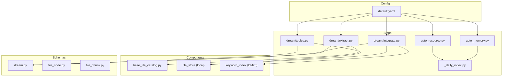
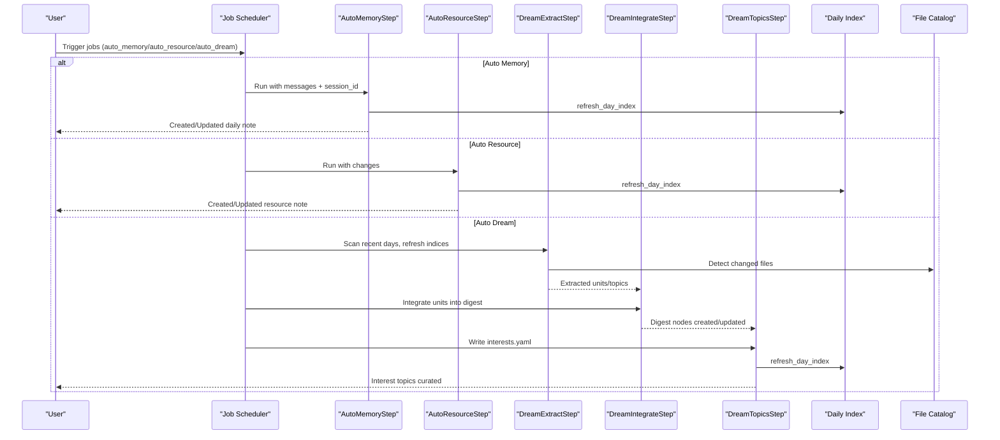
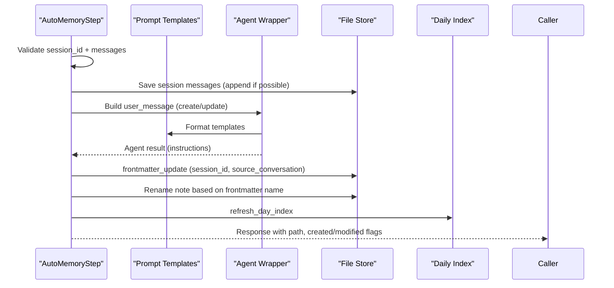
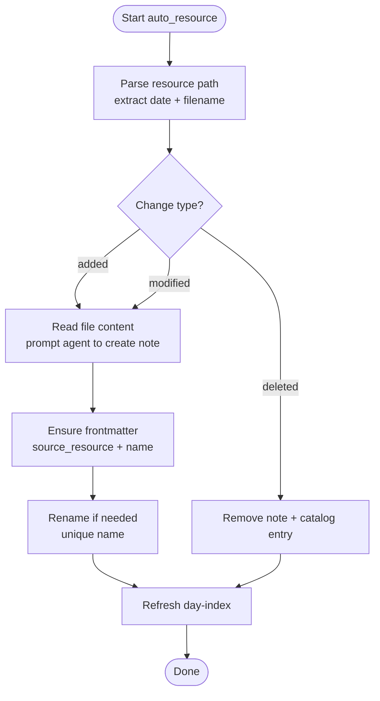
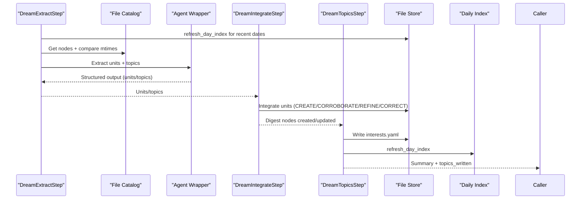
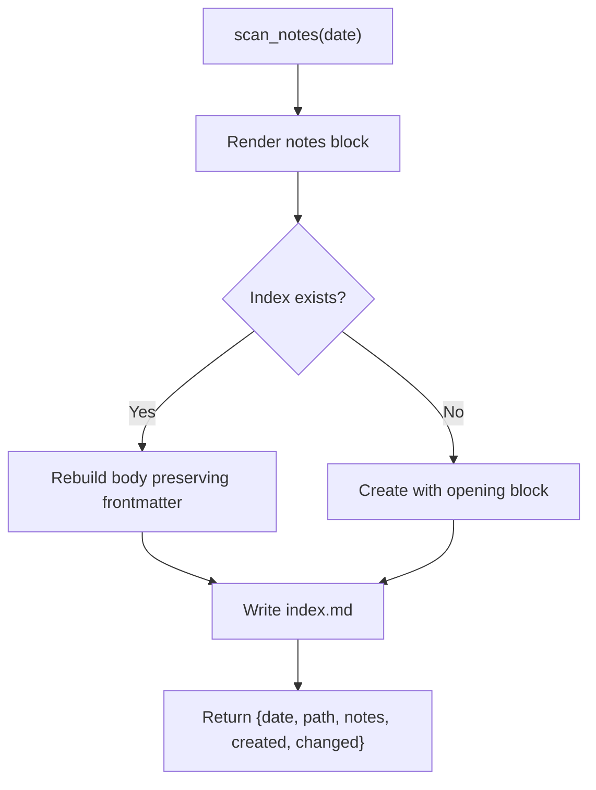
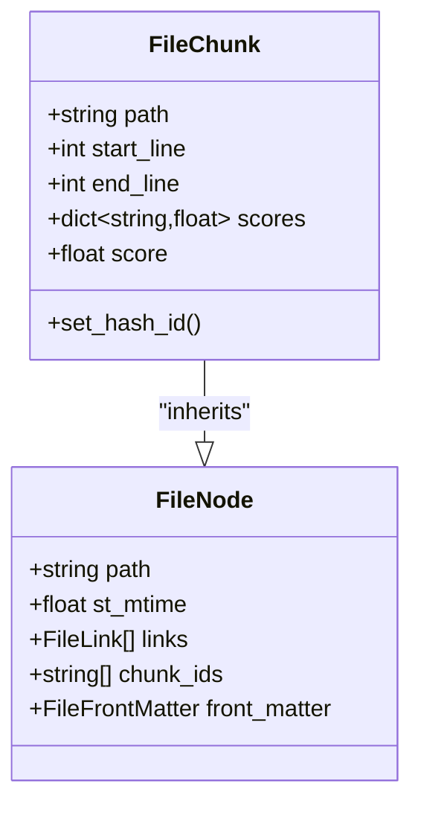
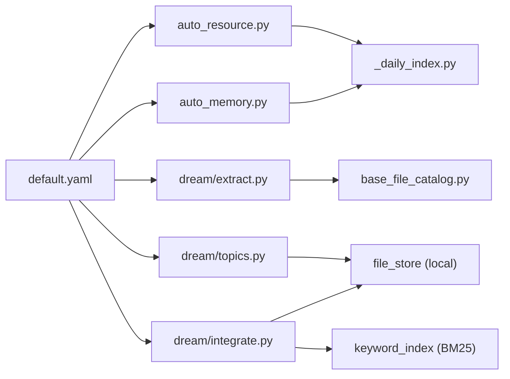

# Memory System

<cite>
**Referenced Files in This Document**
- [auto_memory.py](file://reme/steps/evolve/auto_memory.py)
- [auto_resource.py](file://reme/steps/evolve/auto_resource.py)
- [dream/__init__.py](file://reme/steps/evolve/dream/__init__.py)
- [extract.py](file://reme/steps/evolve/dream/extract.py)
- [integrate.py](file://reme/steps/evolve/dream/integrate.py)
- [topics.py](file://reme/steps/evolve/dream/topics.py)
- [utils.py](file://reme/steps/evolve/dream/utils.py)
- [default.yaml](file://reme/config/default.yaml)
- [auto_memory.yaml](file://reme/steps/evolve/auto_memory.yaml)
- [_daily_index.py](file://reme/steps/file_io/_daily_index.py)
- [_file_io.py](file://reme/steps/file_io/_file_io.py)
- [base_file_catalog.py](file://reme/components/file_catalog/base_file_catalog.py)
- [file_node.py](file://reme/schema/file_node.py)
- [file_chunk.py](file://reme/schema/file_chunk.py)
- [dream.py](file://reme/schema/dream.py)
</cite>

## Table of Contents
1. [Introduction](#introduction)
2. [Project Structure](#project-structure)
3. [Core Components](#core-components)
4. [Architecture Overview](#architecture-overview)
5. [Detailed Component Analysis](#detailed-component-analysis)
6. [Dependency Analysis](#dependency-analysis)
7. [Performance Considerations](#performance-considerations)
8. [Troubleshooting Guide](#troubleshooting-guide)
9. [Conclusion](#conclusion)
10. [Appendices](#appendices)

## Introduction
This document explains the ReMe memory system with a focus on the three core memory processing pipelines:
- Auto Memory: transforms conversational transcripts into daily memory notes and maintains a searchable day-index.
- Auto Resource: interprets external resource files (e.g., PDFs, CSVs) into daily notes linked to their sources.
- Auto Dream: consolidates daily knowledge into digest memory, extracts unified units and topics, integrates them into long-term knowledge, and curates daily interest topics.

The system turns raw inputs (conversations and resources) into structured, searchable, traceable, and reusable file-based memory. It progresses from daily notes to consolidated digest knowledge, enabling robust retrieval and knowledge reuse across time.

## Project Structure
The memory system is organized around:
- Steps: executable pipelines for each memory stage (Auto Memory, Auto Resource, Auto Dream).
- Config: job orchestration and component configuration.
- Components: pluggable backends for catalogs, embeddings, file stores, and indexing.
- Schemas: typed models for memory units, topics, and shared state.
- Utilities: file IO helpers, link expansion, and daily index management.

**Diagram sources**
- [default.yaml:116-178](file://reme/config/default.yaml#L116-L178)
- [auto_memory.py:37-326](file://reme/steps/evolve/auto_memory.py#L37-L326)
- [auto_resource.py:96-518](file://reme/steps/evolve/auto_resource.py#L96-L518)
- [extract.py:27-200](file://reme/steps/evolve/dream/extract.py#L27-L200)
- [integrate.py:23-120](file://reme/steps/evolve/dream/integrate.py#L23-L120)
- [topics.py:23-200](file://reme/steps/evolve/dream/topics.py#L23-L200)
- [_daily_index.py:78-141](file://reme/steps/file_io/_daily_index.py#L78-L141)
- [base_file_catalog.py:10-40](file://reme/components/file_catalog/base_file_catalog.py#L10-L40)
- [dream.py:62-95](file://reme/schema/dream.py#L62-L95)
- [file_node.py:9-17](file://reme/schema/file_node.py#L9-L17)
- [file_chunk.py:8-27](file://reme/schema/file_chunk.py#L8-L27)

**Section sources**
- [default.yaml:1-672](file://reme/config/default.yaml#L1-L672)

## Core Components
- Auto Memory Step: Records conversation facts into daily notes, manages frontmatter, renames files based on content, and refreshes the day-index.
- Auto Resource Step: Interprets resource files into daily notes, handles add/update/delete events, ensures unique note names, and refreshes the day-index.
- Auto Dream Extract: Scans recent daily files, refreshes indices, detects changes, and asks an LLM to extract memory units and topics.
- Auto Dream Integrate: Integrates extracted units into digest memory, deciding CREATE/CORROBORATE/REFINE/CORRECT actions.
- Auto Dream Topics: Writes daily interests.yaml, selecting diverse topics across recent days.
- Daily Index Manager: Builds and updates daily index pages aggregating notes under a date.
- File Catalog: Tracks file metadata and links for retrieval and graph navigation.
- Schemas: Typed models for memory units, topics, and shared state across dream steps.

**Section sources**
- [auto_memory.py:37-326](file://reme/steps/evolve/auto_memory.py#L37-L326)
- [auto_resource.py:96-518](file://reme/steps/evolve/auto_resource.py#L96-L518)
- [extract.py:27-200](file://reme/steps/evolve/dream/extract.py#L27-L200)
- [integrate.py:23-120](file://reme/steps/evolve/dream/integrate.py#L23-L120)
- [topics.py:23-200](file://reme/steps/evolve/dream/topics.py#L23-L200)
- [_daily_index.py:78-141](file://reme/steps/file_io/_daily_index.py#L78-L141)
- [base_file_catalog.py:10-40](file://reme/components/file_catalog/base_file_catalog.py#L10-L40)
- [dream.py:62-95](file://reme/schema/dream.py#L62-L95)

## Architecture Overview
The memory system orchestrates three pipelines:
- Auto Memory: conversation → daily note → day-index.
- Auto Resource: resource file → daily note → day-index.
- Auto Dream: daily notes → extracted units/topics → digest memory → interests.yaml.

**Diagram sources**
- [default.yaml:57-114](file://reme/config/default.yaml#L57-L114)
- [auto_memory.py:199-326](file://reme/steps/evolve/auto_memory.py#L199-L326)
- [auto_resource.py:484-518](file://reme/steps/evolve/auto_resource.py#L484-L518)
- [extract.py:37-137](file://reme/steps/evolve/dream/extract.py#L37-L137)
- [integrate.py:27-53](file://reme/steps/evolve/dream/integrate.py#L27-L53)
- [topics.py:32-106](file://reme/steps/evolve/dream/topics.py#L32-L106)
- [_daily_index.py:78-141](file://reme/steps/file_io/_daily_index.py#L78-L141)

## Detailed Component Analysis

### Auto Memory Pipeline
Purpose: Convert conversation transcripts into daily memory notes with stable filenames and frontmatter, linking back to the source session.

Key processing logic:
- Validates session_id and message list.
- Saves conversation messages to a session file (appending new messages when possible).
- Locates or creates a daily note for the session, using prompts to create or update content.
- Ensures frontmatter includes session_id and source_conversation links.
- Renames note based on frontmatter name when appropriate.
- Refreshes the day-index page for the current date.

Practical example:
- A session with messages is saved to a session file under a daily dialog directory.
- An agent creates a daily note with a descriptive name and description, then updates frontmatter to link back to the session.
- The day-index is refreshed to include the new note.

Configuration highlights:
- Job: auto_memory with parameters for messages, session_id, and memory_hint.
- Tools used: daily_write for creation, read/edit/frontmatter_update/write for updates.

**Diagram sources**
- [auto_memory.py:199-326](file://reme/steps/evolve/auto_memory.py#L199-L326)
- [auto_memory.yaml:1-239](file://reme/steps/evolve/auto_memory.yaml#L1-L239)
- [default.yaml:116-138](file://reme/config/default.yaml#L116-L138)

**Section sources**
- [auto_memory.py:37-326](file://reme/steps/evolve/auto_memory.py#L37-L326)
- [auto_memory.yaml:1-239](file://reme/steps/evolve/auto_memory.yaml#L1-L239)
- [_daily_index.py:78-141](file://reme/steps/file_io/_daily_index.py#L78-L141)

### Auto Resource Pipeline
Purpose: Interpret external resource files into daily notes, manage add/update/delete events, and maintain stable note names.

Key processing logic:
- Parses resource path to extract date and filename; supports loose files at the root.
- Handles add/modify events by reading the resource content and prompting an agent to create or update a daily note.
- Handles delete events by removing the associated note and updating the catalog.
- Ensures frontmatter includes source_resource links and sanitizes note names.
- Refreshes the day-index for the affected date.

Practical example:
- A PDF is added under a dated resource path; the pipeline reads it, prompts an agent to summarize into a daily note, sets frontmatter, and refreshes the index.
- If the same file is modified, the note is updated; if deleted, the note is removed.

Configuration highlights:
- Job: auto_resource with changes array containing path/file_path and change.
- Watches resource_dir and triggers auto_resource_step.

**Diagram sources**
- [auto_resource.py:434-483](file://reme/steps/evolve/auto_resource.py#L434-L483)
- [default.yaml:21-37](file://reme/config/default.yaml#L21-L37)

**Section sources**
- [auto_resource.py:96-518](file://reme/steps/evolve/auto_resource.py#L96-L518)
- [_daily_index.py:78-141](file://reme/steps/file_io/_daily_index.py#L78-L141)

### Auto Dream Pipeline
Purpose: Globally extract merged memory units and topics from daily notes, integrate them into digest memory, and curate daily interest topics.

Stages:
- Dream Extract: Scans recent days, refreshes indices, detects changed files, and asks an LLM to extract units and topics.
- Dream Integrate: For each unit, decides whether to CREATE, CORROBORATE, REFINE, or CORRECT digest nodes; writes outcomes and tracks failures.
- Dream Topics: Writes daily interests.yaml, selecting diverse topics across recent days, and refreshes the index.

Practical example:
- Extract identifies two changed daily notes and emits two memory units and three topic candidates.
- Integration decides to CREATE two digest nodes and CORROBORATE one, then topics selects top diverse topics for the day.

Configuration highlights:
- Job: auto_dream with parameters for date, hint, scan_days, max_units, topic_count, topic_diversity_days.
- Cron schedule runs nightly to consolidate memory.

**Diagram sources**
- [extract.py:37-137](file://reme/steps/evolve/dream/extract.py#L37-L137)
- [integrate.py:27-53](file://reme/steps/evolve/dream/integrate.py#L27-L53)
- [topics.py:32-106](file://reme/steps/evolve/dream/topics.py#L32-L106)
- [default.yaml:57-71](file://reme/config/default.yaml#L57-L71)

**Section sources**
- [extract.py:27-200](file://reme/steps/evolve/dream/extract.py#L27-L200)
- [integrate.py:23-120](file://reme/steps/evolve/dream/integrate.py#L23-L120)
- [topics.py:23-200](file://reme/steps/evolve/dream/topics.py#L23-L200)
- [utils.py:14-185](file://reme/steps/evolve/dream/utils.py#L14-L185)
- [dream.py:62-95](file://reme/schema/dream.py#L62-L95)

### Daily Index Management
Purpose: Maintain a daily index page summarizing notes for a given date, including frontmatter and an auto-generated notes block.

Key logic:
- Scans notes under daily/<date>/*.md and collects frontmatter metadata.
- Renders a notes block with links and metadata.
- Rebuilds or creates the daily index page, preserving existing frontmatter and updating descriptions.

**Diagram sources**
- [_daily_index.py:47-141](file://reme/steps/file_io/_daily_index.py#L47-L141)

**Section sources**
- [_daily_index.py:78-141](file://reme/steps/file_io/_daily_index.py#L78-L141)

### File Catalog and Graph Entities
Purpose: Track file metadata, links, and chunks for retrieval and graph navigation.

Key models:
- FileNode: path, mtime, outgoing links, owned chunk ids, parsed frontmatter.
- FileChunk: inherits embedding node with path, line range, and retrieval scores; supports deterministic hashing of id.

**Diagram sources**
- [file_node.py:9-17](file://reme/schema/file_node.py#L9-L17)
- [file_chunk.py:8-27](file://reme/schema/file_chunk.py#L8-L27)

**Section sources**
- [file_node.py:9-17](file://reme/schema/file_node.py#L9-L17)
- [file_chunk.py:8-27](file://reme/schema/file_chunk.py#L8-L27)

## Dependency Analysis
- Orchestration: Jobs in default.yaml define scheduling and parameters for each pipeline.
- Pipelines depend on file IO utilities for safe read/write and encoding detection.
- Auto Dream relies on file catalogs for change detection and on file stores/indices for retrieval.
- Daily index refresh ties all pipelines to a consistent day-view.

**Diagram sources**
- [default.yaml:1-672](file://reme/config/default.yaml#L1-L672)
- [auto_memory.py:37-326](file://reme/steps/evolve/auto_memory.py#L37-L326)
- [auto_resource.py:96-518](file://reme/steps/evolve/auto_resource.py#L96-L518)
- [extract.py:27-200](file://reme/steps/evolve/dream/extract.py#L27-L200)
- [integrate.py:23-120](file://reme/steps/evolve/dream/integrate.py#L23-L120)
- [topics.py:23-200](file://reme/steps/evolve/dream/topics.py#L23-L200)
- [_daily_index.py:78-141](file://reme/steps/file_io/_daily_index.py#L78-L141)
- [base_file_catalog.py:10-40](file://reme/components/file_catalog/base_file_catalog.py#L10-L40)

**Section sources**
- [default.yaml:1-672](file://reme/config/default.yaml#L1-L672)

## Performance Considerations
- Batch processing: Auto Resource processes multiple changes; ensure efficient change parsing and per-path locking to avoid contention.
- Index refresh: Daily index rebuild scans notes; keep daily directories organized to minimize I/O.
- LLM calls: Dream extract and integrate rely on LLMs; tune scan_days and max_units to balance quality and cost.
- File IO: Use encoding-aware read/write and per-path locks to prevent corruption and race conditions.
- Retrieval: Keyword index and embedding store support hybrid search; configure weights and limits appropriately.

## Troubleshooting Guide
Common issues and resolutions:
- Invalid session_id or missing messages in Auto Memory: Verify session_id format and presence of messages.
- Daily note not created: Check agent reply and ensure daily_write tool is available; confirm frontmatter update succeeded.
- Resource file not found: Confirm resource path is under resource_dir and matches expected date/filename pattern.
- No LLM configured for Auto Dream: Ensure as_llm and agent_wrapper are configured; otherwise steps will skip with an error.
- Index not updating: Verify refresh_day_index is called after note changes; check daily_dir configuration.

**Section sources**
- [auto_memory.py:213-231](file://reme/steps/evolve/auto_memory.py#L213-L231)
- [auto_resource.py:335-341](file://reme/steps/evolve/auto_resource.py#L335-L341)
- [extract.py:105-108](file://reme/steps/evolve/dream/extract.py#L105-L108)
- [_daily_index.py:78-141](file://reme/steps/file_io/_daily_index.py#L78-L141)

## Conclusion
The ReMe memory system transforms raw inputs into a layered, searchable, and traceable knowledge base:
- Conversations become daily notes with stable frontmatter and links.
- Resources become daily notes with source attribution and unique naming.
- Consolidation into digest memory produces reusable abstractions with clear actions and outcomes.
- Daily interest topics capture evolving user interests across time.

This layered approach enables robust retrieval, traceability, and long-term knowledge reuse.

## Appendices

### Configuration Options by Pipeline
- Auto Memory
  - Job: auto_memory
  - Parameters: messages (array), session_id (string), memory_hint (string)
  - Tools: daily_write (create), read/edit/frontmatter_update/write (update)
- Auto Resource
  - Job: auto_resource
  - Parameters: changes (array of {path/file_path, change})
  - Watches: resource_dir with suffixes md, txt, json, jsonl, csv, yaml, html
- Auto Dream
  - Job: auto_dream
  - Parameters: date, hint, scan_days, max_units, topic_count, topic_diversity_days
  - Steps: dream_extract_step → dream_integrate_step → dream_topics_step → dream_finish_step

**Section sources**
- [default.yaml:116-178](file://reme/config/default.yaml#L116-L178)
- [auto_memory.yaml:1-239](file://reme/steps/evolve/auto_memory.yaml#L1-L239)