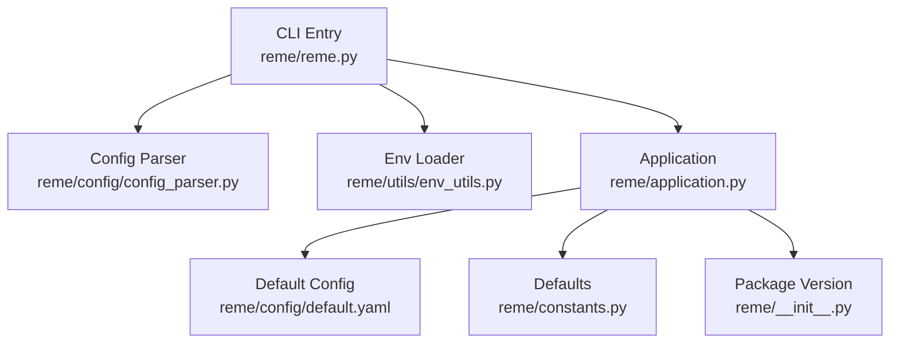
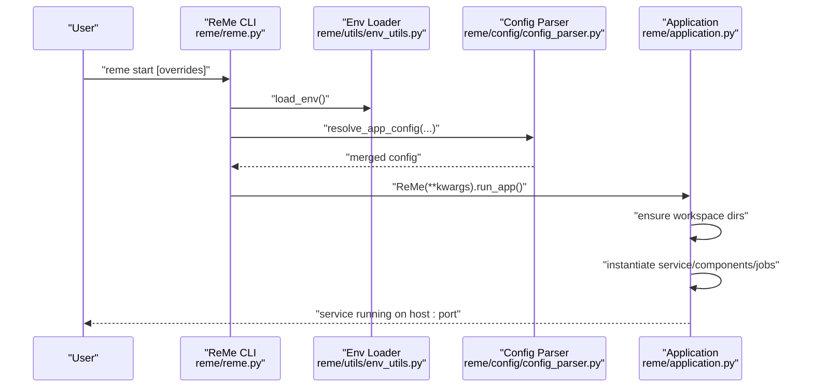
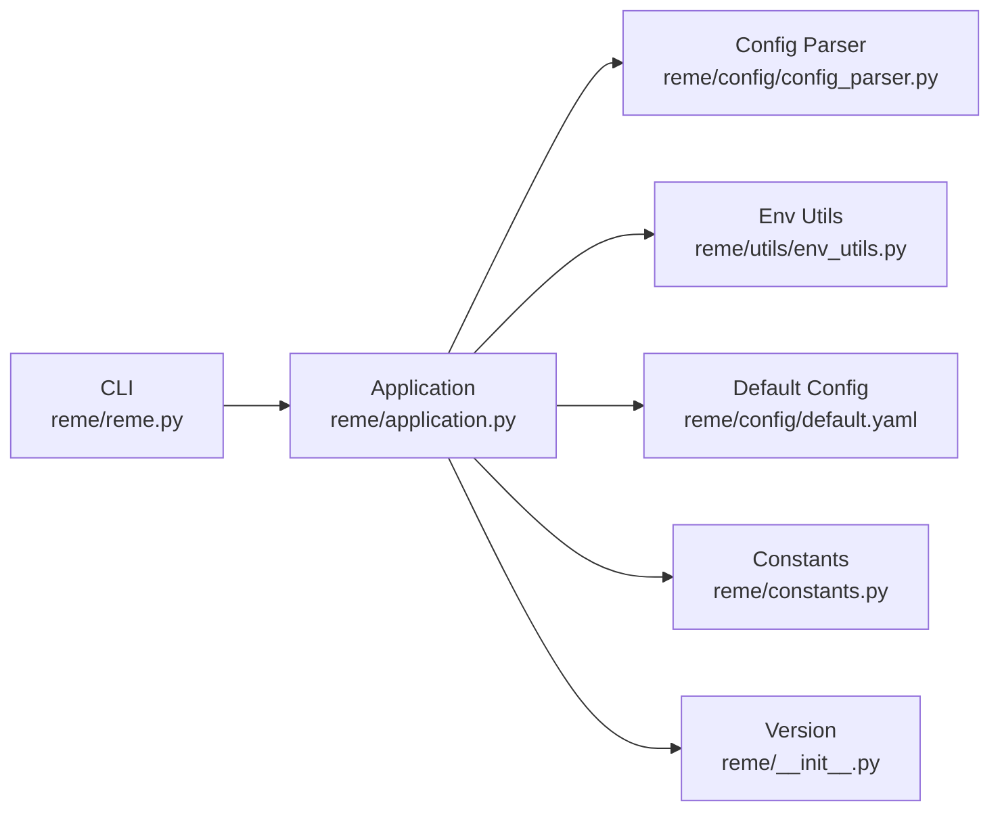

# Getting Started

<cite>
**Referenced Files in This Document**
- [README.md](file://README.md)
- [pyproject.toml](file://pyproject.toml)
- [reme/__init__.py](file://reme/__init__.py)
- [reme/application.py](file://reme/application.py)
- [reme/reme.py](file://reme/reme.py)
- [reme/config/default.yaml](file://reme/config/default.yaml)
- [reme/config/config_parser.py](file://reme/config/config_parser.py)
- [reme/utils/env_utils.py](file://reme/utils/env_utils.py)
- [reme/constants.py](file://reme/constants.py)
- [example.env](file://example.env)
- [reme/steps/common/version.py](file://reme/steps/common/version.py)
- [reme/steps/common/health_check.py](file://reme/steps/common/health_check.py)
</cite>

## Table of Contents
1. [Introduction](#introduction)
2. [Project Structure](#project-structure)
3. [Core Components](#core-components)
4. [Architecture Overview](#architecture-overview)
5. [Detailed Component Analysis](#detailed-component-analysis)
6. [Dependency Analysis](#dependency-analysis)
7. [Performance Considerations](#performance-considerations)
8. [Troubleshooting Guide](#troubleshooting-guide)
9. [Conclusion](#conclusion)
10. [Appendices](#appendices)

## Introduction
This guide helps you quickly install, configure, and run ReMe. You will learn:
- Installation requirements and methods (pip and source)
- Environment variable configuration for embedding and LLM APIs
- Service startup and default workspace layout
- Basic CLI commands for version and health checks
- Practical examples for custom ports and workspace operations
- Integration patterns with agent frameworks
- Troubleshooting tips for common setup issues

## Project Structure
ReMe is a Python 3.11+ application distributed as a CLI tool and a library. The CLI entry point wires configuration, instantiates components, and starts the service. Configuration is YAML-based with environment variable interpolation and dot-notation overrides.

**Diagram sources**
- [reme/reme.py:32-49](file://reme/reme.py#L32-L49)
- [reme/config/config_parser.py:179-231](file://reme/config/config_parser.py#L179-L231)
- [reme/utils/env_utils.py:35-60](file://reme/utils/env_utils.py#L35-L60)
- [reme/application.py:21-88](file://reme/application.py#L21-L88)
- [reme/config/default.yaml:1-672](file://reme/config/default.yaml#L1-L672)
- [reme/constants.py:1-17](file://reme/constants.py#L1-L17)
- [reme/__init__.py:1-27](file://reme/__init__.py#L1-L27)

**Section sources**
- [README.md:53-118](file://README.md#L53-L118)
- [pyproject.toml:10](file://pyproject.toml#L10)
- [reme/reme.py:32-49](file://reme/reme.py#L32-L49)
- [reme/config/default.yaml:1-672](file://reme/config/default.yaml#L1-L672)

## Core Components
- CLI entrypoint: parses actions and arguments, loads environment and configuration, and starts the application or calls remote jobs.
- Application: orchestrates components, jobs, and lifecycle; ensures workspace directories exist; serves the configured backend.
- Configuration: default YAML defines jobs, components, and defaults; supports environment variable substitution and dot-notation overrides.
- Environment loader: reads .env files and injects variables into the process environment.
- Defaults: host/port constants and operational limits.

What you need to know now:
- Install Python 3.11+ and choose pip or source installation.
- Prepare environment variables for embedding and LLM providers.
- Start the service and verify it’s running.
- Use basic CLI commands for version and health checks.

**Section sources**
- [README.md:53-118](file://README.md#L53-L118)
- [reme/reme.py:32-49](file://reme/reme.py#L32-L49)
- [reme/application.py:21-88](file://reme/application.py#L21-L88)
- [reme/config/default.yaml:583-672](file://reme/config/default.yaml#L583-L672)
- [reme/utils/env_utils.py:35-60](file://reme/utils/env_utils.py#L35-L60)
- [reme/constants.py:5-7](file://reme/constants.py#L5-L7)

## Architecture Overview
The startup flow connects CLI, environment, configuration, and application orchestration.

**Diagram sources**
- [reme/reme.py:32-49](file://reme/reme.py#L32-L49)
- [reme/utils/env_utils.py:35-60](file://reme/utils/env_utils.py#L35-L60)
- [reme/config/config_parser.py:204-231](file://reme/config/config_parser.py#L204-L231)
- [reme/application.py:21-88](file://reme/application.py#L21-L88)

## Detailed Component Analysis

### Installation and Setup
- Python requirement: Python 3.11+.
- Install from pip with the core extras to enable integrations.
- Install from source in editable mode for development.
- Prepare environment variables for embedding and LLM providers.

Practical steps:
- Confirm Python version meets the requirement.
- Choose pip or source installation method.
- Create a minimal .env file with provider credentials and base URLs.
- Start the service and verify it listens on the default port.

**Section sources**
- [README.md:55-97](file://README.md#L55-L97)
- [pyproject.toml:10](file://pyproject.toml#L10)
- [example.env:1-5](file://example.env#L1-5)

### Environment Variables and Configuration
- Environment variables are expanded inside configuration files. Keys like EMBEDDING_API_KEY and LLM_API_KEY are used by default components.
- The configuration loader supports ${VAR} and ${VAR:-default} placeholders and merges overrides from dot-notation CLI arguments.
- The default configuration sets embedding and LLM backends and models, with credentials sourced from environment variables.

How to configure:
- Copy the example .env file and fill in your provider keys and base URLs.
- Optionally override service.host/service.port or other settings via CLI dot notation.

**Section sources**
- [reme/config/default.yaml:588-616](file://reme/config/default.yaml#L588-L616)
- [reme/config/config_parser.py:20-42](file://reme/config/config_parser.py#L20-L42)
- [reme/config/config_parser.py:61-81](file://reme/config/config_parser.py#L61-L81)
- [example.env:1-5](file://example.env#L1-5)

### Service Startup and Default Workspace
- Default service address: 127.0.0.1:2333.
- On startup, the application ensures workspace directories exist (metadata, session, resource, daily, digest).
- The CLI action "start" triggers environment loading, configuration resolution, and service execution.

Operational tips:
- If port 2333 is busy, specify an alternate port via CLI overrides.
- Verify startup by checking the version endpoint.

**Section sources**
- [README.md:86-104](file://README.md#L86-L104)
- [reme/constants.py:5-7](file://reme/constants.py#L5-L7)
- [reme/application.py:47-55](file://reme/application.py#L47-L55)
- [reme/reme.py:35-40](file://reme/reme.py#L35-L40)

### Basic CLI Commands
- Version: prints the package version.
- Health check: returns a concise health snapshot of key components.
- Help: lists registered jobs and their metadata.

Usage examples:
- Check version via CLI and HTTP.
- Verify service health.

**Section sources**
- [README.md:196-224](file://README.md#L196-L224)
- [reme/steps/common/version.py:8-20](file://reme/steps/common/version.py#L8-L20)
- [reme/steps/common/health_check.py:189-209](file://reme/steps/common/health_check.py#L189-L209)

### Practical Examples
- Start on a custom port: pass service.port as a dot-notation override.
- Combine workspace_dir and service.port overrides for isolated environments.
- Use curl to hit the version endpoint on your chosen port.

**Section sources**
- [README.md:92-104](file://README.md#L92-L104)

### Agent Integration Patterns
- Use the memory skill and CLI to integrate with agents.
- Trigger auto_memory and proactive from agent hooks.
- Use auto_index, auto_resource, and auto_dream for background maintenance and consolidation.

**Section sources**
- [README.md:106-117](file://README.md#L106-L117)

## Dependency Analysis
ReMe’s CLI maps to the Application, which depends on configuration, environment variables, and component registries. The configuration references component backends and credentials.

**Diagram sources**
- [reme/reme.py:32-49](file://reme/reme.py#L32-L49)
- [reme/application.py:21-88](file://reme/application.py#L21-L88)
- [reme/config/config_parser.py:179-231](file://reme/config/config_parser.py#L179-L231)
- [reme/utils/env_utils.py:35-60](file://reme/utils/env_utils.py#L35-L60)
- [reme/config/default.yaml:1-672](file://reme/config/default.yaml#L1-L672)
- [reme/constants.py:1-17](file://reme/constants.py#L1-L17)
- [reme/__init__.py:1-27](file://reme/__init__.py#L1-L27)

**Section sources**
- [reme/reme.py:32-49](file://reme/reme.py#L32-L49)
- [reme/application.py:21-88](file://reme/application.py#L21-L88)
- [reme/config/default.yaml:583-672](file://reme/config/default.yaml#L583-L672)

## Performance Considerations
- Keep image reads within the documented limits to avoid heavy payloads in LLM contexts.
- Use the health check to monitor component memory usage and readiness.
- For large workspaces, rely on background index and catalog maintenance jobs to keep retrieval efficient.

[No sources needed since this section provides general guidance]

## Troubleshooting Guide
Common issues and resolutions:
- Python version mismatch: ensure Python 3.11+ is installed.
- Missing environment variables: populate EMBEDDING_API_KEY, EMBEDDING_BASE_URL, LLM_API_KEY, LLM_BASE_URL in .env.
- Port conflict: specify a different port via CLI overrides.
- Configuration errors: verify YAML syntax and environment variable placeholders; use dot-notation to override specific settings.
- Health warnings: review the health check output to identify failing components.

**Section sources**
- [README.md:55-97](file://README.md#L55-L97)
- [reme/utils/env_utils.py:35-60](file://reme/utils/env_utils.py#L35-L60)
- [reme/config/config_parser.py:204-231](file://reme/config/config_parser.py#L204-L231)
- [reme/steps/common/health_check.py:189-209](file://reme/steps/common/health_check.py#L189-L209)

## Conclusion
You now have the essentials to install ReMe, configure environment variables, start the service, and verify it’s running. Use the basic CLI commands to check version and health, and explore agent integration patterns described in the project documentation.

[No sources needed since this section summarizes without analyzing specific files]

## Appendices

### Default Workspace Layout
- metadata/: persistent system state (indexes, graphs, catalogs)
- session/: raw conversations and agent sessions
- resource/: external raw materials organized by date
- daily/: lightly processed memory (daily facts, summaries, resource readings)
- digest/: long-term memory (personal facts, procedures, wiki nodes)

**Section sources**
- [README.md:125-148](file://README.md#L125-L148)