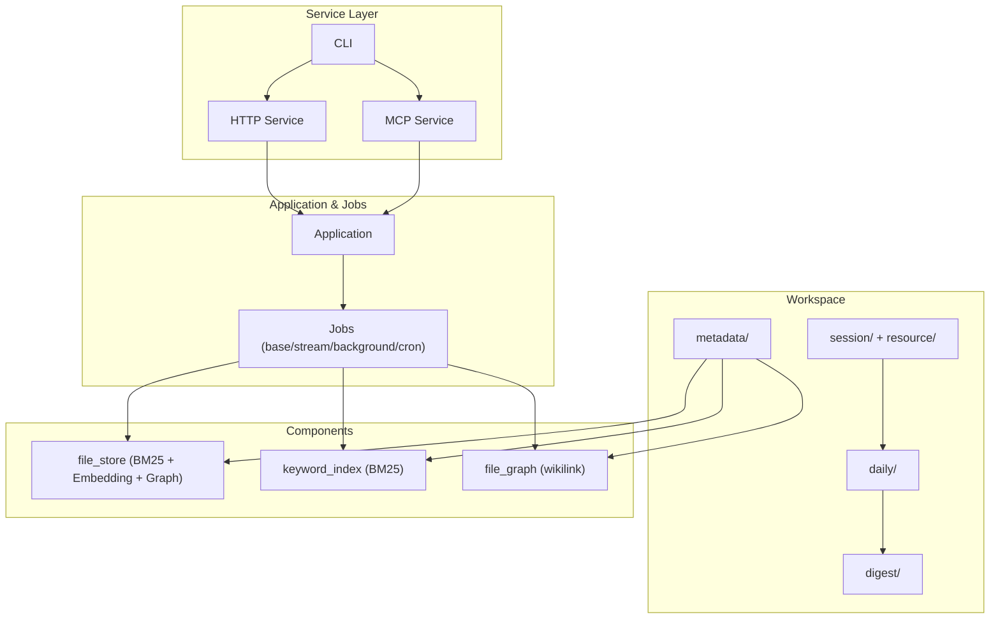
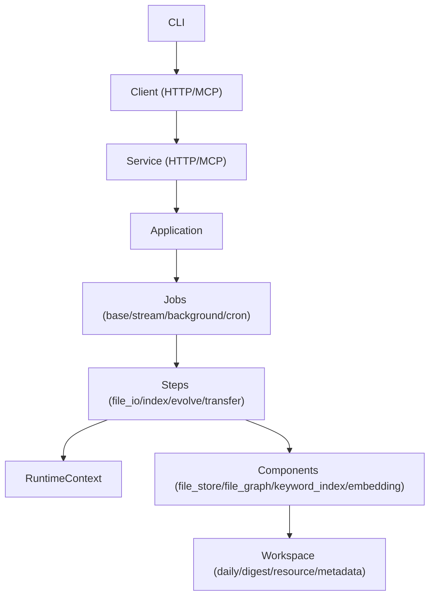
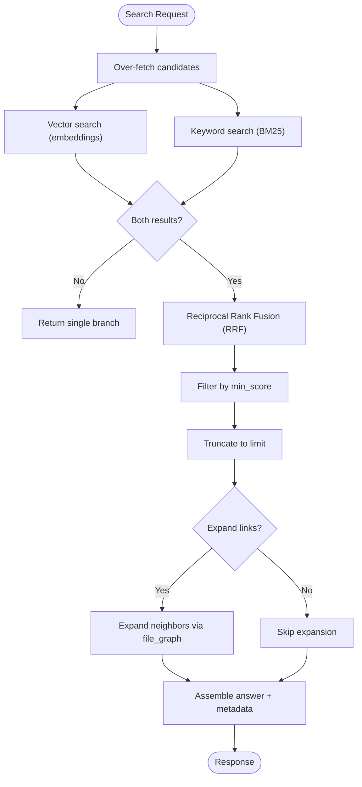
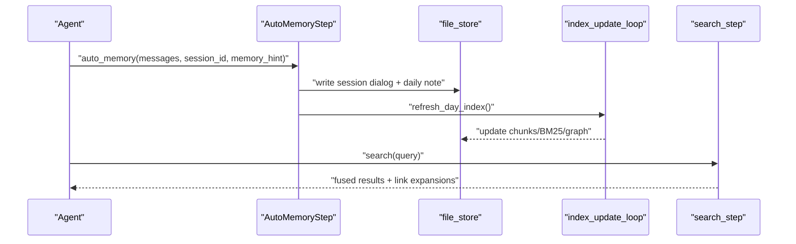
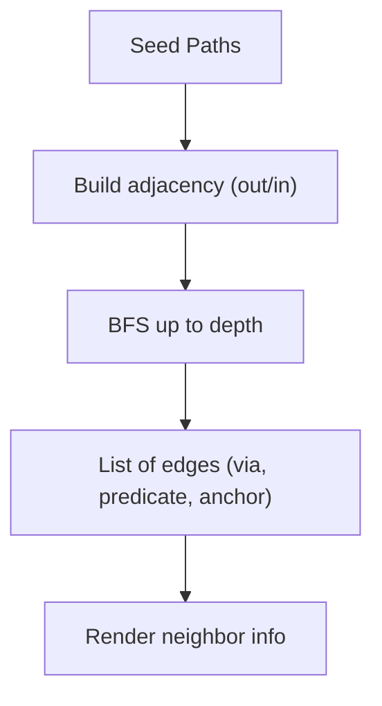
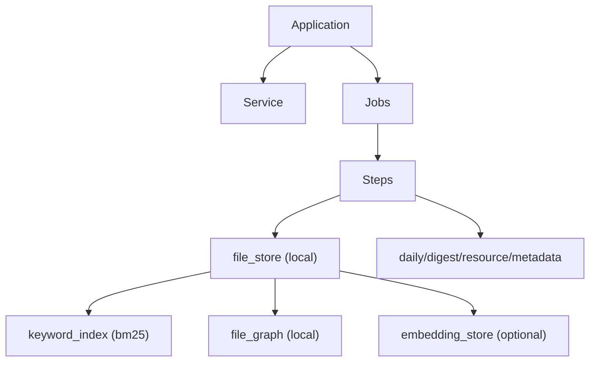

# Project Overview

<cite>
**Referenced Files in This Document**
- [README.md](file://README.md)
- [README_ZH.md](file://README_ZH.md)
- [docs/zh/memory_as_file.md](file://docs/zh/memory_as_file.md)
- [docs/zh/memory_search.md](file://docs/zh/memory_search.md)
- [docs/zh/framework.md](file://docs/zh/framework.md)
- [reme/application.py](file://reme/application.py)
- [reme/steps/evolve/auto_memory.py](file://reme/steps/evolve/auto_memory.py)
- [reme/steps/evolve/auto_resource.py](file://reme/steps/evolve/auto_resource.py)
- [reme/steps/index/search.py](file://reme/steps/index/search.py)
- [reme/steps/index/node_search.py](file://reme/steps/index/node_search.py)
- [reme/steps/index/traverse.py](file://reme/steps/index/traverse.py)
- [reme/components/file_store/local_file_store.py](file://reme/components/file_store/local_file_store.py)
- [reme/components/file_graph/local_file_graph.py](file://reme/components/file_graph/local_file_graph.py)
- [reme/components/keyword_index/bm25_index.py](file://reme/components/keyword_index/bm25_index.py)
</cite>

## Table of Contents
1. [Introduction](#introduction)
2. [Project Structure](#project-structure)
3. [Core Components](#core-components)
4. [Architecture Overview](#architecture-overview)
5. [Detailed Component Analysis](#detailed-component-analysis)
6. [Dependency Analysis](#dependency-analysis)
7. [Performance Considerations](#performance-considerations)
8. [Troubleshooting Guide](#troubleshooting-guide)
9. [Conclusion](#conclusion)

## Introduction
ReMe is a memory management toolkit for AI agents that treats memory as files and builds a self-evolving knowledge base through progressive enhancement. Its core philosophy centers on:
- Memory as File: Markdown files with frontmatter and wikilinks serve as readable, editable, and searchable memory nodes for both users and agents.
- Self-evolving knowledge base: Auto Memory, Auto Resource, and Auto Dream progressively transform raw conversations and external resources into long-term digest knowledge while automatically linking related nodes.
- Progressive hybrid search: ReMe fuses wikilink graph traversal, BM25 keyword matching, and embedding-based semantic recall into a layered retrieval pipeline.

Practical use cases include personal assistants, coding assistants, and knowledge QA systems. The project positions itself as an agent-friendly, file-based memory solution that is human-readable, agent-operable, and extensible.

**Section sources**
- [README.md:29-36](file://README.md#L29-L36)
- [README_ZH.md:29-36](file://README_ZH.md#L29-L36)

## Project Structure
At a high level, ReMe organizes memory across four layers:
- raw input: session/ and resource/
- working memory: daily/
- long memory: digest/
- system state: metadata/

The system exposes a unified CLI and HTTP/MCP service to run jobs that orchestrate Steps, which manipulate files, indexes, and graphs. Components such as file_store, file_graph, keyword_index, and embedding_store are composed to support hybrid search and progressive memory evolution.

**Diagram sources**
- [docs/zh/memory_as_file.md:66-92](file://docs/zh/memory_as_file.md#L66-L92)
- [docs/zh/framework.md:44-83](file://docs/zh/framework.md#L44-L83)
- [reme/application.py:47-55](file://reme/application.py#L47-L55)

**Section sources**
- [docs/zh/memory_as_file.md:32-56](file://docs/zh/memory_as_file.md#L32-L56)
- [docs/zh/framework.md:41-86](file://docs/zh/framework.md#L41-L86)
- [reme/application.py:47-55](file://reme/application.py#L47-L55)

## Core Components
- Memory as File: Markdown with frontmatter and wikilinks forms the basis of human-readable, agent-editable memory nodes. The workspace enforces explicit path semantics and supports chunking that preserves document structure for better recall.
- Progressive Hybrid Search: The search pipeline performs parallel BM25 and vector retrieval, merges results via Reciprocal Rank Fusion (RRF), filters by minimum score, truncates to limit, and optionally expands links to reveal related nodes.
- Self-Evolving Knowledge Base: Auto Memory ingests conversation histories into daily notes; Auto Resource interprets external resources into daily notes; Auto Dream consolidates daily notes into digest knowledge and proactive topics.

Key capabilities:
- Memory as File: Readable, editable, traceable, migratable, indexable, and collaborative memory nodes.
- Progressive Enhancement: Index maintenance, daily consolidation, and digest refinement.
- Hybrid Retrieval: Keyword + vector fusion with link expansion.

**Section sources**
- [docs/zh/memory_as_file.md:17-31](file://docs/zh/memory_as_file.md#L17-L31)
- [docs/zh/memory_search.md:12-18](file://docs/zh/memory_search.md#L12-L18)
- [docs/zh/memory_search.md:90-139](file://docs/zh/memory_search.md#L90-L139)
- [README.md:154-171](file://README.md#L154-L171)

## Architecture Overview
ReMe’s runtime is a configuration-driven Application that wires Components and Jobs behind a Service. The Service exposes Jobs as HTTP endpoints or MCP tools. Jobs are composed of Steps that perform file I/O, indexing, and memory evolution.

**Diagram sources**
- [docs/zh/framework.md:8-26](file://docs/zh/framework.md#L8-L26)
- [docs/zh/framework.md:127-158](file://docs/zh/framework.md#L127-L158)
- [docs/zh/framework.md:254-282](file://docs/zh/framework.md#L254-L282)

**Section sources**
- [docs/zh/framework.md:8-26](file://docs/zh/framework.md#L8-L26)
- [docs/zh/framework.md:127-158](file://docs/zh/framework.md#L127-L158)
- [docs/zh/framework.md:254-282](file://docs/zh/framework.md#L254-L282)

## Detailed Component Analysis

### Memory as File
- Human and agent-readable: Markdown with frontmatter and wikilinks.
- Explicit path semantics: Links resolve to workspace-relative paths; supports predicates and anchors.
- Chunking: Semantic-aware splitting that respects headings, tables, code blocks, and lists to preserve context in retrieval.

Benefits:
- Readable: Users can browse daily and digest notes directly.
- Editable: Users and agents can move, rename, and update files; links are maintained.
- Traceable: derived_from and related links connect digest nodes back to daily and resources.
- Migratable: Entire workspace is portable and compatible with version control and sync tools.
- Indexable: Frontmatter, chunks, and links are parsed and indexed.
- Collaborative: Both humans and agents operate on the same files.

**Section sources**
- [docs/zh/memory_as_file.md:17-31](file://docs/zh/memory_as_file.md#L17-L31)
- [docs/zh/memory_as_file.md:253-274](file://docs/zh/memory_as_file.md#L253-L274)
- [docs/zh/memory_as_file.md:275-359](file://docs/zh/memory_as_file.md#L275-L359)

### Progressive Hybrid Search
- Indexing: Background watcher scans daily/, digest/, and resource/ for changes; updates file_store (chunks + BM25 + optional embeddings) and file_graph.
- Retrieval: search_step runs vector and keyword search in parallel, fuses via RRF, applies min_score threshold, truncates to limit, and optionally expands links.
- Node-level recall: node_search_step aggregates by digest node path and returns name/description for dedup and synapse decisions.

**Diagram sources**
- [docs/zh/memory_search.md:116-129](file://docs/zh/memory_search.md#L116-L129)
- [reme/steps/index/search.py:62-131](file://reme/steps/index/search.py#L62-L131)

**Section sources**
- [docs/zh/memory_search.md:31-64](file://docs/zh/memory_search.md#L31-L64)
- [docs/zh/memory_search.md:116-175](file://docs/zh/memory_search.md#L116-L175)
- [reme/steps/index/search.py:18-51](file://reme/steps/index/search.py#L18-L51)

### Self-Evolving Knowledge Base
- Auto Memory: Converts conversation messages into daily notes, enriches frontmatter, and refreshes daily indices.
- Auto Resource: Interprets uploaded resources into daily notes, manages collisions, and updates indices.
- Auto Dream: Extracts and integrates long-term knowledge from daily notes into digest nodes and generates proactive topics.

**Diagram sources**
- [reme/steps/evolve/auto_memory.py:199-326](file://reme/steps/evolve/auto_memory.py#L199-L326)
- [docs/zh/memory_search.md:116-129](file://docs/zh/memory_search.md#L116-L129)

**Section sources**
- [README.md:154-171](file://README.md#L154-L171)
- [reme/steps/evolve/auto_memory.py:199-326](file://reme/steps/evolve/auto_memory.py#L199-L326)
- [reme/steps/evolve/auto_resource.py:484-518](file://reme/steps/evolve/auto_resource.py#L484-L518)

### Wikilink Graph and Relationship Expansion
- file_graph maintains nodes and links; supports REAL/VIRTUAL scopes and in-memory adjacency for efficient traversal.
- traverse_step performs BFS from seed paths to discover neighbors, preserving predicate and anchor information.

**Diagram sources**
- [reme/steps/index/traverse.py:25-82](file://reme/steps/index/traverse.py#L25-L82)
- [reme/components/file_graph/local_file_graph.py:105-146](file://reme/components/file_graph/local_file_graph.py#L105-L146)

**Section sources**
- [docs/zh/memory_search.md:154-175](file://docs/zh/memory_search.md#L154-L175)
- [reme/steps/index/traverse.py:94-130](file://reme/steps/index/traverse.py#L94-L130)
- [reme/components/file_graph/local_file_graph.py:105-146](file://reme/components/file_graph/local_file_graph.py#L105-L146)

### Practical Use Cases
- Personal assistants: Persist user preferences, session summaries, and daily insights into digest nodes for long-term recall.
- Coding assistants: Capture coding styles, project backgrounds, and workflow experiences across sessions; link related procedures and decisions.
- Knowledge QA: Transform resources and conversations into a searchable, traceable, and linked knowledge base; use proactive topics to surface timely insights.

**Section sources**
- [README.md:42-51](file://README.md#L42-L51)
- [README_ZH.md:42-50](file://README_ZH.md#L42-L50)

## Dependency Analysis
ReMe composes modular components that collaborate to deliver hybrid search and progressive memory evolution. The Application orchestrates Services, Jobs, and Steps, while Components encapsulate file_store, file_graph, keyword_index, and embedding_store.

**Diagram sources**
- [docs/zh/framework.md:456-476](file://docs/zh/framework.md#L456-L476)
- [reme/application.py:65-87](file://reme/application.py#L65-L87)
- [reme/components/file_store/local_file_store.py:20-52](file://reme/components/file_store/local_file_store.py#L20-L52)

**Section sources**
- [docs/zh/framework.md:454-476](file://docs/zh/framework.md#L454-L476)
- [reme/application.py:65-87](file://reme/application.py#L65-L87)
- [reme/components/file_store/local_file_store.py:20-52](file://reme/components/file_store/local_file_store.py#L20-L52)

## Performance Considerations
- Hybrid search: Using vector_weight > 0.5 prioritizes semantic recall; tune candidate_multiplier to balance latency and recall quality.
- Lazy deletion and compaction: BM25Index supports lazy deletion and optimize_index to reclaim space and improve query performance.
- Parallel retrieval: Running vector and keyword search concurrently reduces latency; ensure embedding store health to avoid fallback to keyword-only mode.
- Chunking strategy: Semantic-aware chunking improves retrieval precision and reduces context loss compared to fixed-length splits.

[No sources needed since this section provides general guidance]

## Troubleshooting Guide
Common operational checks and remedies:
- Health status: Use health_check to verify component readiness and index integrity.
- Index rebuild: Run reindex to clear and rebuild file-store indexes from existing files.
- File operations: Use write/edit/move/delete/list/stat to manage workspace content and resolve path/link issues.
- Logging and diagnostics: Enable console/file logging via Application configuration to trace job execution and component initialization.

**Section sources**
- [README.md:203-225](file://README.md#L203-L225)
- [docs/zh/framework.md:254-282](file://docs/zh/framework.md#L254-L282)

## Conclusion
ReMe offers a principled, file-first approach to agent memory management. By treating memory as files, enabling progressive enhancement, and delivering a hybrid search pipeline, it empowers personal assistants, coding assistants, and knowledge QA systems to build long-term, traceable, and evolvable knowledge bases. Its modular architecture and agent-friendly integration make it a robust foundation for the AI agent ecosystem.

[No sources needed since this section summarizes without analyzing specific files]