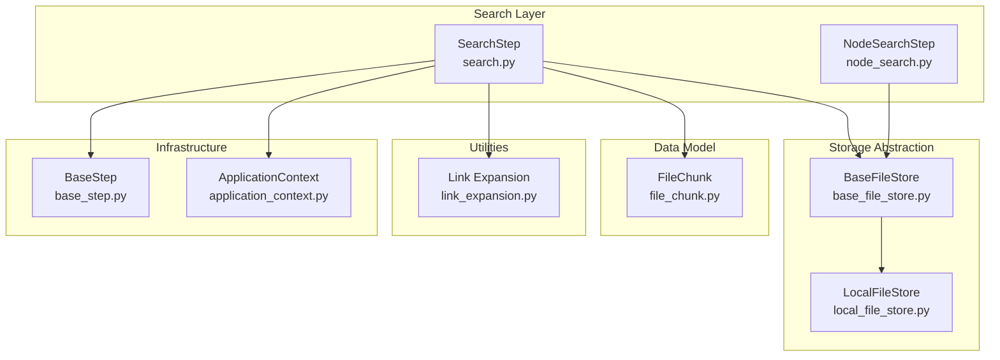
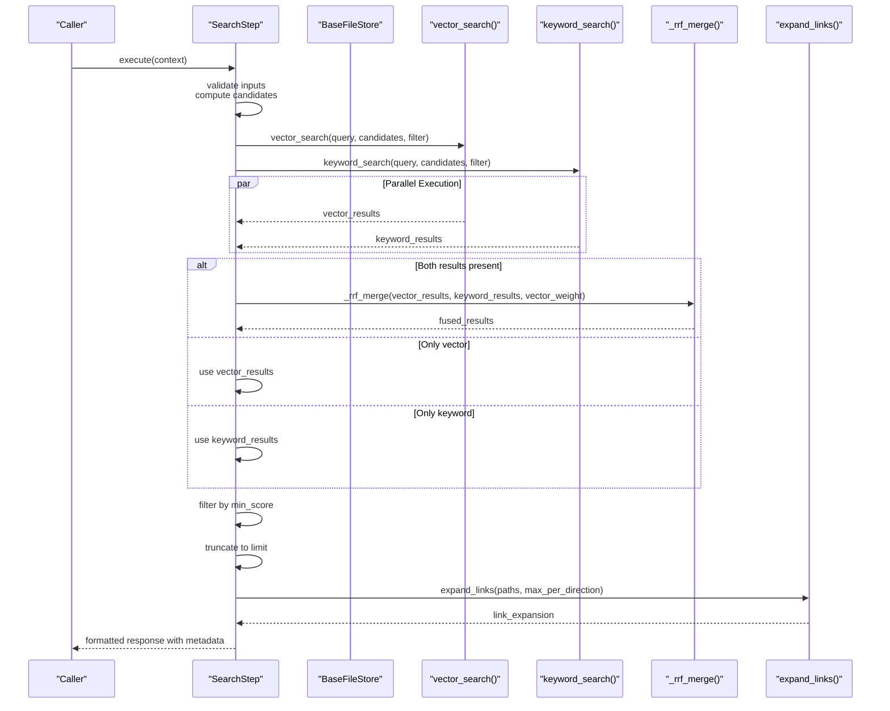
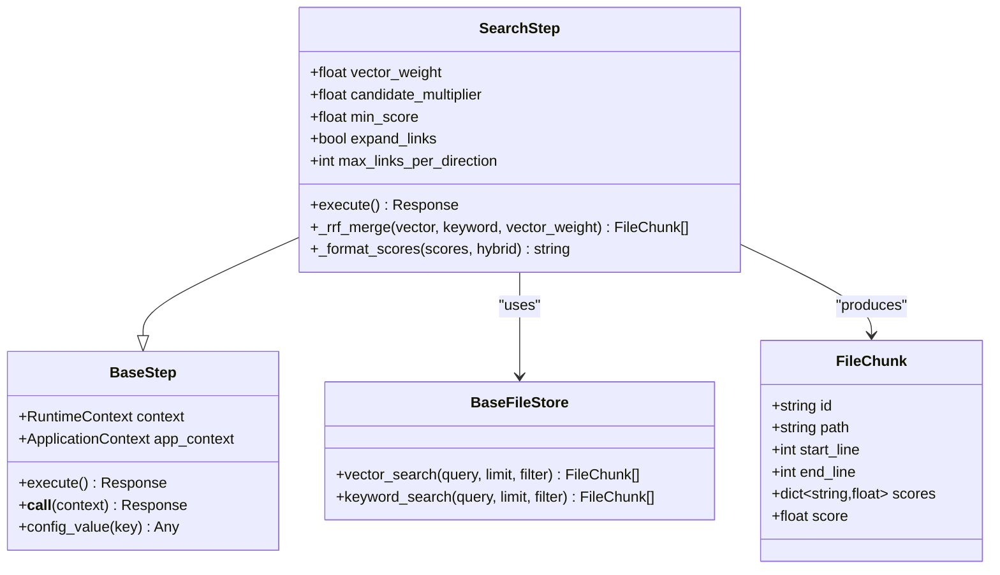
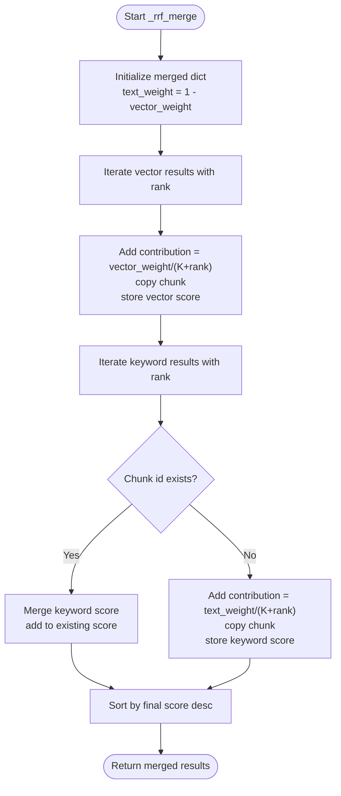
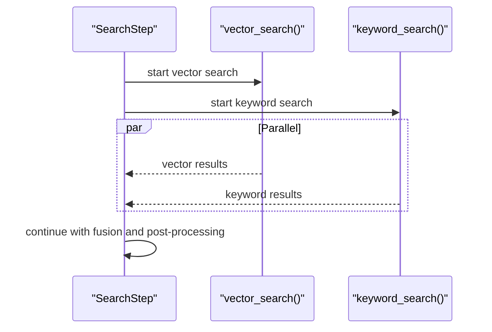
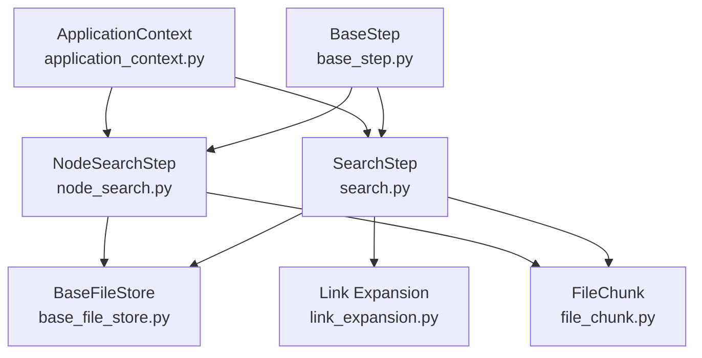

# Hybrid Search Engine

<cite>
**Referenced Files in This Document**
- [search.py](file://reme/steps/index/search.py)
- [test_search_step.py](file://tests/unit/test_search_step.py)
- [base_file_store.py](file://reme/components/file_store/base_file_store.py)
- [local_file_store.py](file://reme/components/file_store/local_file_store.py)
- [file_chunk.py](file://reme/schema/file_chunk.py)
- [link_expansion.py](file://reme/utils/link_expansion.py)
- [node_search.py](file://reme/steps/index/node_search.py)
- [base_step.py](file://reme/steps/base_step.py)
- [application_context.py](file://reme/components/application_context.py)
</cite>

## Table of Contents
1. [Introduction](#introduction)
2. [Project Structure](#project-structure)
3. [Core Components](#core-components)
4. [Architecture Overview](#architecture-overview)
5. [Detailed Component Analysis](#detailed-component-analysis)
6. [Dependency Analysis](#dependency-analysis)
7. [Performance Considerations](#performance-considerations)
8. [Troubleshooting Guide](#troubleshooting-guide)
9. [Conclusion](#conclusion)

## Introduction
This document explains the ReMe hybrid search engine implementation that combines vector search results with keyword search results using Reciprocal Rank Fusion (RRF). It covers the SearchStep class architecture, the _rrf_merge method, configuration parameters, parallel execution strategy, and practical examples of how search queries are processed through multiple layers.

## Project Structure
The hybrid search functionality is centered around the SearchStep class located in the index steps package. It integrates with the file store abstraction, which provides both vector and keyword search capabilities. Supporting components include the file chunk schema, link expansion utilities, and the base step infrastructure.

**Diagram sources**
- [search.py:14-131](file://reme/steps/index/search.py#L14-L131)
- [node_search.py:58-159](file://reme/steps/index/node_search.py#L58-L159)
- [base_file_store.py:10-66](file://reme/components/file_store/base_file_store.py#L10-L66)
- [local_file_store.py:273-323](file://reme/components/file_store/local_file_store.py#L273-L323)
- [file_chunk.py:8-27](file://reme/schema/file_chunk.py#L8-L27)
- [link_expansion.py:68-130](file://reme/utils/link_expansion.py#L68-L130)
- [base_step.py:91-216](file://reme/steps/base_step.py#L91-L216)
- [application_context.py:15-38](file://reme/components/application_context.py#L15-L38)

**Section sources**
- [search.py:1-131](file://reme/steps/index/search.py#L1-L131)
- [base_file_store.py:1-66](file://reme/components/file_store/base_file_store.py#L1-L66)

## Core Components
This section documents the key components involved in hybrid search:

- SearchStep: Orchestrates parallel vector and keyword search, applies RRF fusion, filters by minimum score, truncates results, and optionally expands links.
- BaseFileStore: Defines the abstract interface for vector_search and keyword_search operations.
- FileChunk: Represents a searchable chunk with positional information and per-stage scores.
- Link Expansion Utilities: Provides neighbor discovery and rendering for contextual expansion.
- NodeSearchStep: A specialized hybrid search at the node level for dream phase recall.

Key configuration parameters:
- vector_weight: Controls the balance between vector and keyword contributions in RRF fusion (0.0 to 1.0).
- candidate_multiplier: Determines the number of candidates retrieved before fusion (controls search scope).
- min_score: Filters results below this threshold after fusion.
- expand_links: Enables/disables link expansion for each hit.
- max_links_per_direction: Limits neighbor expansion per direction.

**Section sources**
- [search.py:62-131](file://reme/steps/index/search.py#L62-L131)
- [base_file_store.py:59-65](file://reme/components/file_store/base_file_store.py#L59-L65)
- [file_chunk.py:8-27](file://reme/schema/file_chunk.py#L8-L27)
- [link_expansion.py:68-130](file://reme/utils/link_expansion.py#L68-L130)
- [node_search.py:58-159](file://reme/steps/index/node_search.py#L58-L159)

## Architecture Overview
The hybrid search pipeline executes vector and keyword searches in parallel, fuses the results using RRF, applies filtering and truncation, and optionally enriches results with linked neighbors.

**Diagram sources**
- [search.py:62-131](file://reme/steps/index/search.py#L62-L131)
- [base_file_store.py:59-65](file://reme/components/file_store/base_file_store.py#L59-L65)
- [link_expansion.py:68-103](file://reme/utils/link_expansion.py#L68-L103)

## Detailed Component Analysis

### SearchStep Class Architecture
SearchStep is the primary orchestrator for hybrid search. It validates inputs, computes candidate counts, runs vector and keyword searches in parallel, merges results via RRF, applies filters, and formats the final response.

Key methods and responsibilities:
- _rrf_merge: Implements reciprocal rank fusion combining vector and keyword rankings.
- _format_scores: Formats score metadata for display.
- execute: Main workflow coordinating all phases.

**Diagram sources**
- [search.py:14-131](file://reme/steps/index/search.py#L14-L131)
- [base_step.py:91-216](file://reme/steps/base_step.py#L91-L216)
- [base_file_store.py:10-66](file://reme/components/file_store/base_file_store.py#L10-L66)
- [file_chunk.py:8-27](file://reme/schema/file_chunk.py#L8-L27)

**Section sources**
- [search.py:14-131](file://reme/steps/index/search.py#L14-L131)
- [base_step.py:91-216](file://reme/steps/base_step.py#L91-L216)

### Reciprocal Rank Fusion (RRF) Methodology
The _rrf_merge method combines ranked lists from vector and keyword search using the formula:
- contribution_vector = (vector_weight) / (K + rank)
- contribution_keyword = (1 - vector_weight) / (K + rank)
- final_score = sum of contributions across ranks
Where K is a smoothing constant (60) used to prevent extreme sensitivity to top-ranked items.

Implementation highlights:
- Keys results by FileChunk.id to merge overlapping hits.
- Preserves per-branch scores in the scores dictionary for display.
- Sorts final results by combined score in descending order.

**Diagram sources**
- [search.py:18-50](file://reme/steps/index/search.py#L18-L50)

**Section sources**
- [search.py:18-50](file://reme/steps/index/search.py#L18-L50)

### Configuration Parameters
SearchStep accepts several parameters controlling behavior:

- vector_weight: Float in [0.0, 1.0]; higher values favor semantic similarity over lexical matching.
- candidate_multiplier: Multiplier applied to limit to compute candidates; caps at a maximum to control search scope.
- min_score: Threshold to filter fused results; applied after fusion and truncation.
- expand_links: Boolean enabling link expansion for each result.
- max_links_per_direction: Cap on neighbor expansion per direction.

These parameters are validated and used in the execute method to configure the search pipeline.

**Section sources**
- [search.py:62-78](file://reme/steps/index/search.py#L62-L78)

### Parallel Execution Strategy
Vector and keyword searches are executed concurrently using asyncio.gather to minimize total latency. This approach ensures that neither modality becomes a bottleneck and allows the system to leverage available resources effectively.

**Diagram sources**
- [search.py:82-85](file://reme/steps/index/search.py#L82-L85)

**Section sources**
- [search.py:82-85](file://reme/steps/index/search.py#L82-L85)

### Practical Examples and Workflows
The unit tests demonstrate typical usage scenarios:

- Hybrid fusion with shared and distinct hits: Tests that same-id chunks are merged once while preserving per-branch scores, and that the fused score reflects weighted contributions.
- Keyword-only mode with min_score filtering: Demonstrates that when vector results are absent, keyword results are used directly and filtered by min_score.
- Empty query handling: Ensures early failure without invoking storage backends.

These examples illustrate how search queries are processed through multiple layers, how scores are calculated and combined, and how results are formatted for display.

**Section sources**
- [test_search_step.py:78-108](file://tests/unit/test_search_step.py#L78-L108)
- [test_search_step.py:112-129](file://tests/unit/test_search_step.py#L112-L129)
- [test_search_step.py:133-145](file://tests/unit/test_search_step.py#L133-L145)

### Relationship Between Weights and Final Ranking
The final hybrid ranking balances semantic and lexical signals through vector_weight:
- Increasing vector_weight increases the influence of vector similarity, potentially surfacing semantically related content even if lexical matches are weak.
- Decreasing vector_weight emphasizes keyword matches, which can improve recall for exact term coverage.
- The K constant (60) smooths the contribution of distant ranks, preventing overfitting to top positions.

This relationship is evident in the _rrf_merge method where contributions are computed using the RRF formula and combined into a single score.

**Section sources**
- [search.py:18-50](file://reme/steps/index/search.py#L18-L50)

## Dependency Analysis
The hybrid search engine exhibits clear separation of concerns:

- SearchStep depends on BaseFileStore for retrieval operations and on FileChunk for result representation.
- Link expansion utilities are optional and invoked only when enabled.
- NodeSearchStep provides an alternative node-level fusion strategy for specialized use cases.

**Diagram sources**
- [search.py:14-131](file://reme/steps/index/search.py#L14-L131)
- [node_search.py:58-159](file://reme/steps/index/node_search.py#L58-L159)
- [base_file_store.py:10-66](file://reme/components/file_store/base_file_store.py#L10-L66)
- [file_chunk.py:8-27](file://reme/schema/file_chunk.py#L8-L27)
- [link_expansion.py:68-130](file://reme/utils/link_expansion.py#L68-L130)
- [base_step.py:91-216](file://reme/steps/base_step.py#L91-L216)
- [application_context.py:15-38](file://reme/components/application_context.py#L15-L38)

**Section sources**
- [search.py:14-131](file://reme/steps/index/search.py#L14-L131)
- [node_search.py:58-159](file://reme/steps/index/node_search.py#L58-L159)
- [base_file_store.py:10-66](file://reme/components/file_store/base_file_store.py#L10-L66)

## Performance Considerations
- Candidate selection: Using candidate_multiplier reduces the cost of keyword indexing while still allowing sufficient recall for fusion.
- Parallelism: Executing vector and keyword searches concurrently minimizes latency.
- Truncation: Limiting results to the requested limit after fusion prevents excessive downstream processing.
- Link expansion: Enabled by default but can be disabled to reduce overhead when not needed.

[No sources needed since this section provides general guidance]

## Troubleshooting Guide
Common issues and resolutions:

- Empty query: The step fails fast with an error message and does not invoke storage backends.
- Invalid vector_weight: Asserts that the weight is within [0.0, 1.0].
- No results: When both modalities return empty results, the step returns an empty result set; when only one is empty, it falls back to the other.
- Filtering: min_score ensures only results meeting the threshold are returned.

**Section sources**
- [search.py:72-77](file://reme/steps/index/search.py#L72-L77)
- [search.py:93-99](file://reme/steps/index/search.py#L93-L99)
- [search.py:102-104](file://reme/steps/index/search.py#L102-L104)
- [test_search_step.py:133-145](file://tests/unit/test_search_step.py#L133-L145)

## Conclusion
The ReMe hybrid search engine provides a robust, configurable solution for combining semantic and lexical retrieval signals. Through reciprocal rank fusion, parallel execution, and careful parameterization, it delivers balanced and efficient search results suitable for both general-purpose retrieval and specialized recall tasks.