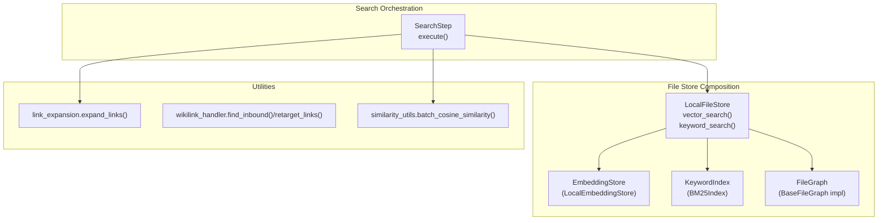
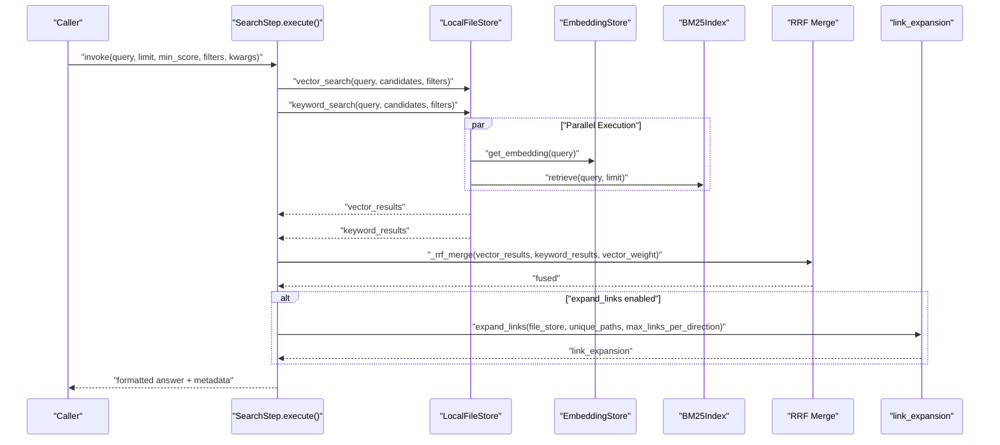
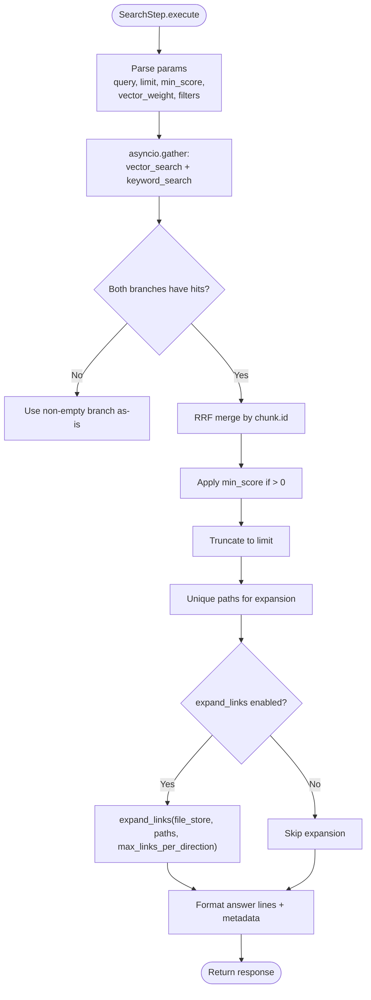
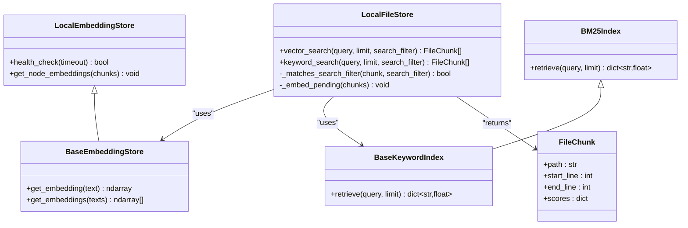
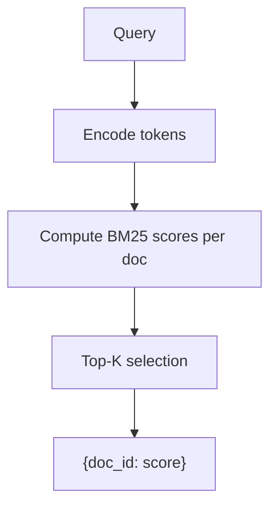
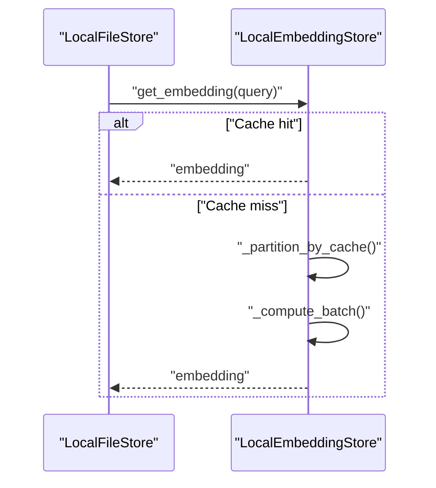
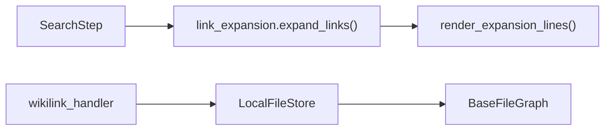
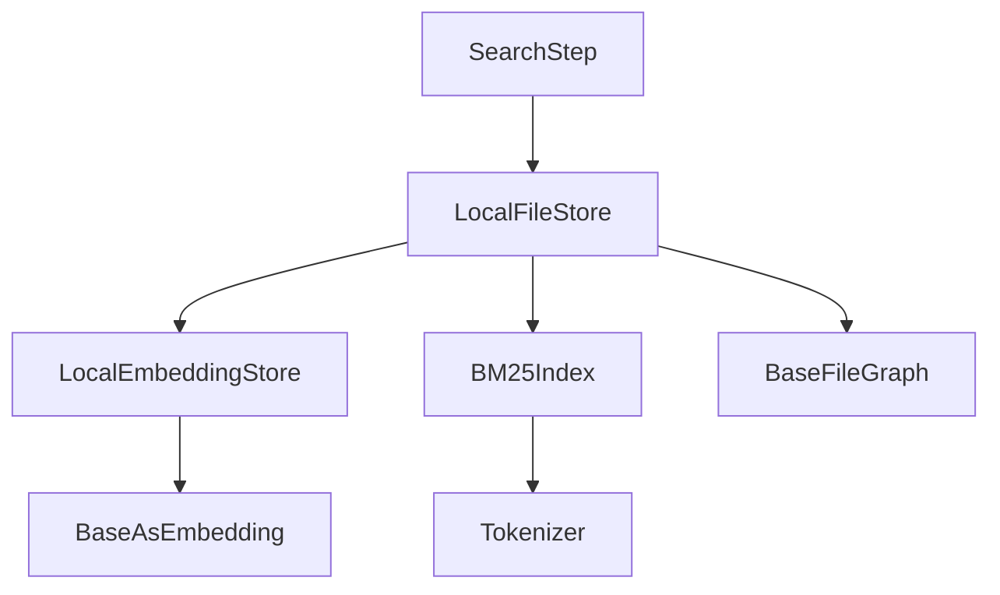

# Search and Retrieval

<cite>
**Referenced Files in This Document**
- [search.py](file://reme/steps/index/search.py)
- [bm25_index.py](file://reme/components/keyword_index/bm25_index.py)
- [base_keyword_index.py](file://reme/components/keyword_index/base_keyword_index.py)
- [local_embedding_store.py](file://reme/components/embedding_store/local_embedding_store.py)
- [base_embedding_store.py](file://reme/components/embedding_store/base_embedding_store.py)
- [local_file_store.py](file://reme/components/file_store/local_file_store.py)
- [base_file_store.py](file://reme/components/file_store/base_file_store.py)
- [base_file_graph.py](file://reme/components/file_graph/base_file_graph.py)
- [file_chunk.py](file://reme/schema/file_chunk.py)
- [link_expansion.py](file://reme/utils/link_expansion.py)
- [wikilink_handler.py](file://reme/utils/wikilink_handler.py)
- [default.yaml](file://reme/config/default.yaml)
- [node_search.py](file://reme/steps/index/node_search.py)
- [similarity_utils.py](file://reme/utils/similarity_utils.py)
- [test_search_step.py](file://tests/unit/test_search_step.py)
- [test_keyword_index.py](file://tests/unit/test_keyword_index.py)
</cite>

## Table of Contents
1. [Introduction](#introduction)
2. [Project Structure](#project-structure)
3. [Core Components](#core-components)
4. [Architecture Overview](#architecture-overview)
5. [Detailed Component Analysis](#detailed-component-analysis)
6. [Dependency Analysis](#dependency-analysis)
7. [Performance Considerations](#performance-considerations)
8. [Troubleshooting Guide](#troubleshooting-guide)
9. [Conclusion](#conclusion)
10. [Appendices](#appendices)

## Introduction
This document explains the ReMe hybrid search and retrieval system that combines three complementary capabilities:
- Keyword search via an on-disk BM25 index
- Semantic similarity via vector embeddings
- Relationship expansion via wikilink graph traversal

The system orchestrates these components in a progressive hybrid search pipeline that runs vector and keyword searches in parallel, fuses results with Reciprocal Rank Fusion (RRF), applies filters and truncation, and optionally expands results with neighboring wikilinks for richer context.

## Project Structure
The search pipeline centers on a dedicated step that coordinates the file store’s vector and keyword search capabilities, merges results, and renders contextual expansions.

**Diagram sources**
- [search.py:62-130](file://reme/steps/index/search.py#L62-L130)
- [local_file_store.py:273-323](file://reme/components/file_store/local_file_store.py#L273-L323)
- [local_embedding_store.py:17-202](file://reme/components/embedding_store/local_embedding_store.py#L17-L202)
- [bm25_index.py:32-308](file://reme/components/keyword_index/bm25_index.py#L32-L308)
- [base_file_graph.py:10-69](file://reme/components/file_graph/base_file_graph.py#L10-L69)
- [link_expansion.py:1-129](file://reme/utils/link_expansion.py#L1-L129)
- [wikilink_handler.py:253-388](file://reme/utils/wikilink_handler.py#L253-L388)
- [similarity_utils.py:21-40](file://reme/utils/similarity_utils.py#L21-L40)

**Section sources**
- [search.py:14-130](file://reme/steps/index/search.py#L14-L130)
- [local_file_store.py:20-379](file://reme/components/file_store/local_file_store.py#L20-L379)
- [default.yaml:264-289](file://reme/config/default.yaml#L264-L289)

## Core Components
- SearchStep: Orchestrates hybrid search, performs parallel vector and keyword retrieval, fuses via RRF, applies filters, truncates, and optionally expands results with wikilink neighbors.
- LocalFileStore: Provides vector_search and keyword_search by composing EmbeddingStore, KeywordIndex, and FileGraph.
- LocalEmbeddingStore: Supplies embeddings with caching, batching, and persistence.
- BM25Index: Full-text keyword index with on-disk persistence and efficient scoring.
- BaseFileGraph: Graph interface for nodes and links.
- FileChunk: Data model for chunked content with positional info and staged scores.
- Utilities: link_expansion for rendering neighbor context and wikilink_handler for graph-aware operations.

**Section sources**
- [search.py:14-130](file://reme/steps/index/search.py#L14-L130)
- [local_file_store.py:20-379](file://reme/components/file_store/local_file_store.py#L20-L379)
- [local_embedding_store.py:17-202](file://reme/components/embedding_store/local_embedding_store.py#L17-L202)
- [bm25_index.py:32-308](file://reme/components/keyword_index/bm25_index.py#L32-L308)
- [base_file_graph.py:10-69](file://reme/components/file_graph/base_file_graph.py#L10-L69)
- [file_chunk.py:8-27](file://reme/schema/file_chunk.py#L8-L27)
- [link_expansion.py:1-129](file://reme/utils/link_expansion.py#L1-L129)
- [wikilink_handler.py:58-388](file://reme/utils/wikilink_handler.py#L58-L388)

## Architecture Overview
The hybrid search pipeline executes in stages:
1. Parameterization: query, limits, weights, and filters are read from runtime context and kwargs.
2. Parallel retrieval: vector_search and keyword_search are executed concurrently.
3. Fusion: results are merged using RRF with configurable vector_weight.
4. Filtering and truncation: optional min_score threshold and limit cap.
5. Optional link expansion: neighbors are fetched and rendered for each result.
6. Formatting: results are formatted with scores and optional per-branch breakdown.

**Diagram sources**
- [search.py:62-130](file://reme/steps/index/search.py#L62-L130)
- [local_file_store.py:273-323](file://reme/components/file_store/local_file_store.py#L273-L323)
- [local_embedding_store.py:76-133](file://reme/components/embedding_store/local_embedding_store.py#L76-L133)
- [bm25_index.py:295-308](file://reme/components/keyword_index/bm25_index.py#L295-L308)
- [link_expansion.py:103-129](file://reme/utils/link_expansion.py#L103-L129)

## Detailed Component Analysis

### SearchStep: Hybrid Search Orchestration
- Responsibilities:
  - Parse runtime parameters and kwargs (vector_weight, candidate_multiplier, expand_links, max_links_per_direction, min_score).
  - Run vector_search and keyword_search concurrently.
  - Fuse results via RRF with configurable vector_weight.
  - Apply min_score threshold and limit truncation.
  - Optionally expand links per result and render neighbor context.
  - Produce formatted answer lines and metadata (counts, link_expansion).
- Key behaviors:
  - Uses a fixed RRF_K constant and a maximum candidate cap.
  - Formats scores to include fused score and per-branch scores in hybrid mode.
  - Deduplicates by path after truncation to reduce repetition across chunks.

**Diagram sources**
- [search.py:62-130](file://reme/steps/index/search.py#L62-L130)
- [link_expansion.py:103-129](file://reme/utils/link_expansion.py#L103-L129)

**Section sources**
- [search.py:14-130](file://reme/steps/index/search.py#L14-L130)

### LocalFileStore: Vector and Keyword Search Implementation
- Vector search:
  - Obtains a query embedding from EmbeddingStore.
  - Filters chunks that have embeddings and match search_filter.
  - Computes cosine similarities in batch and sorts by score.
- Keyword search:
  - Delegates to BM25Index.retrieve to obtain doc_id -> score mapping.
  - Matches results to FileChunk and applies search_filter.
- Search filtering:
  - Supports exact path, path prefix, and arbitrary metadata filters.
- Health and resilience:
  - Disables embedding subsystem on failures and continues with keyword-only mode.

**Diagram sources**
- [local_file_store.py:273-374](file://reme/components/file_store/local_file_store.py#L273-L374)
- [base_file_store.py:59-66](file://reme/components/file_store/base_file_store.py#L59-L66)
- [base_embedding_store.py:1-32](file://reme/components/embedding_store/base_embedding_store.py#L1-L32)
- [local_embedding_store.py:17-202](file://reme/components/embedding_store/local_embedding_store.py#L17-L202)
- [base_keyword_index.py:1-69](file://reme/components/keyword_index/base_keyword_index.py#L1-L69)
- [bm25_index.py:295-308](file://reme/components/keyword_index/bm25_index.py#L295-L308)
- [file_chunk.py:8-27](file://reme/schema/file_chunk.py#L8-L27)

**Section sources**
- [local_file_store.py:273-374](file://reme/components/file_store/local_file_store.py#L273-L374)
- [base_file_store.py:57-66](file://reme/components/file_store/base_file_store.py#L57-L66)
- [file_chunk.py:8-27](file://reme/schema/file_chunk.py#L8-L27)

### BM25 Index: Keyword Retrieval Engine
- Features:
  - On-disk persistent inverted index with lazy deletion.
  - Efficient scoring using BM25 formula with k1 and b parameters.
  - Fast retrieval returning doc_id -> score mapping.
- Behavior:
  - Encodes queries and computes per-document scores.
  - Applies Top-K selection and returns results sorted by score.

**Diagram sources**
- [bm25_index.py:295-308](file://reme/components/keyword_index/bm25_index.py#L295-L308)

**Section sources**
- [bm25_index.py:32-308](file://reme/components/keyword_index/bm25_index.py#L32-L308)
- [base_keyword_index.py:1-69](file://reme/components/keyword_index/base_keyword_index.py#L1-L69)

### Embedding Store: Vector Similarity Provider
- Features:
  - LRU cache with disk persistence.
  - Serial batching and retry on transient errors.
  - Normalization to configured dimensions.
  - Health checks against the backing embedding provider.
- Vector search integration:
  - Converts query text to embedding and compares against chunk embeddings using cosine similarity.

**Diagram sources**
- [local_embedding_store.py:76-133](file://reme/components/embedding_store/local_embedding_store.py#L76-L133)
- [similarity_utils.py:21-40](file://reme/utils/similarity_utils.py#L21-L40)

**Section sources**
- [local_embedding_store.py:17-202](file://reme/components/embedding_store/local_embedding_store.py#L17-L202)
- [base_embedding_store.py:1-32](file://reme/components/embedding_store/base_embedding_store.py#L1-L32)
- [similarity_utils.py:1-40](file://reme/utils/similarity_utils.py#L1-L40)

### Wikilink Graph and Expansion
- Graph interface:
  - BaseFileGraph defines node and link access APIs (outlinks/inlinks) with scope semantics.
- Expansion:
  - link_expansion.expand_links groups edges by neighbor and attaches metadata and predicates.
  - render_expansion_lines formats neighbor context for display.
- Handler:
  - wikilink_handler provides graph-aware operations like finding inbound references and rewriting targets.

**Diagram sources**
- [base_file_graph.py:60-69](file://reme/components/file_graph/base_file_graph.py#L60-L69)
- [link_expansion.py:103-129](file://reme/utils/link_expansion.py#L103-L129)
- [wikilink_handler.py:253-388](file://reme/utils/wikilink_handler.py#L253-L388)

**Section sources**
- [base_file_graph.py:10-69](file://reme/components/file_graph/base_file_graph.py#L10-L69)
- [link_expansion.py:1-129](file://reme/utils/link_expansion.py#L1-L129)
- [wikilink_handler.py:58-388](file://reme/utils/wikilink_handler.py#L58-L388)

### Node-Level Search (for Dream Phase 2)
- Differences from general search:
  - Aggregates by node (path) and returns frontmatter inline.
  - Digest-only filter and no link expansion.
  - Uses a heavier candidate multiplier and different weight defaults.
- Purpose:
  - Support dream’s recall needs for deduplication and synapse construction.

**Section sources**
- [node_search.py:1-159](file://reme/steps/index/node_search.py#L1-L159)

## Dependency Analysis
- Coupling:
  - SearchStep depends on LocalFileStore for retrieval and on link_expansion for optional context.
  - LocalFileStore composes EmbeddingStore, KeywordIndex, and FileGraph.
- Cohesion:
  - Each component encapsulates a single responsibility: retrieval, indexing, embeddings, or graph.
- External integrations:
  - EmbeddingStore delegates to a pluggable embedding backend via BaseAsEmbedding.
  - KeywordIndex uses a tokenizer backend.

**Diagram sources**
- [search.py:62-130](file://reme/steps/index/search.py#L62-L130)
- [local_file_store.py:20-51](file://reme/components/file_store/local_file_store.py#L20-L51)
- [local_embedding_store.py:17-37](file://reme/components/embedding_store/local_embedding_store.py#L17-L37)
- [bm25_index.py:32-36](file://reme/components/keyword_index/bm25_index.py#L32-L36)
- [default.yaml:588-672](file://reme/config/default.yaml#L588-L672)

**Section sources**
- [default.yaml:588-672](file://reme/config/default.yaml#L588-L672)
- [local_file_store.py:20-51](file://reme/components/file_store/local_file_store.py#L20-L51)

## Performance Considerations
- Candidate scaling:
  - SearchStep uses a candidate_multiplier to over-fetch and then truncate, reducing the cost of repeated reruns.
- Parallelism:
  - Vector and keyword retrieval run concurrently to minimize latency.
- Caching:
  - EmbeddingStore caches embeddings with LRU eviction and disk persistence to amortize compute costs.
- Batch similarity:
  - LocalFileStore computes cosine similarities in batch to leverage vectorized operations.
- Index maintenance:
  - BM25Index supports lazy deletion and on-disk persistence; optimize periodically to compact postings.
- Filtering:
  - LocalFileStore’s search_filter reduces downstream computation by early pruning.

[No sources needed since this section provides general guidance]

## Troubleshooting Guide
- Empty or degraded results:
  - Verify embedding health; LocalFileStore disables embedding on failures and falls back to keyword-only search.
- Slow vector search:
  - Check embedding cache hit rate and consider increasing max_cache_size or tuning embedding dimensions.
- Keyword scoring anomalies:
  - Confirm tokenizer and BM25 parameters; ensure index is synchronized with persisted chunks.
- Link expansion issues:
  - Ensure FileGraph is healthy and up-to-date; verify that expand_links is enabled and max_links_per_direction is sufficient.
- Misconfigured parameters:
  - Validate vector_weight, candidate_multiplier, min_score, and search_filter values.

**Section sources**
- [local_file_store.py:73-79](file://reme/components/file_store/local_file_store.py#L73-L79)
- [local_embedding_store.py:58-72](file://reme/components/embedding_store/local_embedding_store.py#L58-L72)
- [local_file_store.py:340-374](file://reme/components/file_store/local_file_store.py#L340-L374)

## Conclusion
ReMe’s hybrid search pipeline unifies keyword, semantic, and relational signals to deliver robust, explainable retrieval. By running vector and keyword search in parallel, fusing with RRF, and optionally expanding with wikilinks, the system balances precision and recall while maintaining operational simplicity and strong performance characteristics.

[No sources needed since this section summarizes without analyzing specific files]

## Appendices

### Configuration Options
- SearchStep parameters (from job definition):
  - vector_weight: default 0.7
  - candidate_multiplier: default 3.0
  - expand_links: default true
  - max_links_per_direction: default 10
- Component bindings (from default.yaml):
  - embedding_store.default.backend: local
  - keyword_index.default.backend: bm25
  - file_store.default.backend: local

**Section sources**
- [default.yaml:264-289](file://reme/config/default.yaml#L264-L289)
- [default.yaml:598-672](file://reme/config/default.yaml#L598-L672)

### Practical Examples and Scoring Behavior
- Example: Hybrid fusion yields higher combined scores than individual branches for overlapping results.
- Example: When vector has no hits, keyword results are returned directly and filtered by min_score.
- Example: Per-result scores include fused score and per-branch scores in hybrid mode.

**Section sources**
- [test_search_step.py:93-122](file://tests/unit/test_search_step.py#L93-L122)
- [test_search_step.py:112-122](file://tests/unit/test_search_step.py#L112-L122)
- [search.py:52-60](file://reme/steps/index/search.py#L52-L60)

### Data Model: FileChunk
- Fields:
  - path, start_line, end_line: positional boundaries
  - scores: staged scores keyed by retrieval stage
  - score: final aggregated score

**Section sources**
- [file_chunk.py:8-27](file://reme/schema/file_chunk.py#L8-L27)