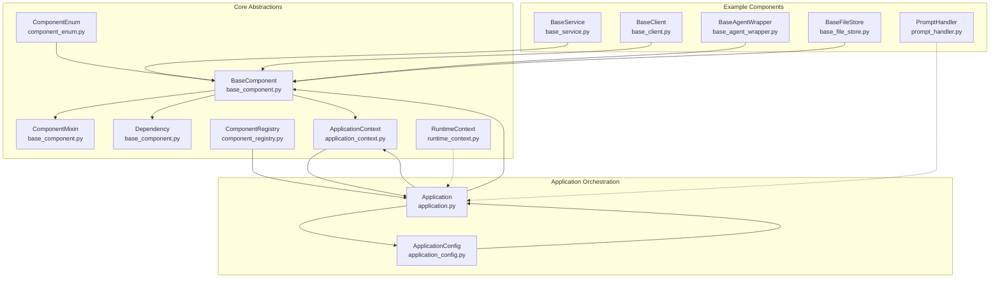
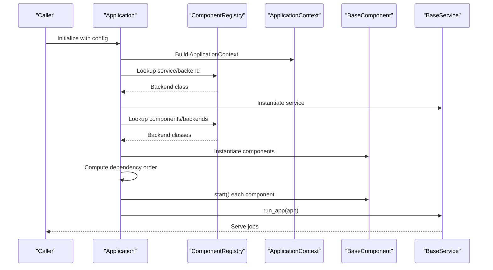
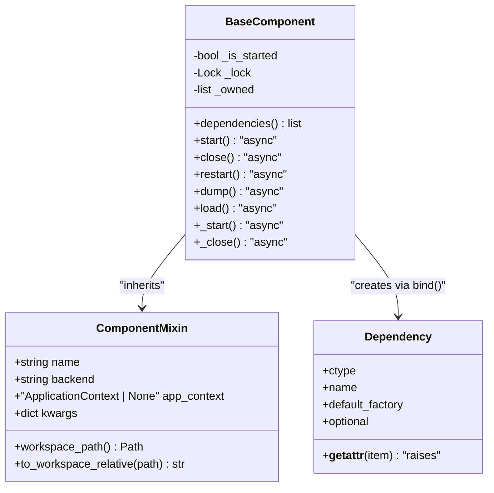
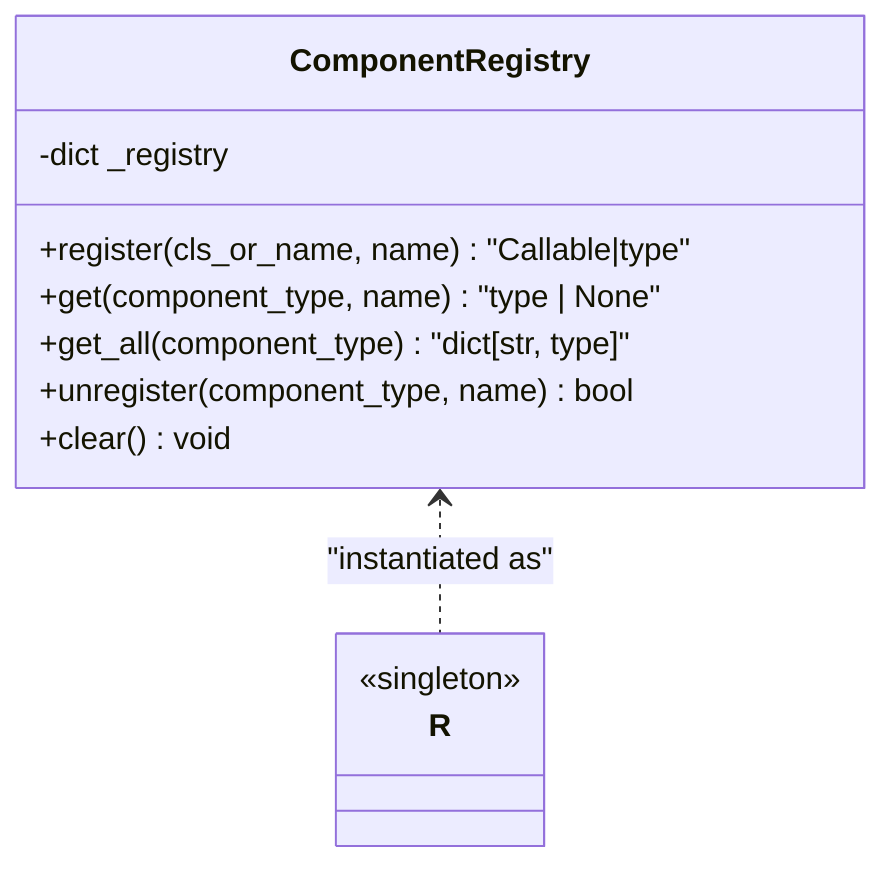
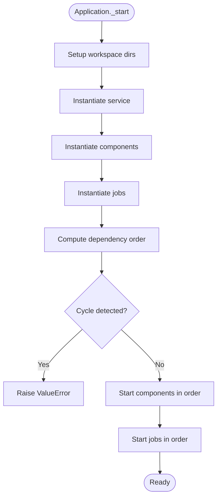
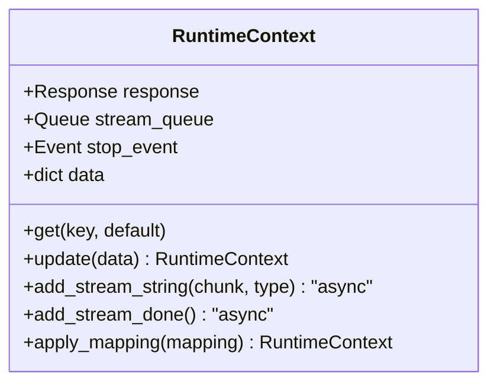
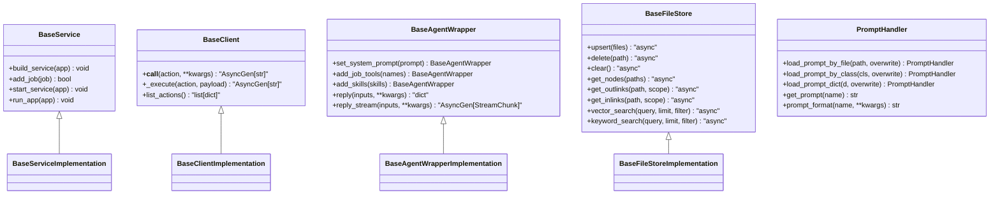
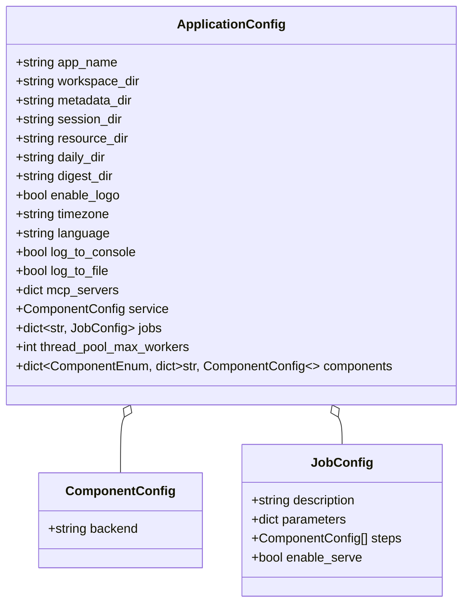
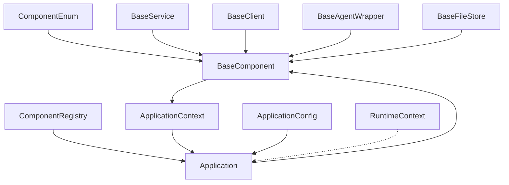

# Component System Design

<cite>
**Referenced Files in This Document**
- [__init__.py](file://reme/components/__init__.py)
- [base_component.py](file://reme/components/base_component.py)
- [component_registry.py](file://reme/components/component_registry.py)
- [application_context.py](file://reme/components/application_context.py)
- [runtime_context.py](file://reme/components/runtime_context.py)
- [prompt_handler.py](file://reme/components/prompt_handler.py)
- [component_enum.py](file://reme/enumeration/component_enum.py)
- [application.py](file://reme/application.py)
- [base_client.py](file://reme/components/client/base_client.py)
- [base_service.py](file://reme/components/service/base_service.py)
- [base_agent_wrapper.py](file://reme/components/agent_wrapper/base_agent_wrapper.py)
- [base_file_store.py](file://reme/components/file_store/base_file_store.py)
- [application_config.py](file://reme/schema/application_config.py)
- [demo.yaml](file://reme/config/demo.yaml)
- [test_component_registry.py](file://tests/unit/test_component_registry.py)
- [test_base_component.py](file://tests/unit/test_base_component.py)
</cite>

## Table of Contents
1. [Introduction](#introduction)
2. [Project Structure](#project-structure)
3. [Core Components](#core-components)
4. [Architecture Overview](#architecture-overview)
5. [Detailed Component Analysis](#detailed-component-analysis)
6. [Dependency Analysis](#dependency-analysis)
7. [Performance Considerations](#performance-considerations)
8. [Troubleshooting Guide](#troubleshooting-guide)
9. [Conclusion](#conclusion)
10. [Appendices](#appendices)

## Introduction
This document explains the ReMe component system design with a focus on the component registry pattern, dependency injection mechanism, circular dependency detection, base component lifecycle, and runtime context handling. It also covers how components are registered, instantiated, and managed across the application lifecycle, along with examples of registration, configuration patterns, inter-component communication, and practical guidance for building custom components.

## Project Structure
The component system is centered around a small set of core modules that define the base component abstractions, a global registry, application context, and runtime context. Supporting enumerations and configuration models provide type-safe keys and wiring metadata. Example components illustrate concrete implementations, and tests validate the core behaviors.

**Diagram sources**
- [base_component.py:85-254](file://reme/components/base_component.py#L85-L254)
- [component_registry.py:12-84](file://reme/components/component_registry.py#L12-L84)
- [application_context.py:15-37](file://reme/components/application_context.py#L15-L37)
- [runtime_context.py:9-90](file://reme/components/runtime_context.py#L9-L90)
- [component_enum.py:6-37](file://reme/enumeration/component_enum.py#L6-L37)
- [application.py:21-254](file://reme/application.py#L21-L254)
- [application_config.py:27-49](file://reme/schema/application_config.py#L27-L49)
- [base_service.py:18-83](file://reme/components/service/base_service.py#L18-L83)
- [base_client.py:11-41](file://reme/components/client/base_client.py#L11-L41)
- [base_agent_wrapper.py:18-82](file://reme/components/agent_wrapper/base_agent_wrapper.py#L18-L82)
- [base_file_store.py:10-65](file://reme/components/file_store/base_file_store.py#L10-L65)
- [prompt_handler.py:14-136](file://reme/components/prompt_handler.py#L14-L136)

**Section sources**
- [__init__.py:1-45](file://reme/components/__init__.py#L1-L45)
- [application.py:21-254](file://reme/application.py#L21-L254)
- [application_config.py:27-49](file://reme/schema/application_config.py#L27-L49)

## Core Components
This section introduces the foundational pieces of the component system.

- BaseComponent: Provides async lifecycle hooks, dependency declaration and resolution, owned component cascading, and workspace helpers.
- ComponentMixin: Supplies identity, configuration, and workspace path utilities.
- Dependency: Placeholder returned by bind() that is resolved at start() time.
- ComponentRegistry: Global registry mapping (ComponentEnum, name) -> class with decorator and direct registration support.
- ApplicationContext: Shared state container for components, jobs, service, and metadata.
- RuntimeContext: Per-execution scratch space for streaming and data exchange.
- ComponentEnum: Strongly-typed enumeration of component categories.

Key behaviors:
- Dependency injection via bind() returning a placeholder; resolution occurs in start() via _resolve_bindings().
- Lifecycle: start() resolves dependencies, starts owned components, invokes subclass _start(); close() reverses the process.
- Circular dependency detection via topological sort during Application startup.

**Section sources**
- [base_component.py:17-254](file://reme/components/base_component.py#L17-L254)
- [component_registry.py:12-84](file://reme/components/component_registry.py#L12-L84)
- [application_context.py:15-37](file://reme/components/application_context.py#L15-L37)
- [runtime_context.py:9-90](file://reme/components/runtime_context.py#L9-L90)
- [component_enum.py:6-37](file://reme/enumeration/component_enum.py#L6-L37)

## Architecture Overview
The system orchestrates components through Application, which:
- Parses configuration into ApplicationConfig.
- Instantiates the service, components, and jobs via registry lookup and constructor injection.
- Computes dependency order using Kahn’s algorithm and starts components and jobs in a safe order.
- Manages thread pool and lifecycle of components and jobs.

**Diagram sources**
- [application.py:24-123](file://reme/application.py#L24-L123)
- [application.py:127-167](file://reme/application.py#L127-L167)
- [application.py:171-211](file://reme/application.py#L171-L211)
- [base_service.py:79-83](file://reme/components/service/base_service.py#L79-L83)
- [component_registry.py:63-65](file://reme/components/component_registry.py#L63-L65)

**Section sources**
- [application.py:21-254](file://reme/application.py#L21-L254)
- [application_config.py:27-49](file://reme/schema/application_config.py#L27-L49)

## Detailed Component Analysis

### BaseComponent and ComponentMixin
BaseComponent defines:
- bind(): Declares a dependency with component_type and name; returns a Dependency placeholder.
- _resolve_bindings(): Iterates attributes and replaces Dependency placeholders with resolved targets.
- start()/close()/restart(): Thread-safe lifecycle with owned component cascade.
- Workspace helpers: workspace_path, workspace_metadata_path, component_metadata_path.

ComponentMixin provides:
- Identity: name, backend, app_context.
- Workspace utilities: converting paths to workspace-relative form.

**Diagram sources**
- [base_component.py:17-254](file://reme/components/base_component.py#L17-L254)

**Section sources**
- [base_component.py:17-254](file://reme/components/base_component.py#L17-L254)

### Component Registry Pattern
ComponentRegistry provides:
- register(): Direct registration or decorator usage.
- get(): Retrieve a registered class by (ComponentEnum, name).
- get_all(): Return a copy of all classes for a type.
- unregister()/clear(): Manage registry contents.

**Diagram sources**
- [component_registry.py:12-84](file://reme/components/component_registry.py#L12-L84)

**Section sources**
- [component_registry.py:12-84](file://reme/components/component_registry.py#L12-L84)
- [test_component_registry.py:31-100](file://tests/unit/test_component_registry.py#L31-L100)

### Application Orchestration and Circular Dependency Detection
Application wires and starts the system:
- _instantiate(): Uses ComponentRegistry to resolve backend classes and constructs instances with app_context injected.
- _topological_order(): Builds dependency graph from component.dependencies and validates cycles.
- _start(): Starts components and jobs in a safe order; manages thread pool.

**Diagram sources**
- [application.py:47-87](file://reme/application.py#L47-L87)
- [application.py:89-123](file://reme/application.py#L89-L123)
- [application.py:127-167](file://reme/application.py#L127-L167)
- [application.py:171-211](file://reme/application.py#L171-L211)

**Section sources**
- [application.py:89-167](file://reme/application.py#L89-L167)

### Runtime Context Handling
RuntimeContext encapsulates per-execution state:
- response, stream_queue, stop_event, and a free-form data dict.
- Helpers for streaming, mapping, and data mutation.

**Diagram sources**
- [runtime_context.py:9-90](file://reme/components/runtime_context.py#L9-L90)

**Section sources**
- [runtime_context.py:9-90](file://reme/components/runtime_context.py#L9-L90)

### Example Components and Interactions
Concrete components demonstrate the base patterns:

- BaseService: Exposes jobs via a service backend; integrates with Application lifecycle.
- BaseClient: Abstract client interface for action execution and discovery.
- BaseAgentWrapper: Agent facade with job tool resolution and streaming.
- BaseFileStore: Semantic contract for file storage operations.
- PromptHandler: Loads and renders prompt templates with localization and flags.

**Diagram sources**
- [base_service.py:18-83](file://reme/components/service/base_service.py#L18-L83)
- [base_client.py:11-41](file://reme/components/client/base_client.py#L11-L41)
- [base_agent_wrapper.py:18-82](file://reme/components/agent_wrapper/base_agent_wrapper.py#L18-L82)
- [base_file_store.py:10-65](file://reme/components/file_store/base_file_store.py#L10-L65)
- [prompt_handler.py:14-136](file://reme/components/prompt_handler.py#L14-L136)

**Section sources**
- [base_service.py:18-83](file://reme/components/service/base_service.py#L18-L83)
- [base_client.py:11-41](file://reme/components/client/base_client.py#L11-L41)
- [base_agent_wrapper.py:18-82](file://reme/components/agent_wrapper/base_agent_wrapper.py#L18-L82)
- [base_file_store.py:10-65](file://reme/components/file_store/base_file_store.py#L10-L65)
- [prompt_handler.py:14-136](file://reme/components/prompt_handler.py#L14-L136)

### Configuration Patterns and Examples
ApplicationConfig defines the schema for:
- Application-level settings (workspace, logging, thread pool).
- Service configuration.
- Jobs (descriptions, parameters, steps).
- Components grouped by ComponentEnum.

Example configuration demonstrates service and job definitions.

**Diagram sources**
- [application_config.py:10-49](file://reme/schema/application_config.py#L10-L49)

**Section sources**
- [application_config.py:27-49](file://reme/schema/application_config.py#L27-L49)
- [demo.yaml:1-64](file://reme/config/demo.yaml#L1-L64)

## Dependency Analysis
This section maps the relationships among core modules and highlights coupling and cohesion.

**Diagram sources**
- [component_enum.py:6-37](file://reme/enumeration/component_enum.py#L6-L37)
- [base_component.py:85-254](file://reme/components/base_component.py#L85-L254)
- [component_registry.py:12-84](file://reme/components/component_registry.py#L12-L84)
- [application.py:21-254](file://reme/application.py#L21-L254)
- [application_context.py:15-37](file://reme/components/application_context.py#L15-L37)
- [application_config.py:27-49](file://reme/schema/application_config.py#L27-L49)
- [base_service.py:18-83](file://reme/components/service/base_service.py#L18-L83)
- [base_client.py:11-41](file://reme/components/client/base_client.py#L11-L41)
- [base_agent_wrapper.py:18-82](file://reme/components/agent_wrapper/base_agent_wrapper.py#L18-L82)
- [base_file_store.py:10-65](file://reme/components/file_store/base_file_store.py#L10-L65)
- [runtime_context.py:9-90](file://reme/components/runtime_context.py#L9-L90)

**Section sources**
- [application.py:89-167](file://reme/application.py#L89-L167)
- [base_component.py:140-176](file://reme/components/base_component.py#L140-L176)

## Performance Considerations
- Dependency resolution is O(N + D) where N is components and D is declared dependencies; performed once per component start.
- Topological sorting uses Kahn’s algorithm with O(N + D) time and heap operations for ordering.
- Owned component lifecycle ensures deterministic teardown; exceptions in close() are aggregated to surface the first error while still closing remaining components.
- Thread pool creation is optional and controlled by ApplicationConfig.thread_pool_max_workers.

[No sources needed since this section provides general guidance]

## Troubleshooting Guide
Common issues and diagnostics:
- Unresolved dependencies: Accessing a Dependency placeholder before start() raises a clear error.
- Missing required dependency in context: start() raises a ValueError indicating the missing component.
- Circular dependencies: Application._topological_order() detects cycles and raises a ValueError with affected component identifiers.
- Close failures: Application aggregates errors during close(), logging subsequent failures for owned components.

**Section sources**
- [base_component.py:78-82](file://reme/components/base_component.py#L78-L82)
- [base_component.py:175-175](file://reme/components/base_component.py#L175-L175)
- [application.py:145-147](file://reme/application.py#L145-L147)
- [application.py:229-248](file://reme/application.py#L229-L248)

## Conclusion
The ReMe component system provides a robust, extensible foundation for building modular applications. The registry-driven instantiation, explicit dependency injection, and lifecycle management ensure predictable startup and shutdown. The Application orchestrator enforces dependency order and detects cycles, while RuntimeContext supports streaming and per-execution state. Concrete component abstractions (Service, Client, Agent Wrapper, File Store) demonstrate how to implement domain-specific capabilities with shared utilities.

[No sources needed since this section summarizes without analyzing specific files]

## Appendices

### Practical Examples

- Registering a component:
  - Use the global registry singleton R to register a class under a ComponentEnum and name. Both direct registration and decorator forms are supported.
  - Reference: [component_registry.py:41-61](file://reme/components/component_registry.py#L41-L61)

- Declaring and resolving dependencies:
  - Declare a dependency with BaseComponent.bind(name, TargetClass, optional/default_factory).
  - Dependencies are resolved automatically during start(); optional missing dependencies become None; required missing dependencies cause a ValueError.
  - Reference: [base_component.py:112-176](file://reme/components/base_component.py#L112-L176)

- Starting and stopping components:
  - Call start() to initialize; close() to tear down; restart() to cycle lifecycle.
  - References: [base_component.py:207-244](file://reme/components/base_component.py#L207-L244)

- Creating a custom component:
  - Define a subclass of BaseComponent with component_type set to a ComponentEnum value.
  - Implement _start() and _close() for async initialization and cleanup.
  - Optionally declare dependencies via bind() and use app_context to access shared resources.
  - References: [base_component.py:85-254](file://reme/components/base_component.py#L85-L254), [component_enum.py:6-37](file://reme/enumeration/component_enum.py#L6-L37)

- Integrating into the system:
  - Register the component class with R.register(...).
  - Add a configuration entry under ApplicationConfig.components with backend pointing to the registered name.
  - Reference: [application.py:65-76](file://reme/application.py#L65-L76), [application_config.py:46-49](file://reme/schema/application_config.py#L46-L49)

- Inter-component communication:
  - Components can access each other via ApplicationContext.components and app_context.jobs when bound to the same Application.
  - References: [application_context.py:29-30](file://reme/components/application_context.py#L29-L30), [base_agent_wrapper.py:55-66](file://reme/components/agent_wrapper/base_agent_wrapper.py#L55-L66)

- Streaming and runtime context:
  - Use RuntimeContext to emit stream chunks and coordinate cancellation via stop_event.
  - References: [runtime_context.py:65-79](file://reme/components/runtime_context.py#L65-L79)