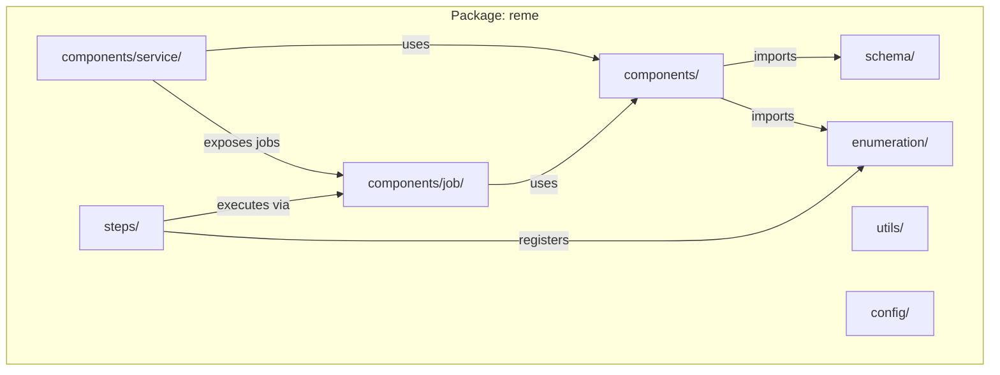
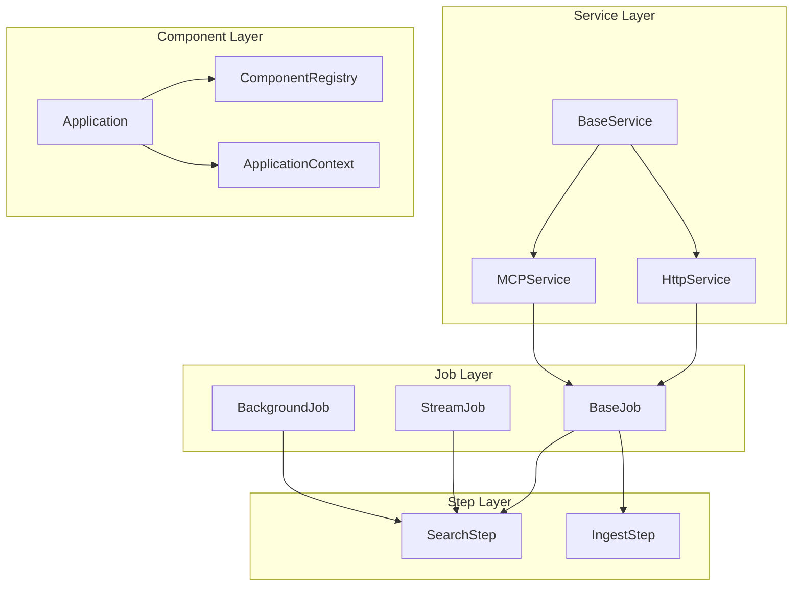
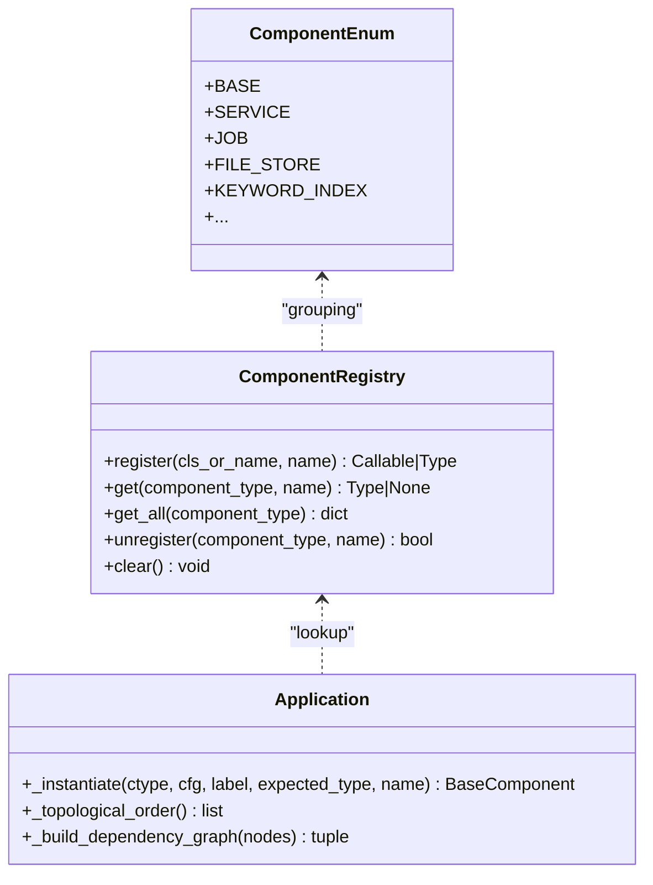
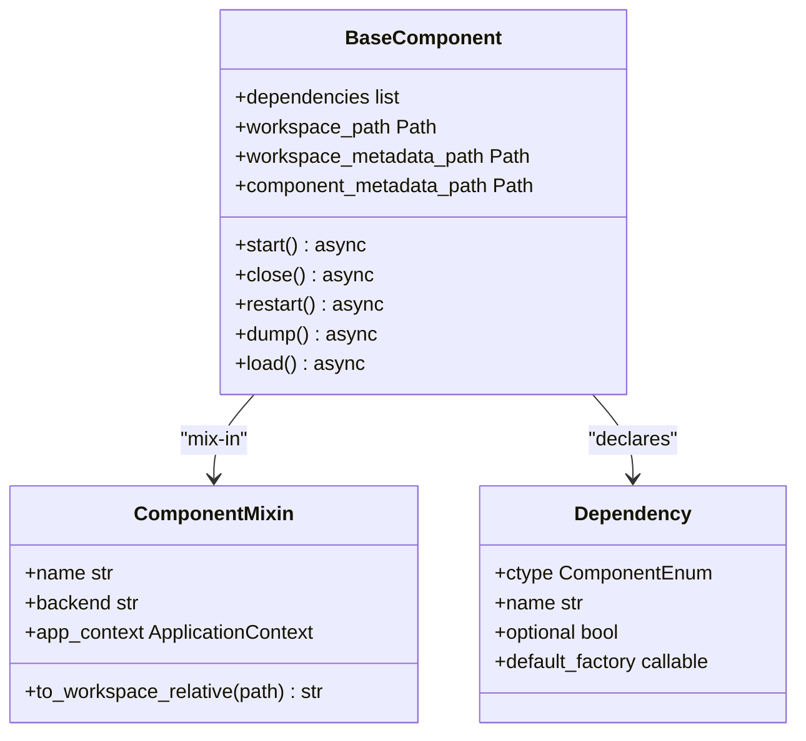
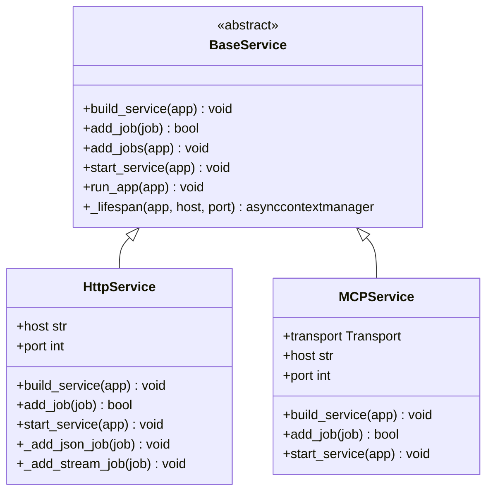
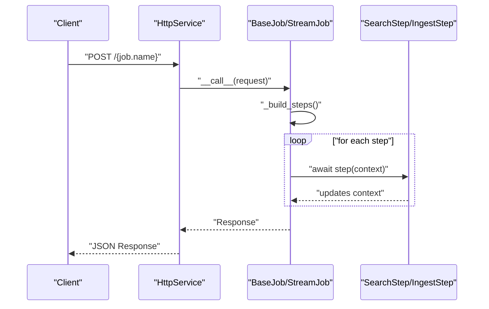
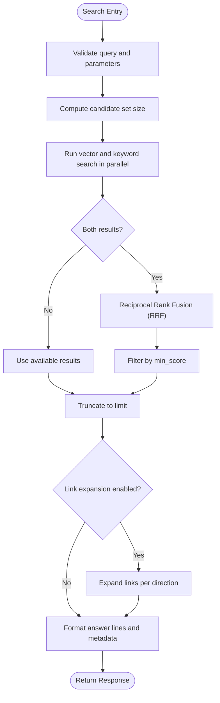
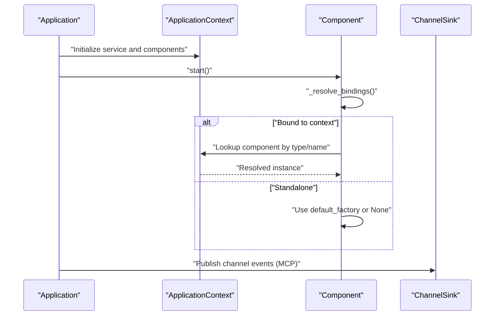
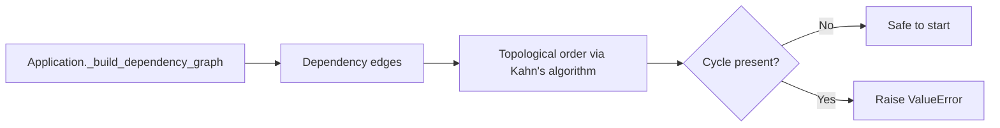
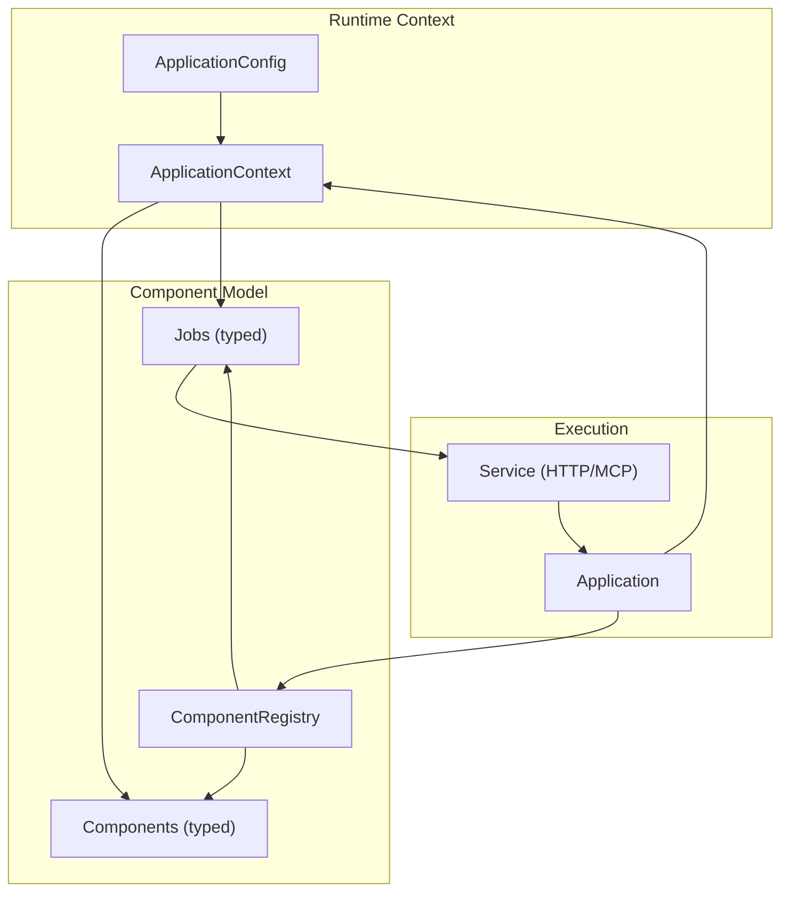

# System Architecture

<cite>
**Referenced Files in This Document**
- [__init__.py](file://reme/__init__.py)
- [application.py](file://reme/application.py)
- [component_registry.py](file://reme/components/component_registry.py)
- [base_component.py](file://reme/components/base_component.py)
- [application_context.py](file://reme/components/application_context.py)
- [component_enum.py](file://reme/enumeration/component_enum.py)
- [application_config.py](file://reme/schema/application_config.py)
- [base_service.py](file://reme/components/service/base_service.py)
- [http_service.py](file://reme/components/service/http_service.py)
- [mcp_service.py](file://reme/components/service/mcp_service.py)
- [base_job.py](file://reme/components/job/base_job.py)
- [background_job.py](file://reme/components/job/background_job.py)
- [stream_job.py](file://reme/components/job/stream_job.py)
- [search.py](file://reme/steps/index/search.py)
- [ingest.py](file://reme/steps/transfer/ingest.py)
</cite>

## Table of Contents
1. [Introduction](#introduction)
2. [Project Structure](#project-structure)
3. [Core Components](#core-components)
4. [Architecture Overview](#architecture-overview)
5. [Detailed Component Analysis](#detailed-component-analysis)
6. [Dependency Analysis](#dependency-analysis)
7. [Performance Considerations](#performance-considerations)
8. [Troubleshooting Guide](#troubleshooting-guide)
9. [Conclusion](#conclusion)
10. [Appendices](#appendices)

## Introduction
This document describes the ReMe system architecture, focusing on high-level design patterns and runtime behavior. The system follows a layered architecture from CLI/service interfaces down to component implementations. It employs:
- Component Registry Pattern: centralized registration and lookup of component classes by type and name
- Factory Pattern: instantiation of components and jobs via registry-resolved constructors
- Observer Pattern: event-driven channel notifications integrated with agent frameworks
- Service Layer Architecture: pluggable service backends (HTTP/MCP) exposing jobs as endpoints/tools

It documents component interactions, memory processing pipelines, hybrid search methodology, file-based memory storage, progressive enhancement, and integration with agent frameworks. Infrastructure requirements, scalability, and deployment topology are addressed alongside cross-cutting concerns such as dependency injection, circular dependency detection, and service abstraction.

## Project Structure
The ReMe package organizes functionality by layers and concerns:
- Components: base abstractions, registry, application context, and concrete implementations
- Schema: typed configuration and data models
- Enumeration: component type taxonomy
- Steps: discrete units of work executed by jobs
- Services: HTTP and MCP service backends
- Jobs: orchestration of steps with lifecycle and streaming support
- Utilities and configuration: parsing, logging, and runtime helpers

**Diagram sources**
- [__init__.py:1-27](file://reme/__init__.py#L1-L27)
- [application.py:1-254](file://reme/application.py#L1-L254)
- [component_registry.py:1-85](file://reme/components/component_registry.py#L1-L85)
- [base_component.py:1-255](file://reme/components/base_component.py#L1-L255)
- [application_context.py:1-38](file://reme/components/application_context.py#L1-L38)
- [component_enum.py:1-38](file://reme/enumeration/component_enum.py#L1-L38)
- [application_config.py:1-50](file://reme/schema/application_config.py#L1-L50)
- [base_service.py:1-84](file://reme/components/service/base_service.py#L1-L84)
- [http_service.py:1-108](file://reme/components/service/http_service.py#L1-L108)
- [mcp_service.py:1-167](file://reme/components/service/mcp_service.py#L1-L167)
- [base_job.py:1-72](file://reme/components/job/base_job.py#L1-L72)
- [background_job.py:1-131](file://reme/components/job/background_job.py#L1-L131)
- [stream_job.py:1-24](file://reme/components/job/stream_job.py#L1-L24)
- [search.py:1-131](file://reme/steps/index/search.py#L1-L131)
- [ingest.py:1-453](file://reme/steps/transfer/ingest.py#L1-L453)

**Section sources**
- [__init__.py:1-27](file://reme/__init__.py#L1-L27)

## Core Components
This section outlines the foundational building blocks that define the system’s architecture.

- Component Registry Pattern
  - Centralized mapping of (ComponentEnum, name) to component classes
  - Supports direct registration and decorator-based registration
  - Provides get/get_all/unregister/clear operations for dynamic discovery

- Base Component Abstractions
  - BaseComponent defines async lifecycle hooks, dependency injection via bind, and workspace path helpers
  - ComponentMixin encapsulates identity, backend selection, and workspace path utilities
  - Dependency placeholders are resolved at start() time, supporting optional and required dependencies

- Application Context
  - ApplicationContext holds typed configuration and shared state (service, components, jobs, thread pool)
  - Acts as a passive container for wiring performed by Application

- Component Types
  - ComponentEnum enumerates component categories (e.g., SERVICE, JOB, FILE_STORE, KEYWORD_INDEX)
  - Used for registry grouping and DI resolution

- Application Orchestration
  - Application wires components from configuration, enforces dependency order, and manages lifecycle
  - Implements topological ordering with circular dependency detection and controlled startup/shutdown

**Section sources**
- [component_registry.py:12-85](file://reme/components/component_registry.py#L12-L85)
- [base_component.py:17-255](file://reme/components/base_component.py#L17-L255)
- [application_context.py:15-38](file://reme/components/application_context.py#L15-L38)
- [component_enum.py:6-38](file://reme/enumeration/component_enum.py#L6-L38)
- [application.py:21-254](file://reme/application.py#L21-L254)

## Architecture Overview
The system follows a layered architecture:
- CLI/Service Interface: HTTPService and MCPService expose jobs as REST endpoints or MCP tools
- Service Layer: BaseService defines the contract for building and serving jobs
- Job Layer: BaseJob orchestrates step execution; StreamJob emits chunks; BackgroundJob runs long-lived tasks
- Step Layer: Discrete units implementing domain logic (e.g., search, ingest)
- Component Layer: Pluggable implementations for file storage, indexing, embedding, graph, and catalog

**Diagram sources**
- [base_service.py:18-84](file://reme/components/service/base_service.py#L18-L84)
- [http_service.py:32-108](file://reme/components/service/http_service.py#L32-L108)
- [mcp_service.py:110-167](file://reme/components/service/mcp_service.py#L110-L167)
- [base_job.py:15-72](file://reme/components/job/base_job.py#L15-L72)
- [stream_job.py:9-24](file://reme/components/job/stream_job.py#L9-L24)
- [background_job.py:15-131](file://reme/components/job/background_job.py#L15-L131)
- [search.py:14-131](file://reme/steps/index/search.py#L14-L131)
- [ingest.py:104-453](file://reme/steps/transfer/ingest.py#L104-L453)
- [component_registry.py:12-85](file://reme/components/component_registry.py#L12-L85)
- [application_context.py:15-38](file://reme/components/application_context.py#L15-L38)
- [application.py:21-254](file://reme/application.py#L21-L254)

## Detailed Component Analysis

### Component Registry and Factory Pattern
The registry centralizes component discovery and instantiation:
- Registration supports both direct calls and decorators
- Lookup returns the registered class for a given type/name pair
- Application uses the registry to instantiate services, components, and jobs based on configuration

**Diagram sources**
- [component_registry.py:12-85](file://reme/components/component_registry.py#L12-L85)
- [application.py:89-123](file://reme/application.py#L89-L123)
- [component_enum.py:6-38](file://reme/enumeration/component_enum.py#L6-L38)

**Section sources**
- [component_registry.py:12-85](file://reme/components/component_registry.py#L12-L85)
- [application.py:89-123](file://reme/application.py#L89-L123)

### Dependency Injection and Lifecycle Management
BaseComponent implements a robust dependency injection and lifecycle model:
- bind() declares dependencies with optional/default_factory semantics
- start()/close() manage resolution, ownership, and orderly shutdown
- Workspace path helpers provide consistent access to directories

**Diagram sources**
- [base_component.py:85-255](file://reme/components/base_component.py#L85-L255)

**Section sources**
- [base_component.py:85-255](file://reme/components/base_component.py#L85-L255)

### Service Layer Architecture
Services implement BaseService to expose jobs:
- HttpService registers JSON endpoints for non-stream jobs and SSE endpoints for StreamJob
- MCPService exposes jobs as MCP tools and integrates a ChannelSink for agent notifications
- BaseService coordinates service lifecycle and job registration

**Diagram sources**
- [base_service.py:18-84](file://reme/components/service/base_service.py#L18-L84)
- [http_service.py:32-108](file://reme/components/service/http_service.py#L32-L108)
- [mcp_service.py:110-167](file://reme/components/service/mcp_service.py#L110-L167)

**Section sources**
- [base_service.py:18-84](file://reme/components/service/base_service.py#L18-L84)
- [http_service.py:32-108](file://reme/components/service/http_service.py#L32-L108)
- [mcp_service.py:110-167](file://reme/components/service/mcp_service.py#L110-L167)

### Job Execution and Memory Processing Pipelines
Jobs orchestrate steps with distinct execution modes:
- BaseJob: sequential step execution returning a Response
- StreamJob: emits chunks to a queue for streaming delivery
- BackgroundJob: long-running loop with supervisor, backoff, and graceful shutdown

**Diagram sources**
- [http_service.py:74-84](file://reme/components/service/http_service.py#L74-L84)
- [base_job.py:60-72](file://reme/components/job/base_job.py#L60-L72)
- [search.py:62-131](file://reme/steps/index/search.py#L62-L131)
- [ingest.py:108-148](file://reme/steps/transfer/ingest.py#L108-L148)

**Section sources**
- [base_job.py:15-72](file://reme/components/job/base_job.py#L15-L72)
- [stream_job.py:9-24](file://reme/components/job/stream_job.py#L9-L24)
- [background_job.py:15-131](file://reme/components/job/background_job.py#L15-L131)

### Hybrid Search Methodology and File-Based Memory Storage
The search step implements a hybrid retrieval strategy:
- Parallel vector and keyword search queries
- Reciprocal Rank Fusion (RRF) to combine rankings
- Optional link expansion and filtering by minimum score and limits
- Results formatted with per-chunk scores and metadata

File-based memory storage is enforced through:
- Resource ingestion into dated buckets under resource/
- Atomic writes and per-day locking to prevent conflicts
- Markdown day views and metadata JSON for provenance and navigation

**Diagram sources**
- [search.py:14-131](file://reme/steps/index/search.py#L14-L131)

**Section sources**
- [search.py:14-131](file://reme/steps/index/search.py#L14-L131)
- [ingest.py:104-453](file://reme/steps/transfer/ingest.py#L104-L453)

### Progressive Enhancement and Agent Framework Integration
Progressive enhancement is achieved through:
- Optional dependency resolution: bind() supports optional dependencies and default factories
- Standalone vs. context-bound resolution: components can operate independently or within ApplicationContext
- Channel notifications: MCPService integrates a ChannelSink for agent-side event delivery

**Diagram sources**
- [application.py:171-209](file://reme/application.py#L171-L209)
- [base_component.py:140-176](file://reme/components/base_component.py#L140-L176)
- [mcp_service.py:47-86](file://reme/components/service/mcp_service.py#L47-L86)

**Section sources**
- [base_component.py:140-176](file://reme/components/base_component.py#L140-L176)
- [mcp_service.py:47-86](file://reme/components/service/mcp_service.py#L47-L86)

## Dependency Analysis
The system enforces strict dependency ordering and detects cycles:
- Application builds a dependency graph from component dependencies
- Topological sort ensures deterministic startup/shutdown
- Circular dependency detection raises explicit errors

**Diagram sources**
- [application.py:127-167](file://reme/application.py#L127-L167)

**Section sources**
- [application.py:127-167](file://reme/application.py#L127-L167)

## Performance Considerations
- Concurrency and Parallelism
  - Hybrid search executes vector and keyword queries concurrently
  - Thread pool can be enabled for background jobs using ThreadPoolExecutor
- I/O Bound Operations
  - File ingestion uses per-day locks and atomic writes to maintain consistency
- Streaming Delivery
  - StreamJob and HttpService SSE endpoints minimize latency for real-time output
- Scalability
  - Horizontal scaling supported by MCP/HTTP transports; stateless jobs improve elasticity
  - Background jobs with supervisor and backoff reduce operational overhead

[No sources needed since this section provides general guidance]

## Troubleshooting Guide
Common issues and diagnostics:
- Missing Backend or Unregistered Component
  - Application._instantiate validates backend presence and expected type
- Circular Dependencies
  - Application._topological_order detects cycles and reports unresolved dependencies
- Job Exposure Issues
  - BaseService.add_jobs logs skipped or failed job registrations
- Channel Notifications
  - MCPService.ChannelSink swallows transport failures and logs warnings

**Section sources**
- [application.py:89-123](file://reme/application.py#L89-L123)
- [application.py:127-167](file://reme/application.py#L127-L167)
- [base_service.py:66-78](file://reme/components/service/base_service.py#L66-L78)
- [mcp_service.py:62-86](file://reme/components/service/mcp_service.py#L62-L86)

## Conclusion
ReMe’s architecture combines a registry-driven factory, robust dependency injection, and a layered service/job/step model. The hybrid search methodology and file-based memory storage emphasize practicality and reliability. Integration with agent frameworks is facilitated through MCP channel notifications and flexible service backends. The system’s design supports progressive enhancement, scalability, and maintainability through clear separation of concerns and strong typing.

[No sources needed since this section summarizes without analyzing specific files]

## Appendices

### System Context Diagram
This diagram shows the relationship between application context, component registry, and job execution system.

**Diagram sources**
- [application_context.py:15-38](file://reme/components/application_context.py#L15-L38)
- [application_config.py:27-50](file://reme/schema/application_config.py#L27-L50)
- [component_registry.py:12-85](file://reme/components/component_registry.py#L12-L85)
- [application.py:21-254](file://reme/application.py#L21-L254)
- [base_service.py:18-84](file://reme/components/service/base_service.py#L18-L84)