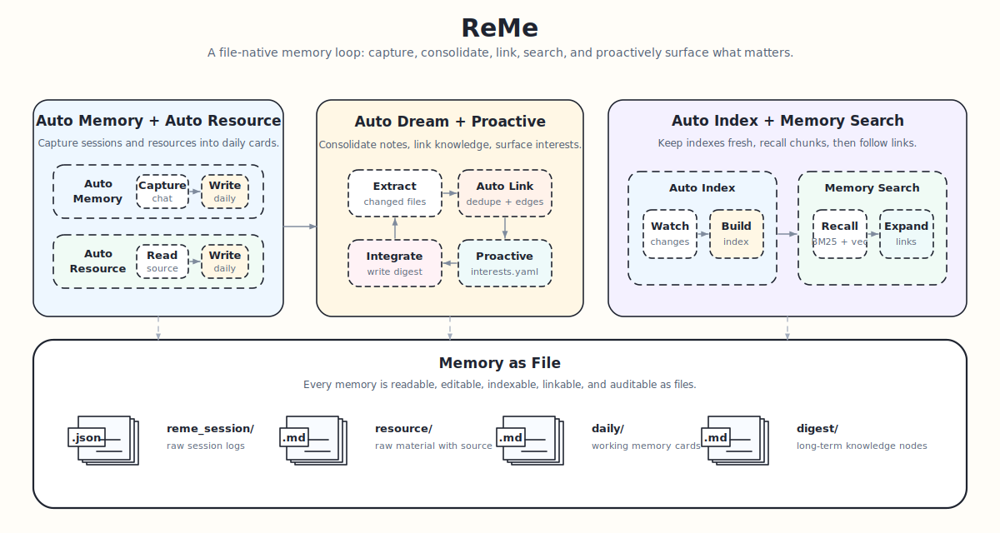

<p align="center">
 
</p>

<p align="center">
  <a href="https://pypi.org/project/reme-ai/"></a>
  <a href="https://pypi.org/project/reme-ai/"></a>
  <a href="https://pepy.tech/project/reme-ai/"></a>
  <a href="https://github.com/agentscope-ai/ReMe"></a>
  <a href="./LICENSE"></a>
  <a href="./README.md"></a>
  <a href="./README_ZH.md"></a>
  <a href="https://github.com/agentscope-ai/ReMe"></a>
  <a href="https://deepwiki.com/agentscope-ai/ReMe"></a>
</p>

<p align="center">
<a href="https://trendshift.io/repositories/20528" target="_blank"></a>
</p>

<p align="center">
  <strong>A memory management toolkit for AI agents — Remember Me, Refine Me.</strong><br>
</p>

> 历史版本 [0.3.x](https://github.com/agentscope-ai/ReMe/tree/v0.3.1.10)
> [0.2.x](https://github.com/agentscope-ai/ReMe/tree/v0.2.0.6)
> [MemoryScope](https://github.com/agentscope-ai/ReMe/tree/memoryscope_branch)

---

🧠 ReMe 是一个专为 **AI 智能体** 打造的记忆管理工具，以 **Memory as File** 为核心，将对话、资料和长期知识沉淀为可读、可编辑、可检索的文件化记忆。

ReMe 让智能体拥有可持续维护的记忆库：历史对话可归档，外部资料可索引，重要信息可沉淀为长期记忆，并通过关键词、语义检索和
wikilink 图谱重新找到。

<details>
<summary><b>你可以用 ReMe 做什么</b></summary>

<br>

- **个人助理**：为 [QwenPaw](https://github.com/agentscope-ai/QwenPaw) 等智能体提供长期记忆，记住用户偏好和历史对话。
- **编程助手**：记录代码风格偏好、项目上下文，跨会话保持一致的开发体验。
- **客服机器人**：记录用户问题历史、偏好设置，提供个性化服务。
- **任务自动化**：从历史任务中学习成功/失败模式，持续优化执行策略。
- **知识问答**：构建可检索的知识库，支持语义搜索和精确匹配。

</details>

---

## 📁 基于文件的记忆系统

> Memory as files, files as memory.

将**记忆视为文件**：原始对话和外部资料先进入输入层，再加工成 daily note，最后沉淀为可长期复用的 digest 记忆。

| 层级   | 目录                          | 内容                      |
|------|-----------------------------|-------------------------|
| 原始输入 | `reme_session/`、`resource/` | 原始对话、Agent session、外部资料 |
| 浅加工  | `daily/`                    | 当天事实、对话摘要、资源解读、兴趣主题     |
| 深加工  | `digest/`                   | 用户画像、长期事实、流程经验、知识节点     |

```text
<vault_dir>/
├── reme_metadata/       # 系统索引、图谱、catalog 等持久状态
├── reme_session/        # 原始对话和 Agent session
│   ├── dialog/
│   │   └── <session_id>.jsonl
│   ├── agentscope/
│   └── claude_code/
├── resource/            # 外部原始材料
│   └── YYYY-MM-DD/
│       └── <resource>.<ext>
├── daily/               # 浅加工记忆：当天事实、对话摘要、资源解读
│   ├── YYYY-MM-DD.md
│   └── YYYY-MM-DD/
│       ├── <session_id>.md
│       ├── <resource_stem>.md
│       └── interests.yaml
└── digest/              # 长期记忆：个人事实、流程经验、知识节点
    ├── personal/
    ├── procedure/
    └── wiki/
```



---

### 🚀 快速开始

#### 安装

ReMe 要求 Python 3.11+。

从 pip 安装：

```bash
pip install "reme-ai[core]"
```

从源码安装：

```bash
git clone https://github.com/agentscope-ai/ReMe.git
cd ReMe
pip install -e ".[core]"
```

`core` extra 建议安装：当前代码会导入 AgentScope wrapper，自进化记忆也依赖它。

#### 环境变量

配置环境变量：

```bash
cat > .env <<'EOF'
EMBEDDING_API_KEY=sk-xxx
EMBEDDING_BASE_URL=https://dashscope.aliyuncs.com/compatible-mode/v1
LLM_API_KEY=sk-xxx
LLM_BASE_URL=https://dashscope.aliyuncs.com/compatible-mode/v1
EOF
```

#### 启动

```bash
reme start
```

默认服务地址是 `127.0.0.1:2333`。如果端口被占用：

```bash
reme start service.port=23333
# reme start vault_dir=/tmp/reme-demo service.port=8181
```

```bash
reme version
curl -s http://127.0.0.1:23333/version -H 'Content-Type: application/json' -d '{}'
```

#### 接入方式

ReMe 不绑定具体 Agent 框架，启动服务后可以按三种方式接入：

| 方式                    | 适用场景                                  | 使用说明                                                                                                                                |
|-----------------------|---------------------------------------|-------------------------------------------------------------------------------------------------------------------------------------|
| `skill.md + cli`      | 任意支持读取 skill/system prompt 的 Agent 框架 | 将 [reme_memory skill](reme/skills/reme_memory/SKILL.md) 加入 Agent，并允许 Agent 调用 `reme search/read/write/auto_memory/proactive` 等 CLI。 |
| `background` / `cron` | 索引更新、资源监听、定时 dream 等自动流程              | 执行 `reme start` 后自动运行，无需在 Agent 侧手动调用。                                                                                              |
| `hook`                | 需要把对话、资源或主动主题接入 Agent 生命周期的流程         | 在 Agent 框架中手动加入 `auto_memory`、`auto_resource`、`auto_dream`、`proactive` 调用点。                                                         |

QwenPaw 2.0 将会集成新版 ReMe；未来也会推出 Claude Code plugin，降低手动接入成本。

更多细节见 [快速开始](docs/zh/quick_start.md)。

---

## 核心能力

| 类型         | name                                        | 描述                                                                        | 参数                                                     |
|------------|---------------------------------------------|---------------------------------------------------------------------------|--------------------------------------------------------|
| background | `index_update_loop`                         | 后台监听 `daily/`、`digest/`、`resource/` 中的 Markdown/JSONL 变化，并持续更新检索索引。       | 配置项：`watch_dirs`、`watch_suffixes`                      |
| background | `resource_watch_loop`                       | 后台监听 `resource/` 资料变化，更新 resource catalog，并触发资源解读。                        | 配置项：`watch_dirs`、`watch_suffixes`                      |
| background | `digest_watch_loop`                         | 后台监听 `daily/` 与 `digest/` 的 Markdown 变化，更新 digest catalog 并记录变化。          | 配置项：`watch_dirs`、`watch_suffixes`                      |
| cron       | `dream_cron`                                | 每天 23:00 定时执行 dream 流程：抽取长期记忆、整合 digest、生成兴趣主题并持久化 catalog。               | 配置项：`cron`                                             |
| hook       | [`auto_dream`](docs/zh/auto_dream.md)       | 扫描当天 day-index 与 daily notes，抽取并整合长期记忆单元，写入 `interests.yaml`。             | `date`、`hint`、`topic_count`、`topic_diversity_days`     |
| hook       | [`auto_memory`](docs/zh/auto_memory.md)     | 将对话消息记录并整理为 daily 记忆卡片。                                                   | 必填：`messages`；可选：`session_id`、`memory_hint`            |
| hook       | [`auto_resource`](docs/zh/auto_resource.md) | 将 resource 文件变更批次解读为 daily 资源卡片。                                          | 必填：`changes`；每项可含 `path`、`file_path`、`change`          |
| hook       | [`proactive`](docs/zh/proactive.md)         | 读取 `daily/<date>/interests.yaml`，向上层 Agent 暴露最新用户兴趣主题。                    | `date`、`include_content`                               |
| cli        | `version`                                   | 返回 ReMe 包版本。                                                              | 无                                                      |
| cli        | `health_check`                              | 返回 ReMe 组件健康检查摘要。                                                         | 无                                                      |
| cli        | `help`                                      | 列出已注册 jobs 及其 metadata。                                                   | 无                                                      |
| cli        | `traverse`                                  | 从指定路径出发遍历 wikilink 图谱。                                                    | 必填：`path`；可选：`depth`、`direction`                       |
| cli        | `reindex`                                   | 清空 file store，并基于现有文件重建索引。                                                | 配置项：`watch_dirs`、`watch_suffixes`                      |
| cli        | [`search`](docs/zh/memory_search.md)        | 在 vault 中执行混合检索，结合向量召回、BM25 和 RRF 融合。                                     | 必填：`query`；可选：`limit`、`min_score`                      |
| cli        | `node_search`                               | 根据候选抽象的名称与描述，召回相似 digest 节点用于去重或关联。                                       | 必填：`query`；可选：`limit`                                  |
| cli        | `daily_create`                              | 创建 daily session note：`daily/<date>/<session_id>.md` 或 `daily/<date>.md`。 | `session_id`、`date`                                    |
| cli        | `daily_list`                                | 列出某一天的 notes。                                                             | `date`                                                 |
| cli        | `daily_reindex`                             | 重建 day-index 页面 `daily/<date>.md`。                                        | `date`                                                 |
| cli        | `frontmatter_delete`                        | 删除文件 frontmatter 中的指定 keys。                                               | 必填：`path`、`keys`                                       |
| cli        | `frontmatter_read`                          | 读取文件 frontmatter。                                                         | 必填：`path`                                              |
| cli        | `frontmatter_update`                        | 合并 key-values 到文件 frontmatter。                                            | 必填：`path`、`metadata`                                   |
| cli        | `stat`                                      | 获取 vault 路径状态，包括大小、mtime、是否存在、是否目录或文件。                                    | 必填：`path`                                              |
| cli        | `list`                                      | 列出 vault 路径下的文件。                                                          | `path`、`recursive`、`limit`                             |
| cli        | `move`                                      | 移动或重命名 vault 文件，并默认重写入站 wikilink。                                         | 必填：`src_path`、`dst_path`；可选：`overwrite`、`retarget`     |
| cli        | `delete`                                    | 删除 vault 文件或文件夹，并返回仍存在的入站 wikilink。                                       | 必填：`path`                                              |
| cli        | `read`                                      | 读取 vault 下的 Markdown 文件。                                                  | 必填：`path`；可选：`start_line`、`end_line`                   |
| cli        | `read_image`                                | 读取 vault 下的图片文件并返回 base64。                                                | 必填：`path`                                              |
| cli        | `write`                                     | 创建或覆盖 Markdown 文件，并写入 name/description frontmatter。                       | 必填：`path`、`name`、`description`、`content`；可选：`metadata` |
| cli        | `edit`                                      | 对 Markdown 文件执行全文 find-and-replace。                                       | 必填：`path`、`old`、`new`                                  |

---

## ⭐ 社区与支持

- **问题反馈与需求**：请先查看 [Open Issues](https://github.com/agentscope-ai/ReMe/issues)；如无相关讨论，可新建 Issue
  说明背景、目标行为和影响范围。
- **代码贡献**：改动前建议阅读 [贡献指南](docs/zh/contributing.md) 和 [代码框架](docs/zh/framework.md)，遵循 CLI /
  Service / Application / Job / Step / Component 的分层。
- **文档贡献**：用户可见的安装、配置、调用或行为变化，请同步更新 `docs/zh/` 或 `README.md`。
- **提交规范**：建议使用 Conventional Commits，例如 `feat(search): add link expansion option`、
  `docs(zh): update quick start`。
- **提交前检查**：提交 PR 前请尽量运行 `pre-commit run --all-files` 和 `pytest`；如有依赖 LLM、embedding 或外部服务的测试无法运行，请在
  PR 中说明。
- **获取帮助**：Bugs 和功能请求使用 [GitHub Issues](https://github.com/agentscope-ai/ReMe/issues)
  ，项目文档见 [https://reme.agentscope.io/](https://reme.agentscope.io/)。

### 贡献者

感谢所有为 ReMe 做出贡献的朋友们：

<a href="https://github.com/agentscope-ai/ReMe/graphs/contributors">
  
</a>

---

## 📄 引用

```bibtex
@software{AgentscopeReMe2026,
  title = {AgentscopeReMe: Memory Management Kit for Agents},
  author = {ReMe Team},
  url = {https://reme.agentscope.io},
  year = {2026}
}
```

---

## ⚖️ 许可证

本项目基于 Apache License 2.0 开源，详情参见 [LICENSE](./LICENSE) 文件。

---

## 📈 Star 历史

[](https://www.star-history.com/#agentscope-ai/ReMe&Date)
