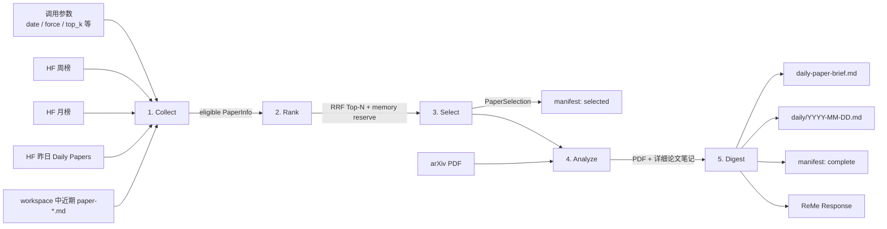

# Daily Paper Cookbook

`daily_paper` 是一个本地优先、文件原生的论文日报工作流。它从 Hugging Face Papers 的周榜和月榜收集候选论文，排除昨天刚上榜以及近期已经推荐过的论文，再经过 RRF 排序、Claude Code 精选、arXiv PDF 精读，最终在 ReMe workspace 中生成：

- 每篇入选论文的原始 PDF；
- 每篇论文的中文详细解读 Markdown；
- 一篇约五分钟可读完的中文日报；
- 当日索引和一份机器可读的运行 manifest。

工作流由 [daily_cookbook.yaml](../../reme/config/daily_cookbook.yaml) 装配，公共数据模型在 [daily_paper.py](../../reme/schema/daily_paper.py)，实现位于 [`reme/steps/cookbook/daily_paper`](../../reme/steps/cookbook/daily_paper/)。

## 1. 整体 pipeline



Job 按配置顺序串行执行 5 个 Step。每次 Job 调用都会创建一个新的 `RuntimeContext`；中间结果使用 `daily_paper_*` 命名的 key 在本次调用内传递，不使用 Step 实例保存跨调用状态。

持久化文件不是 `RuntimeContext` 的镜像：候选全集、完整 prompt、模型原始响应等只存在于运行期间，最终只保存 PDF、Markdown 和经过筛选的 manifest。

## 2. Pipeline 的日期与幂等语义

`date` 决定本次运行日：

- 显式传入时必须严格符合 `YYYY-MM-DD`；
- 省略或为空时，使用应用配置时区中的今天，当前独立配置默认为 `Asia/Shanghai`；
- 周榜 key 使用该日期的 ISO week，例如 `2026-W30`；
- 月榜 key 使用 `YYYY-MM`，例如 `2026-07`；
- “昨日排除”严格查询 `date - 1 day` 的 Hugging Face Daily Papers，而不是模糊的最近 24 小时。

若 `daily/<date>/daily-paper-brief.md` 已存在，并且 `force=false`，Collect 会设置整条 pipeline 的 skip 标志；后续 4 个 Step 都直接返回，不访问 Hugging Face、arXiv 或模型。此时响应的 `metadata.skipped` 为 `true`，如果 manifest 可解析，还会带回之前的 `selection`。

`force=true` 会重新采集、排序、选择和覆盖生成 Markdown/manifest；已有且以 `%PDF-` 开头的 PDF 会继续复用，不重复下载。

## 3. 每一步的输入、输出和能力

### 3.1 Collect：采集、合并与排重

实现：[collect.py](../../reme/steps/cookbook/daily_paper/collect.py)，数据源客户端：[huggingface_papers.py](../../reme/utils/huggingface_papers.py)。

能力：

1. 同时获取运行日所在周的周榜、所在月的月榜，以及严格昨日的 Daily Papers ID。
2. 榜单 HTML 用于取得页面展示顺序；`/api/daily_papers` 用于取得结构化元数据。HTML 中有而列表 API 中没有的 ID，会再请求 `/api/papers/<arxiv_id>` 补齐详情。
3. 以 arXiv ID 合并周榜和月榜：非空字段优先保留先合入的月榜值，`upvotes` 取两者最大值，并分别记录 `monthly_rank`、`weekly_rank`。
4. 扫描最近 `history_days` 天的 `daily/<prior-date>/paper-*.md`，从 frontmatter 的 `arxiv_id` 建立历史排除集合。
5. 排除昨日 ID 与历史 ID；如果没有剩余论文，明确失败。

主要输入：

| 输入 | 来源 | 默认值 | 含义 |
|---|---|---:|---|
| `date` | 调用参数 | 当天 | 运行日期，严格 `YYYY-MM-DD` |
| `force` | 调用参数 | `false` | 是否忽略已存在的最终日报 |
| `history_days` | Job/调用参数 | `30` | 历史推荐排除窗口；小于等于 0 表示不做历史排除 |
| `hf_timeout` | Job/调用参数 | `30` 秒 | 单次 Hugging Face HTTP client timeout |
| `hf_max_retries` | Job/调用参数 | `3` | Hugging Face 请求最多尝试次数，内部最少为 1 |
| `daily_dir` | 应用配置 | `daily` | 日记和历史论文笔记目录 |

写入 `RuntimeContext` 的输出：

| 状态 key | 类型 | 内容 |
|---|---|---|
| `daily_paper_run_date` | `str` | 规范化运行日 |
| `daily_paper_info` | `dict[str, PaperInfo]` | 通过排重的论文，以 arXiv ID 为 key |
| `daily_paper_week` / `daily_paper_month` | `str` | 实际查询的周/月 scope |
| `daily_paper_yesterday` | `str` | 被查询的严格昨日日期 |
| `daily_paper_excluded_yesterday` | `list[str]` | 昨日论文 ID |
| `daily_paper_excluded_history` | `list[str]` | 历史论文 ID |
| `daily_paper_source_counts` | `dict` | `weekly`、`monthly`、合并后 `merged` 数量 |

`PaperInfo` 的标准化字段如下：

```text
arxiv_id, title, summary, authors, published_at, submitted_on_daily_at,
upvotes, organization, github_repo, github_stars, project_page, thumbnail,
monthly_rank, weekly_rank, fused_score
```

同时提供派生 URL：`hf_url`、`arxiv_url`、`pdf_url`。

### 3.2 Rank：RRF 融合排序与记忆论文保留位

实现：[rank.py](../../reme/steps/cookbook/daily_paper/rank.py)。这一步是确定性本地计算，不调用网络或模型。

输入是 Collect 写入的 `daily_paper_info`。每篇论文的融合分为：

```text
fused_score = 1 / (rrf_k + monthly_rank)
            + weekly_weight / (rrf_k + weekly_rank)
```

论文不在某一榜单时，该项贡献为 0。默认 `rrf_k=60`、`weekly_weight=0.7`，因此默认情况下月榜贡献权重为 1，周榜贡献权重为 0.7。

随后构建最多 `candidate_limit` 篇的候选池：

1. 先按 `fused_score` 降序、`upvotes` 降序、`arxiv_id` 升序稳定排序；
2. 先取前 `candidate_limit - memory_reserve` 篇通用强候选；
3. 从剩余论文中按长期记忆关键词命中数、融合分、upvotes 选出最多 `memory_reserve` 篇；
4. 如果记忆相关论文不足，用总体排名继续补满。

记忆关键词是轻量的召回启发式，包括 `long-term memory`、`agent memory`、`memory retrieval`、`continual learning`、`context compression`、`knowledge graph`、`RAG`、`长期记忆`、`记忆整合` 等。判断方式是对标题和摘要做小写后的子串匹配，不是语义分类器。

主要输入与输出：

| 名称 | 默认值/类型 | 说明 |
|---|---|---|
| `daily_paper_info` | `dict[str, PaperInfo]` | Collect 的 eligible 论文 |
| `rrf_k` | `60` | 必须非负 |
| `weekly_weight` | `0.7` | 周榜 RRF 权重，可由调用参数覆盖 |
| `candidate_limit` | `20` | 候选池上限，必须大于 0 |
| `memory_reserve` | `5` | 记忆方向保留位，会限制在 `[0, candidate_limit]` |
| `daily_paper_candidates` | `list[PaperInfo]` | 输出给 Select 的有界候选池 |

### 3.3 Select：Claude Code 结构化精选

实现：[select.py](../../reme/steps/cookbook/daily_paper/select.py)，prompt：[select.yaml](../../reme/steps/cookbook/daily_paper/select.yaml)。

输入是 Rank 生成的候选池。发送给 Claude Code 的每条候选包含：

```text
arxiv_id, title, summary, authors, organization, upvotes,
monthly_rank, weekly_rank, fused_score, github_repo, github_stars,
memory_keyword_score
```

模型通过 `PaperSelection` JSON schema 返回：

```json
{
  "selection_reasoning": "面向读者的决策摘要",
  "selected": [
    {
      "arxiv_id": "2607.10001",
      "rank": 1,
      "reason": "具体选择依据",
      "memory_relevance": "high | medium | low"
    }
  ],
  "alternates": ["2607.10002"]
}
```

代码会执行硬校验：

- 必须恰好选出 `top_k` 篇；
- ID 必须唯一且都属于候选池；
- rank 必须从 1 到 `top_k` 连续；
- alternate 会去重，并静默过滤不在候选池或已经入选的 ID。

首次校验失败会把错误文本作为反馈再请求一次；两次都失败则 Job 失败。`top_k` 必须在 `1..len(candidates)` 范围内。

输出包括：

| 输出 | 类型/位置 | 内容 |
|---|---|---|
| `daily_paper_selection` | `PaperSelection` | 校验并按 rank 排序后的模型选择 |
| `daily_paper_selected_papers` | `list[PaperInfo]` | 与 selection 顺序对齐的完整论文信息 |
| manifest | `metadata/daily_paper/<date>.json` | 立即写入 `status: selected`、选择结果、排除集合和分数 |

在分析开始前先写 `selected` manifest，意味着后续 PDF 或模型调用失败时，仍可检查当时选中了什么。

### 3.4 Analyze：下载 PDF、提取文本并逐篇精读

实现：[analyze.py](../../reme/steps/cookbook/daily_paper/analyze.py)，prompt：[analyze.yaml](../../reme/steps/cookbook/daily_paper/analyze.yaml)，下载器：[arxiv.py](../../reme/utils/arxiv.py)。

每篇入选论文按 rank 顺序串行处理：

1. 校验 arXiv ID，只接受当前实现支持的新版 ID 格式 `NNNN.NNNN` 或 `NNNN.NNNNN`；
2. 下载 `https://arxiv.org/pdf/<arxiv_id>`，限制最大字节数，并检查文件头必须为 `%PDF-`；
3. 已存在且通过 PDF 文件头检查的文件直接复用；下载使用同目录 `.part` 临时文件后原子替换；
4. 使用 `pypdf` 在线程中提取文本，并插入 `--- PAGE N ---` 页面标记；
5. 同时应用最大页数和最大字符数限制；超过任一限制时将 `truncated=true` 告知模型；
6. 将论文元信息、选择理由、PDF 总页数、截断标记和提取文本发送给 Claude Code；
7. 通过 `PaperNoteOutput` schema 接收 `description` 和 Markdown `body`，去掉模型意外生成的一层 YAML frontmatter，再由代码写入规范 frontmatter。

主要输入：

| 输入 | 默认值 | 说明 |
|---|---:|---|
| `daily_paper_selection` | — | Select 输出，必须存在且数量匹配 |
| `daily_paper_selected_papers` | — | 按选择顺序排列的论文信息 |
| `pdf_timeout` | `90` 秒 | arXiv 下载 timeout |
| `max_pdf_bytes` | `52,428,800` | 单个 PDF 上限，默认 50 MiB |
| `max_pdf_pages` | `80` | 最多提取的 PDF 页数 |
| `max_pdf_chars` | `240,000` | 单篇发送给模型的 PDF 文本字符上限 |
| `resource_dir` | `resource` | PDF 资源根目录 |
| `daily_dir` | `daily` | 论文笔记根目录 |

每篇模型输出 schema：

```json
{
  "description": "用于 frontmatter 和日索引的一句话描述",
  "body": "完整 Markdown 解读正文"
}
```

持久化输出：

- `resource/papers/<arxiv_id>.pdf`；
- `daily/<date>/paper-<arxiv_id>.md`。

运行时输出：

- `daily_paper_note_paths: list[str]`；
- `daily_paper_pdf_paths: list[str]`。

当前 PDF 提取依赖文本层；扫描版或没有可提取文本的 PDF 会明确失败，不包含 OCR 回退。某一篇失败会中止后续论文和 Digest，之前已经成功写入的 PDF/笔记不会回滚。

### 3.5 Digest：生成五分钟日报并完成索引

实现：[digest.py](../../reme/steps/cookbook/daily_paper/digest.py)，prompt：[digest.yaml](../../reme/steps/cookbook/daily_paper/digest.yaml)。

Digest 把所有详细笔记的绝对路径和 workspace-relative wikilink 交给 Claude Code，并要求模型逐个使用 `Read` 阅读。模型通过 `DailyBriefOutput` 返回：

```json
{
  "description": "日报的一句话描述",
  "body": "五分钟日报 Markdown 正文"
}
```

代码要求 `description` 和 `body` 非空，并检查每个详细笔记 wikilink 是否出现在正文中。缺失的链接会自动追加到正文的“详细文章”部分，因此最终日报总能链接到所有源笔记。

完成后会：

1. 写入 `daily/<date>/daily-paper-brief.md`；
2. 重建派生日索引 `daily/<date>.md`；
3. 把 manifest 从 `status: selected` 更新为 `status: complete`，补充笔记、PDF 和日报路径；
4. 填充最终 ReMe `Response`。

成功响应的主要 metadata：

```text
date, week, month, selection_reasoning, selected_arxiv_ids,
note_paths, pdf_paths, digest_path, manifest_path, source_counts,
excluded_yesterday_count, excluded_history_count
```

## 4. 数据存储结构

默认 `workspace_dir` 是启动目录下的 `.reme`。一次完成的运行大致生成：

```text
.reme/
├── daily/
│   ├── 2026-07-21.md                         # 派生的当日索引
│   └── 2026-07-21/
│       ├── daily-paper-brief.md              # 最终五分钟日报
│       ├── paper-2607.10001.md               # 详细论文解读
│       ├── paper-2607.10002.md
│       └── paper-2607.10003.md
├── resource/
│   └── papers/
│       ├── 2607.10001.pdf                    # 可复用的原始 PDF
│       ├── 2607.10002.pdf
│       └── 2607.10003.pdf
├── metadata/
│   └── daily_paper/
│       └── 2026-07-21.json                   # 运行 manifest
└── mem_session/
    └── claude_config/                        # Claude Code SDK 的运行配置/会话支持目录
```

目录名可通过应用级 `workspace_dir`、`daily_dir`、`resource_dir`、`metadata_dir`、`mem_session_dir` 修改。代码始终把 manifest 放在 `<metadata_dir>/daily_paper/`，PDF 放在 `<resource_dir>/papers/`。

首次实际调用 Claude Code 时，wrapper 还会尝试在 `<project_path>/.claude/skills/` 和 `<mem_session_dir>/claude_config/skills/` 中创建所选项目 skill 的符号链接。它们用于 Claude Code 的 skill 发现，不是论文数据；若目标位置已存在，wrapper 会保留原路径而不是覆盖。

### 4.1 详细论文笔记

`paper-<arxiv_id>.md` 采用 YAML frontmatter + Markdown 正文：

```yaml
---
name: paper-2607.10001
description: 一句话描述
arxiv_id: '2607.10001'
title: Paper title
authors:
  - A. Author
hf_url: https://huggingface.co/papers/2607.10001
arxiv_url: https://arxiv.org/abs/2607.10001
download_url: https://arxiv.org/pdf/2607.10001
source_pdf: '[[resource/papers/2607.10001.pdf]]'
published_at: '...'
monthly_rank: 1
weekly_rank: 2
fused_score: 0.02715411
selection_reason: 选择原因
memory_relevance: high
generated_at: '...+00:00'
pdf_pages: 18
pdf_text_truncated: false
---

# 论文详细解读
...
```

历史去重以这些笔记 frontmatter 中的 `arxiv_id` 为准，而不是以 manifest 为准。因此 Markdown 笔记是推荐历史的关键文件原生事实来源。

### 4.2 最终日报

`daily-paper-brief.md` 的 frontmatter：

```yaml
---
name: daily-paper-brief
description: 一句话日报描述
date: '2026-07-21'
arxiv_ids:
  - 2607.10001
source_notes:
  - '[[daily/2026-07-21/paper-2607.10001.md]]'
generated_at: '...+00:00'
---
```

正文由 Claude Code 生成，包含每篇论文的完整 wikilink。

### 4.3 当日索引

`daily/<date>.md` 是可重建的派生文件。它扫描 `daily/<date>/*.md` 的 frontmatter，维护：

```text
<!-- notes:auto -->
- [[daily/2026-07-21/daily-paper-brief.md]] name: ... description: ...
- [[daily/2026-07-21/paper-2607.10001.md]] name: ... description: ... arxiv_id: ...
<!-- /notes:auto -->
```

它不是论文全文或 manifest 的副本，也不是独立的向量/关键词索引。

### 4.4 Manifest

Select 阶段先写 `status: selected`，Digest 成功后更新为 `status: complete`。完整结构近似：

```json
{
  "date": "2026-07-21",
  "status": "complete",
  "week": "2026-W30",
  "month": "2026-07",
  "yesterday": "2026-07-20",
  "source_counts": {"weekly": 20, "monthly": 100, "merged": 110},
  "excluded_yesterday": ["2607.10010"],
  "excluded_history": ["2607.10011"],
  "thinking": "选择决策摘要",
  "top_arxiv_ids": ["2607.10001"],
  "selection": {
    "selection_reasoning": "选择决策摘要",
    "selected": [
      {
        "arxiv_id": "2607.10001",
        "rank": 1,
        "reason": "选择原因",
        "memory_relevance": "high"
      }
    ],
    "alternates": []
  },
  "scores": {
    "2607.10001": {
      "fused_score": 0.02715411,
      "monthly_rank": 1,
      "weekly_rank": 2
    }
  },
  "note_paths": ["daily/2026-07-21/paper-2607.10001.md"],
  "pdf_paths": ["resource/papers/2607.10001.pdf"],
  "digest_path": "daily/2026-07-21/daily-paper-brief.md"
}
```

Manifest 不保存完整候选池、完整 `PaperInfo`、PDF 提取文本、prompt 或模型原始响应；需要审计这些信息时应另行增加显式持久化，而不是假设 manifest 已包含。

详细论文笔记、最终日报和 manifest 使用同目录临时文件 + `os.replace` 原子写入；PDF 使用 `.part` 文件 + 原子替换。这些文件不会暴露半写状态，但 `daily/<date>.md` 日索引由通用索引 helper 直接重写，整条 5 步 pipeline 也不是跨文件事务。并发运行同一日期没有全局 run lock，最后写入者可能覆盖先前结果。

## 5. 配置参数

独立配置的关键默认值：

| 参数 | 默认值 | 使用阶段 |
|---|---:|---|
| `candidate_limit` | `20` | Rank |
| `memory_reserve` | `5` | Rank |
| `top_k` | `3` | Select、后续产物数量 |
| `rrf_k` | `60` | Rank |
| `weekly_weight` | `0.7` | Rank |
| `history_days` | `30` | Collect |
| `hf_timeout` | `30` | Collect |
| `hf_max_retries` | `3` | Collect |
| `pdf_timeout` | `90` | Analyze |
| `max_pdf_bytes` | `52428800` | Analyze |
| `max_pdf_pages` | `80` | Analyze |
| `max_pdf_chars` | `240000` | Analyze |

`date`、`force`、`top_k`、`weekly_weight`、`history_days` 出现在 Job 的公开参数 schema 中。CLI 和 HTTP 的请求模型允许额外字段，因此其余 Job 默认值也可以在手动调用时按需覆盖，例如 `candidate_limit=10` 或 `max_pdf_pages=40`。

手动调用参数优先于 Job 配置默认值。cron 没有调用方参数，使用 `jobs.daily_paper_cron` 下配置的值。

## 6. 如何运行

### 6.1 前置条件

- Python 3.11 或更高版本；
- 能访问 Hugging Face、arXiv 和所配置的模型 API；
- 安装 `core` 依赖，其中包括 Claude Agent SDK 和 `pypdf`；
- 一个与 `CLAUDE_CODE_BASE_URL`、`CLAUDE_CODE_MODEL_NAME` 匹配的 API key。

从仓库根目录安装：

```bash
cd /Users/yuli/workspace/ReMe
python -m pip install -e ".[dev,core]"
```

当前 [daily_cookbook.yaml](../../reme/config/daily_cookbook.yaml) 的模型默认值是：

```text
CLAUDE_CODE_MODEL_NAME=qwen3.7-max
CLAUDE_CODE_BASE_URL=https://dashscope.aliyuncs.com/apps/anthropic
```

最少设置：

```bash
export CLAUDE_CODE_API_KEY="your-api-key"
```

也可以在仓库根目录创建不提交的 `.env`：

```dotenv
CLAUDE_CODE_API_KEY=your-api-key
# CLAUDE_CODE_MODEL_NAME=qwen3.7-max
# CLAUDE_CODE_BASE_URL=https://dashscope.aliyuncs.com/apps/anthropic
# SERPER_API_KEY=your-serper-key
```

ReMe CLI 会从当前目录向上查找 `.env`。`SERPER_API_KEY` 只在 Claude Code 实际调用当前配置的 `serper-search` skill 时需要；采集 Hugging Face 榜单和下载 arXiv PDF 不通过 Serper。

请从仓库根目录运行默认配置。默认 `workspace_dir=.reme`，而 `DAILY_PAPER_PROJECT_PATH=..` 是相对 workspace 解析的，最终正好指向仓库根目录并找到 `skills/serper-search`。如果 workspace 放到别处，需要显式指定：

```bash
export DAILY_PAPER_WORKSPACE_DIR=/absolute/path/to/daily-paper-workspace
export DAILY_PAPER_PROJECT_PATH=/Users/yuli/workspace/ReMe
```

### 6.2 一次性运行

运行今天的日报：

```bash
reme start config=daily_cookbook job=daily_paper
```

运行指定日期，并覆盖部分参数：

```bash
reme start \
  config=daily_cookbook \
  job=daily_paper \
  date=2026-07-21 \
  top_k=3 \
  candidate_limit=20 \
  history_days=30
```

已存在日报时强制重建：

```bash
reme start \
  config=daily_cookbook \
  job=daily_paper \
  date=2026-07-21 \
  force=true
```

一次性 CLI 默认只打印 `Response.answer`。需要同时打印 metadata 时，把选项放在 service 配置下：

```bash
reme start \
  config=daily_cookbook \
  service.show_metadata=true \
  job=daily_paper \
  date=2026-07-21
```

Job 内任何未捕获异常都会被 `BaseJob` 转为失败响应，并保留异常发生前已经写入的 metadata：

```json
{
  "success": false,
  "answer": "错误信息",
  "metadata": {"可能包含": "前序步骤已写入的诊断信息"}
}
```

CLI 在失败时以非零状态退出。

### 6.3 常驻 HTTP + 每日 cron

启动独立应用：

```bash
reme start config=daily_cookbook
```

默认行为：

- HTTP 监听 `127.0.0.1:8001`；
- 暴露 `POST /daily_paper`；
- `daily_paper_cron` 按 `0 8 * * *` 在 `Asia/Shanghai` 每天 08:00 运行；
- cron 使用空 `date`，因此每次触发时处理配置时区中的当天；已有日报会自动 skip。

另一个终端中手动调用 HTTP：

```bash
curl -s http://127.0.0.1:8001/daily_paper \
  -H 'Content-Type: application/json' \
  -d '{"date":"2026-07-21","top_k":3,"force":false}'
```

修改监听地址、时区或 cron：

```bash
reme start \
  config=daily_cookbook \
  service.host=0.0.0.0 \
  service.port=8101 \
  timezone=Asia/Shanghai \
  jobs.daily_paper_cron.cron="30 7 * * *"
```

cron 运行失败时会记录异常，并等待下一次调度；它不会自动回滚已经生成的文件。

## 7. Claude Code 能力与安全边界

Select、Analyze、Digest 都使用名为 `claude_code` 的同一个 agent wrapper，但每次调用都要求不同的 Pydantic JSON schema。结构化 schema 约束输出形状，业务校验再约束选择数量、ID 和 rank。

当前独立配置还具有以下行为：

- `permission_mode: bypassPermissions`；
- 加载项目 skill `serper-search`；
- wrapper 全局禁用 Claude Code 内置 `WebSearch`，但 Serper skill 可通过自己的 API 搜索；
- Digest prompt 要求只 `Read` 指定笔记，Analyze prompt 要求只依据给出的元信息和 PDF 文本。

需要注意：当前三个 Step 没有在每次调用上设置严格的 `allowed_tools` allowlist。prompt 中“只读取指定文件”“不要修改其他文件”属于模型行为指令，不是操作系统或 SDK 级沙箱；`bypassPermissions` 下 agent 进程对 `project_path` 可见文件具有较宽权限。请只在受信任的 workspace/project 中运行，并在用于共享或生产环境前根据威胁模型收紧 agent 配置。

工作流也不会自动验证模型正文中的每个自然语言事实。Analyze prompt 要求只依据 PDF 并尽量标注页码，但当前代码层只验证结构化输出非空，不做引文逐条核验。

## 8. 失败、恢复与已知边界

| 场景 | 当前行为 |
|---|---|
| 最终日报已存在 | 默认整条 pipeline skip；`force=true` 可重跑 |
| Hugging Face 请求暂时失败 | 指数间隔重试，最多 `hf_max_retries` 次 |
| 没有 eligible 论文 | 明确失败 |
| `top_k` 超出候选数 | 明确失败 |
| Select 输出不合法 | 携带校验反馈再试 1 次，然后失败 |
| PDF 太大/不是 PDF/无文本层 | Analyze 失败 |
| PDF 超页数或字符数 | 截断后继续，并在笔记 frontmatter 标记 |
| 某篇 Analyze 失败 | 整个 Job 停止；已落盘的前序文件保留 |
| Digest 缺少 wikilink | 代码自动追加缺失链接 |
| Digest 前失败 | manifest 通常停留在 `status: selected` |
| 同日并发运行 | 单文件写入是原子的，但没有 pipeline 级锁，最后写入者可能覆盖结果 |

恢复建议：

1. 先查看 `metadata/daily_paper/<date>.json` 的 `status` 和已选 ID；
2. 检查 `resource/papers/` 是否已有可复用 PDF；
3. 修复网络、凭据、PDF 或模型问题；
4. 使用同一日期加 `force=true` 重跑。

## 9. 测试

核心离线单元测试会 mock Hugging Face、arXiv 下载和 Claude Code，不需要真实凭据：

```bash
pytest tests/unit/test_daily_paper.py -v
```

该测试覆盖：

- Hugging Face payload/HTML 标准化；
- RRF 和记忆候选保留；
- 历史 frontmatter 排除；
- 独立配置与 08:00 cron；
- 完整 5 步 pipeline 的 mocked 输出、manifest、wikilink 和幂等 skip。

真实运行会访问外部服务并产生模型费用，不应把它当作普通单元测试自动执行。
