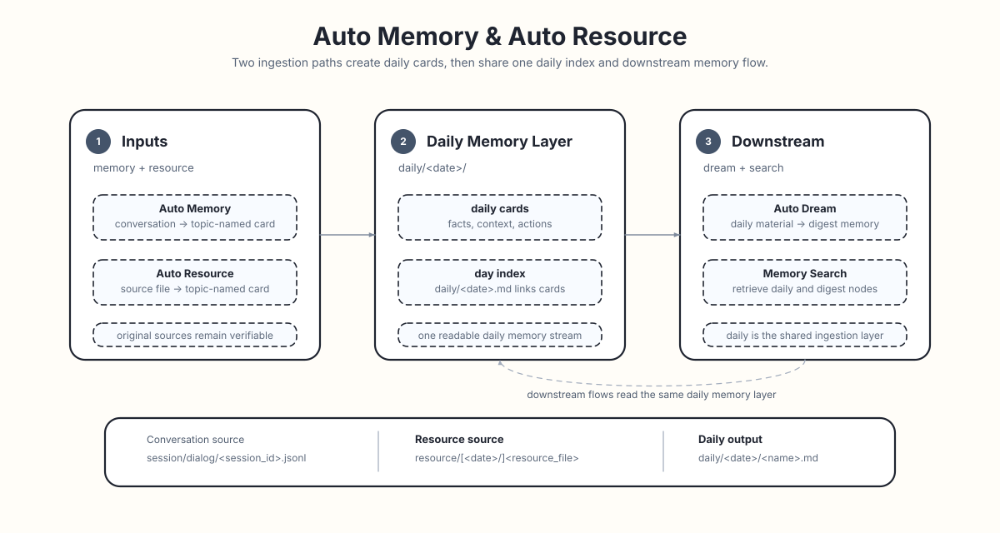

# Auto Memory

Auto Memory 是 ReMe 的对话记忆入口：在目标日期内，它用 `session_id` 定位或更新最多一张 daily 记忆卡片，文件名由 Agent
根据内容生成简洁的主题或事件名，再由当天的 `YYYY-MM-DD.md` 统一索引。它负责把“聊过”变成“记住”，并保留可追溯的对话记录。

<p align="center">
  
</p>

关于 `daily/`、`session/`、frontmatter 和 wikilink 的通用文件语义，见 [Memory as File](./memory_as_file.md)。

```text
Conversation
  ├─ step 1: daily/YYYY-MM-DD/<generated_name>.md # 每个 session 一张主题卡片
  ├─ step 2: daily/YYYY-MM-DD.md                  # 当天索引再串起来
  └─ source: session/dialog/<session_id>.jsonl    # 对话来源记录
```

## 它记录什么

它不记录聊天流水账，只记录以后可能还会用到的内容：

- 用户偏好：喜欢什么风格、习惯怎么协作、长期要求是什么。
- 关键事实：项目背景、重要数字、明确结论、限制条件。
- 过程决定：发生了什么，为什么这么选，哪些方案被放弃。
- 当前状态：做到哪一步，卡在哪里，下一步是什么。
- 可复用经验：命令、流程、排查方法、解决方案。

## 写入位置

Auto Memory 会把整理后的记忆放进 `daily/`。当天发生的对话会先被整理成一张张小卡片：

示例目录：

```text
workspace/
  daily/
    2026-06-20.md
    2026-06-20/
      login-refactor-decision.md
      retrieval-regression.md
```

日期目录下的两个文件是不同对话整理出的主题卡片，`daily/2026-06-20.md` 是当天索引页。资源文件也会进入
同一个 daily 记忆层，见 [Auto Resource](./auto_resource.md)。

当调用时带上 `session_id`，Auto Memory 会通过 frontmatter 用它定位卡片，Agent 则通过 `name` 决定可读文件名：

```yaml
name: login-refactor-decision
session_id: session-a
source_conversation: "[[session/dialog/session-a.jsonl]]"
```

这样既能分开不同对话，又不必把不透明的 ID 当文件名。更新时会按 `session_id` 或 `source_conversation` 找到旧卡片；如果 Agent
提供了更好的 frontmatter `name`，系统可重命名并重定向入链。查看某天内容时从 `YYYY-MM-DD.md` 开始。

## 同时保存原始信息

整理后的 daily note 负责“好读”，过滤后的对话来源记录负责“可信”。

Auto Memory 在生成记忆卡片的同时，也会保存对话来源消息：

```text
session/
  dialog/
    session-a.jsonl
    session-b.jsonl
```

daily note 会指向对应的对话记录。持久化时会排除 tool-result block 和 base64 data block，避免召回记忆或二进制负载在后续流程中被误当成
用户提供的证据。

## 对话中的图像

Auto Memory 可以结合上下文理解对话中的图像。默认只处理文本，调用时加上 `include_images=true` 即可开启图像。

图像输入需要 `agentscope` wrapper，其 `as_llm` 应绑定支持视觉的模型，并使用兼容的 formatter。
Auto Memory 直接用这个模型理解图文，不先生成 caption。关闭图像或消息中没有图像块时，仍按原有方式处理文本，也不限制
wrapper 类型。

在 `messages` 中用 AgentScope 顶层 `DataBlock` 传入图像，媒体类型以 `image/` 开头。文本和图像按原顺序交错排列，
保留说话人和时间信息。Base64 source 与 HTTP(S) URL 原样交给 formatter，不缩放或转码。URL 不会被下载，需要能被模型
供应商访问；本地文件请先转为 Base64，不使用 `file://` URL，其他 URL scheme 也不支持。

开启图像后，Auto Memory 会把 Base64 图像的原始字节保存到配置的 `session_dir` 下：

```text
session/images/<session_id>/msg-<encoded-message-id>-image-<block-index>.<ext>
```

文件名使用消息的 `id`，以及图像在所有 content block 中的位置（从零开始）。重复提交对话时，请保持消息 ID 不变：同一路径、
相同字节的图像会直接复用；内容不同则报错，不覆盖已有附件。关闭图像或消息中没有图像时，不保存附件。

模型输入中，每张图像旁边都会带上准确的来源链接。记忆 prompt 要求 Agent 在相应的视觉事实旁引用原图，例如：

```markdown
部署图中，Gateway 位于 Worker 和 PostgreSQL 之前，见 [[session/images/session-a/msg-6d6573736167652d61-image-1.png]]。
```

URL 图像使用原始 URL 作为引用。Auto Memory 还会把本次传入的图像来源补充到 daily note 的 `source_images` frontmatter 中，
保留已有条目。这个列表负责记录来源，正文链接则说明具体事实对应哪张图。会话附件不会被当作资源监听，也不会触发额外的 caption 调用。

每次调用的图像数量受 wrapper 的 `context_config.max_image_num` 限制，超限会报错，不会自动提高上限。
AgentScope 默认允许 5 张图像。需要更多时，在启动服务时设置：

```bash
reme start components.agent_wrapper.default.context_config.max_image_num=20
```

然后在另一个终端中，使用同一 workspace 调用已启动的服务：

```bash
reme auto_memory session_id=session-a include_images=true messages='[...]'
```

模型与 formatter 自身的限制仍然适用。开启图像且消息中包含图像时，才会在保存对话前检查 wrapper backend、URL scheme 和图像数量。
之后的 formatter 或 provider 错误直接返回，不转为纯文本重试；与纯文本调用相同，已保存的对话不会因此回滚。

源 JSONL 仍按上文规则保存，包括过滤 Base64 block。读取 JSONL 时不会自动还原附件图像；再次处理图像仍需提交原始消息。
如果模型调用失败，或判断无需写入记忆卡片，已经保存的附件仍然保留，不会自动清理。本地来源路径也可以交给 `read_image` 读取。

## 消息时间

Auto Memory 会在 prompt 和对话来源 JSONL 中保留每条已保留消息的 `created_at`。导入历史对话或 benchmark 数据时，建议为每条
message 提供真实发生时间，避免模型把事件时间误解为运行时间：

```bash
reme auto_memory \
  session_id=locomo-session \
  messages='[
    {"role":"user","content":"Jon lost his job today.","created_at":"2023-01-19T08:00:00"},
    {"role":"assistant","content":"I am sorry to hear that.","created_at":"2023-01-19T08:01:00"}
  ]'
```

为了兼容常见数据集字段，`auto_memory` 也会在缺少 `created_at` 时读取 `time_created`、`timestamp`、`createdAt`、
`timeCreated` 或 `created_time`。这些字段可以放在 message 顶层，也可以放在 `metadata` 中。

当调用没有显式传入 `date` 时，Auto Memory 会使用消息中最晚的有效 `created_at` 日期作为 daily note 日期；如果消息没有有效时间，
则回退到当前日期。历史导入也可以显式指定目标日期：

```bash
reme auto_memory \
  session_id=locomo-session \
  date=2023-01-19 \
  messages='[{"role":"user","content":"Jon lost his job today."}]'
```

## 后续流向

默认的 `auto_memory` 和 `auto_memory_cc` Job 会在记录记忆后执行 `auto_tag_step`，只为实际新增或修改的 daily 笔记打标，
并使用重命名后的最终路径。Claude Code 调用方仍只需传入 `session_id`；重复 Stop 没有新增消息时，记忆生成和打标都会跳过。

标签描述文档的核心实体，写入配置的 frontmatter 字段，默认为 `memory_tags`。单文件打标失败记录在 `metadata.auto_tag`，
保留原有记忆响应；没有笔记变化的调用不会自动重试失败的打标。标签索引通过现有文件 watcher 异步更新。

Auto Memory 只生成 daily 层记忆。要把这些材料进一步沉淀为长期 `digest/` 节点，使用 [Auto Dream](./auto_dream.md)；要搜索
daily 和 digest，使用 [Memory Search](./memory_search.md)。
