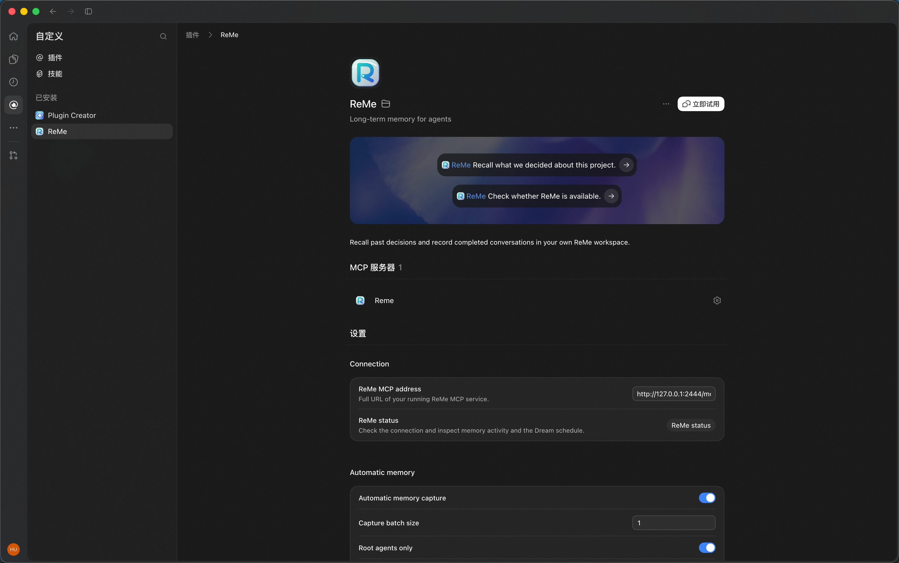
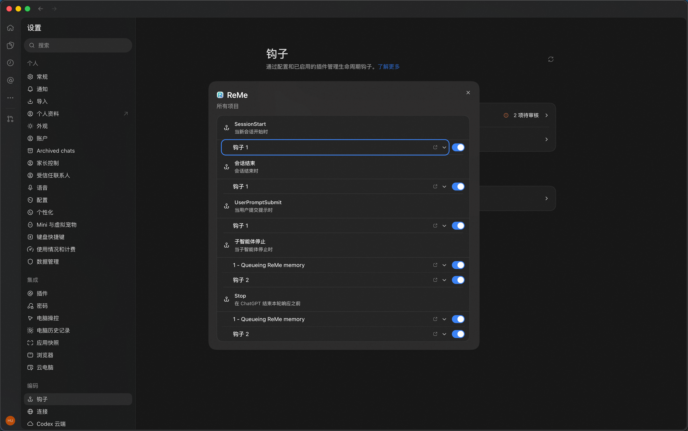
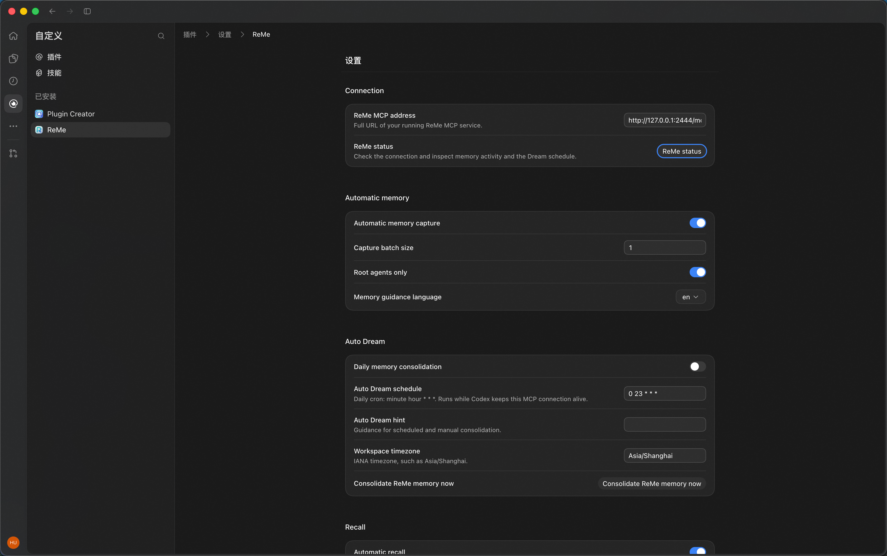
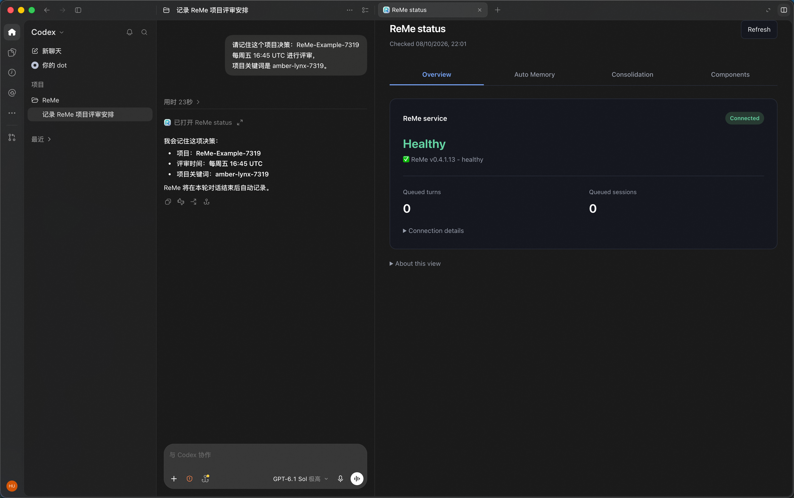
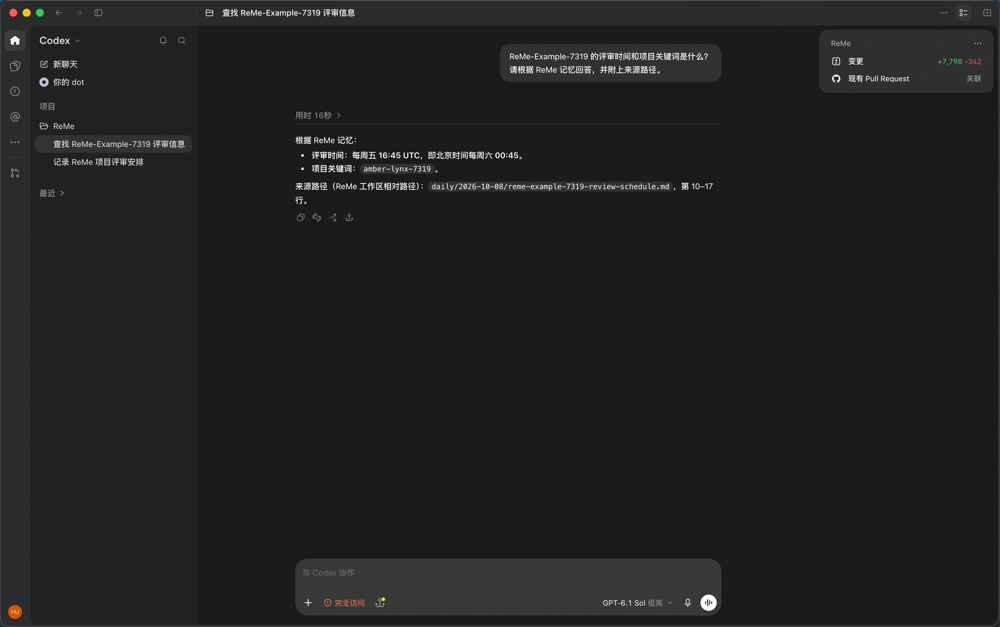
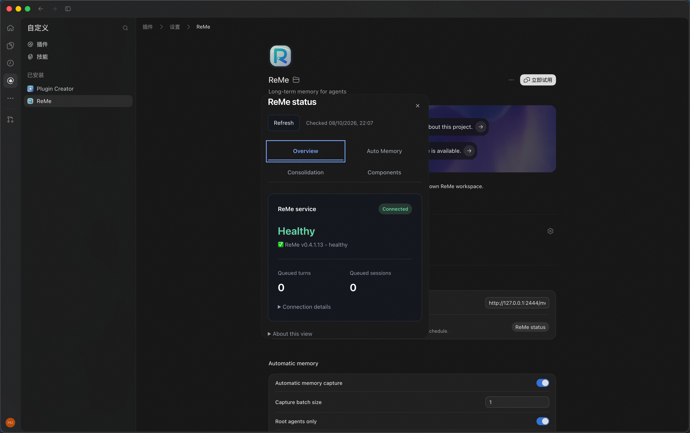

# 在 Codex 中使用 ReMe

[English](./README.md)

将 Codex 接入自己的 ReMe 服务，即可跨会话记住项目决策、个人偏好和待办事项。
ReMe 可以自动记录、召回记忆，并每天整理。记忆文件保存在你自己的 ReMe 工作区中。

## 开始前

- 使用最新版 Codex，支持安装插件和审核 Hook；原生 MCP 设置使用桌面版打开。
- 启动 Codex 的环境中，`python3` 需要是 Python 3.11+，并安装 `fastmcp>=3.4.2`。
  即使 ReMe 在远程运行，Codex 所在机器也需要这个环境。检查命令：

  ```bash
  python3 -c "import sys, fastmcp; print(sys.version); print(fastmcp.__version__)"
  ```

  如未安装，执行 `python3 -m pip install "fastmcp>=3.4.2"`。
- 按[配置指南](../../docs/zh/configuration.md)配置 ReMe 用于提取记忆的模型。默认 BM25 检索不需要 embedding 模型。
- 准备本仓库的本地副本，用于安装。

## 1. 启动 ReMe 服务

```bash
pip install "reme-ai[core]"
reme start \
  workspace_dir=/absolute/path/to/reme-workspace \
  service.backend=http \
  service.host=127.0.0.1 \
  service.port=2333 \
  service.tool_error_on_failure=true \
  jobs.dream_cron.backend=base \
  jobs.dream_cron.enable_serve=false
```

保持服务运行。MCP 地址为 `http://127.0.0.1:2333/mcp`，必须能从 **Codex 所在机器**访问。
远程部署时填写实际可达的服务地址。`workspace_dir` 决定记忆文件存放位置。
未启用认证的服务应仅监听本机，或放在受保护的代理之后。

保留 `service.tool_error_on_failure=true`，以便写入失败后稍后重试。

这个示例由 Codex 管理每日整理。如果 ReMe 服务已有整理计划且希望继续使用，省略最后两项，
并在 Codex 中关闭 **Daily memory consolidation**。同一个工作区只在一处开启每日整理。

## 2. 安装 ReMe 并信任 Hook

将路径替换为仓库所在的绝对路径：

```bash
codex plugin marketplace add /absolute/path/to/ReMe/integrations/codex
codex plugin add reme@reme-codex
```

重启桌面客户端，或打开新的 CLI 会话。在已安装的 ReMe 详情中确认已启用。

> **截图槽位 — `plugin-installed.png`：** 真实 Codex 中的 ReMe 详情页，保留启用状态和 `reme` MCP 卡片。

<!--

-->

在 Codex 的 Hooks 设置中，审核并信任 **所有 ReMe 条目**（目前共七个）；CLI 可使用 `/hooks`。
完成这一步才能自动记录和召回。仅连接服务并不会启用这些能力。
升级后如条目发生变化，需要重新审核。参见 [Codex Hook 审核与信任说明](https://learn.chatgpt.com/docs/hooks#review-and-trust-hooks)。

> **截图槽位 — `hooks-trusted.png`：** Codex Hooks 设置或 `/hooks` 中，七个 ReMe 条目均已启用、已信任。

<!--

-->

## 3. 在 MCP 设置中连接服务

打开已安装的 ReMe 详情，找到 **reme MCP server** 卡片，点击 **Open MCP settings**。
在这个表单中调整服务地址和记忆选项，无需手动编辑配置文件。

首次验证建议保存以下配置：

| 字段 | 值 |
| --- | --- |
| ReMe MCP address | `http://127.0.0.1:2333/mcp`，或实际可达地址 |
| Automatic recall | 开启 |
| Automatic memory capture | 开启 |
| Capture batch size | `1`，每次回复完成后记录 |
| Memory guidance language | `zh` 或 `en` |

先保存，再点击 **ReMe status**。在 **总览** 中确认服务显示 **健康**，并能看到 ReMe 版本。
若无法连接，展开 **连接详情** 核对地址，并确认服务正在运行。接下来尝试记录和召回一条记忆。

> **截图槽位 — `mcp-settings.png`：** 真实原生表单，保留服务地址、自动开关、批次大小及唯一的 ReMe status 入口。

<!--

-->

## 4. 记录并召回第一条记忆

新建会话 A，使用一组独立的项目名和校验词，例如：

```text
请记住这个项目决策：ReMe-Example-7319 每周五 16:45 UTC 进行评审，
项目关键词是 amber-lynx-7319。
```

Codex 回复后，保持会话打开，等待记录完成。打开 **ReMe status → 自动记忆 → 最近活动**，
查看是否出现 **记忆已保存**（`memory_saved`），并确认 **待提交轮数** 回到零。
也可以在 ReMe 工作区的 `daily/` 下阅读保存的笔记。
看到保存成功后再进行下一步；Codex 的确认回复本身不能证明记忆已写入。

> **截图槽位 — `memory-recorded.png`：** 会话 A 中的项目决策和确认回复。

<!--

-->

另建会话 B：

```text
ReMe-Example-7319 的评审时间和项目关键词是什么？
请根据 ReMe 记忆回答，并附上来源路径。
```

预期答复包含每周五 16:45 UTC、`amber-lynx-7319`，以及 `daily/...md` 等来源路径。
要确认自动召回生效，再查看 **自动记忆 → 最近活动** 中的 **已召回相关记忆**（`recall_found`）。
仅答对问题、却没有这条活动记录，不能证明自动召回已开启。

> **截图槽位 — `memory-recalled.png`：** 独立会话 B 中的正确事实和 ReMe 来源路径。

<!--

-->

日常使用时，直接提问即可，例如“我们之前确定的发布流程是什么？”或“找一下我之前的代码评审偏好”。
首次验证后可调整 **Capture batch size**：默认每五次完成的回复记录一批；希望每次回复后尽快保存时，设为 `1`。
尤其在短暂的 CLI 会话中，请保持 Codex 打开，直到待提交记录保存完成。

## 5. 设置定时整理或立即整理

在 **Auto Dream** 分组中设置 **Daily memory consolidation**、**Auto Dream schedule**、
**Workspace timezone**，按需填写 **Auto Dream hint**，然后保存。默认 `0 23 * * *`、
`Asia/Shanghai`，即每天上海时间 23:00。仅支持 `分钟 小时 * * *` 的每日计划，例如每天 02:30 为
`30 2 * * *`。Hint 可以填写想优先保留的信息，例如“优先保留项目决策和未完成事项”。

打开 **ReMe status → 记忆整理**，查看下次运行时间和最近结果。
在计划时间保持 Codex 和 ReMe 运行；重启后不会补跑错过的计划。
多台机器共用同一个 ReMe 工作区时，只在其中一台开启每日整理。

需要立即整理时，等待 **待提交轮数** 回到零，再在 MCP 设置中点击
**Consolidate now (updates memory files)**。该操作会更新记忆文件，关闭每日计划后仍可使用。
整理后到 **记忆整理** 页签查看结果。关闭计划不会停止已经开始的整理；如果出现超时，先检查状态再重试。

## 6. 查看状态和调整使用偏好

从 MCP 设置打开 **ReMe status**，根据需要选择页签：

| 页签 | 查看什么 |
| --- | --- |
| 总览 | 服务是否健康、是否还有对话待保存；展开 **连接详情** 可查看服务地址。 |
| 自动记忆 | 记录和召回是否开启；展开 **最近活动** 查看保存、召回或失败记录。 |
| 记忆整理 | 下次什么时候整理、最近一次是否成功。 |
| 组件 | ReMe 的内存用量；排错时可展开 **服务详情**。 |

点击 **刷新** 更新状态。也可以在对话中要求：“调用 `reme_status`，用文字告诉我连接状态、
待保存记忆和下次整理时间。”

> **截图槽位 — `plugin-status.png`：** 真实 ReMe status 面板或 `reme_status` 输出，保留连接健康、待提交轮数、最近活动和下次 Dream 时间。

<!--

-->

需要调整时，回到 **Open MCP settings** 修改并保存。新设置对后续活动生效，无需重新安装。
下面按表单中显示的名称列出常用选项。

| 字段 | 默认值 | 什么时候调整 |
| --- | --- | --- |
| ReMe MCP address | `http://127.0.0.1:2333/mcp` | 改为另一个 ReMe 服务地址。 |
| Automatic memory capture | 开启 | 关闭后暂停自动记录。 |
| Capture batch size | `5` | 设为 `1` 可在每次回复后保存；调大可将更多回复合并记录。 |
| Automatic recall | 开启 | 关闭后不再为新提问自动补充过去的记忆。 |
| Root agents only | 开启 | 如果也需要记录和召回子代理对话，可关闭。 |
| Memory guidance language | `en` | 选择 `zh` 使用中文记忆指引和状态文字；设置表单标签仍为英文。 |
| Search result limit | `5` | 调大可获取更多检索结果，最多 50 条。 |
| Minimum recall score | `0` | 调高可过滤掉得分较低的匹配结果。 |
| Daily memory consolidation | 开启 | 希望手动整理，或服务已有整理计划时关闭。 |
| Auto Dream schedule | `0 23 * * *` | 修改每日整理时间，例如 `30 2 * * *` 表示每天 02:30。 |
| Auto Dream hint | 空 | 填写整理记忆时希望优先保留的信息。 |
| Workspace timezone | `Asia/Shanghai` | 设置记忆日期和每日计划使用的时区，例如 `Europe/London`。 |

<details>
<summary>超时设置</summary>

以下数值均以毫秒为单位，通常保留默认值；经常遇到请求超时时再调整。

| 字段 | 默认值 | 用途 |
| --- | --- | --- |
| Request timeout (ms) | `10000` | 检索和状态检查的等待时间，最多 `120000`。 |
| Background timeout (ms) | `3600000` | 记录和整理记忆的等待时间，最多 `3600000`。 |
| Shutdown timeout (ms) | `5000` | 退出等待设置；Codex 限制退出时的记忆提交最多等待两秒，调大此值也无法延长这段等待。 |

</details>

切换服务地址前，先等待待提交记录保存完成。尚未保存的记录仍关联原地址，需要切回原地址重试。
整理过程中修改的配置用于下一次整理。

## 排查与更新

| 现象 | 检查方式 |
| --- | --- |
| 找不到 MCP 设置 | 在最新版桌面端打开已安装的 ReMe 详情及 `reme` MCP 卡片；确认启用后重启。 |
| 状态卡片空白，随后提示“插件功能未成功加载” | 检查 Codex 沙箱页面的网络访问；见下方说明。 |
| 连接健康，但没有记录或召回 | 检查全部 ReMe Hook 的信任状态、自动开关及最近活动；连接健康不代表 Hook 已执行。 |
| 记录一直在队列中 | 保持 Codex 和 ReMe 运行，检查 ReMe 模型配置和服务日志，并确认启动命令包含 `service.tool_error_on_failure=true`。 |
| 没有召回结果 | 先确认事实已保存，提问时带上项目名，再检查 **Search result limit** 和 **Minimum recall score**。 |
| Dream 未触发 | 查看保存的时区、下次运行时间、开关及 MCP 连接；离线期间错过的时点不会补跑。 |
| 升级后提示未知配置字段 | 备份 `~/.codex/reme/config.json`，对照[当前配置示例](plugins/reme/config.example.json)更新旧字段，再打开设置。 |
| Python 或 FastMCP 启动报错 | 检查 Codex 实际继承的 `python3` 环境，尤其是桌面端的启动环境。 |

<details>
<summary>状态卡片空白或提示加载失败</summary>

Codex 需要访问 `web-sandbox.oaiusercontent.com` 才能展示面板。在运行 Codex 的机器上检查：

```bash
curl -i --max-time 20 https://web-sandbox.oaiusercontent.com/mcp-app.html
```

若响应为公司网络或安全软件的拦截提示，请按其正规流程放行 `web-sandbox.oaiusercontent.com`，
然后重启 Codex 并重新打开面板。暂时可以在对话中要求：“调用 `reme_status`，用文字展示返回的状态。”

</details>

需要进一步排查时，查看 `~/.codex/reme/hooks.log`。如果设置过 `CODEX_HOME`，用该目录替换 `~/.codex`。
排错时不要直接删除 `reme/` 目录，其中还保存着你的配置和尚未写入的对话。

更新仓库后重新安装：

```bash
codex plugin remove reme@reme-codex
codex plugin add reme@reme-codex
```

重启 Codex 并重新审核发生变化的 Hook。已保存的设置和待提交记忆会继续保留。
